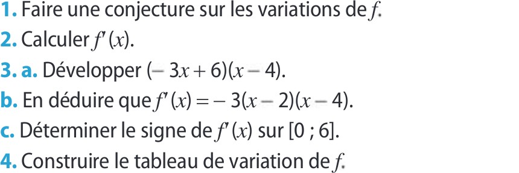
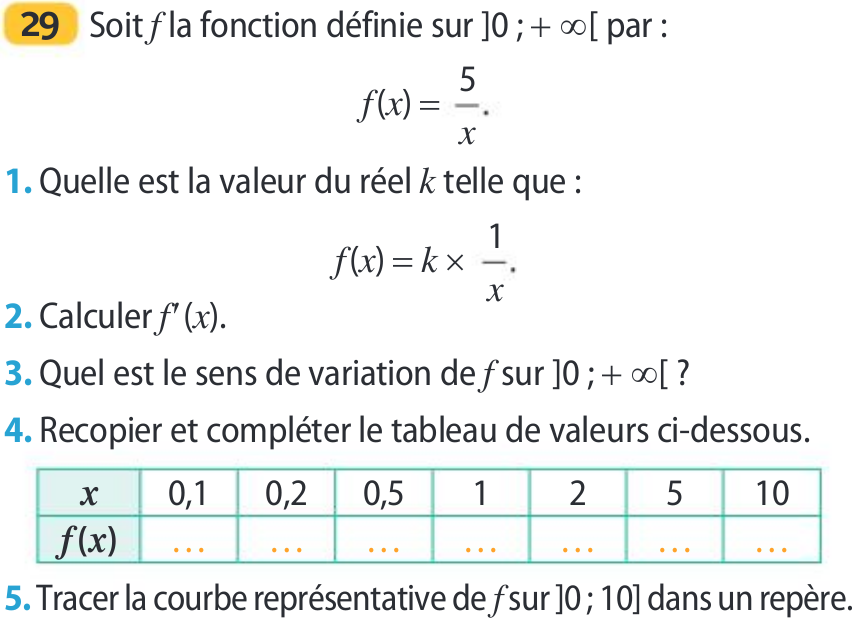

\setlength{\columnsep}{0.5cm}
\setlength{\columnseprule}{0.5pt}
\Begin{multicols}{2}

## Etudier une fonction polynôme $P(x)$ de degré au plus 3

:smile:

{width=45%}

{width=45%}

{width=45%}

{width=45%}
\vfill\null\columnbreak

{width=45%}

{width=45%}
{width=45%}
\vfill\null\columnbreak

{width=45%}

{width=45%}

## Etudier une fonction de la forme : $x\mapsto\dfrac{k}{x}$

{width=45%}
{width=45%}
\vfill\null\columnbreak

{width=45%}

{width=45%}

{width=45%}
\vfill\null\columnbreak

{width=45%}

## Etudier une fonction de la forme : $x\mapsto P(x)+\dfrac{k}{x}$

{width=45%}

{width=45%}

{width=45%}

{width=45%}
\vfill\null\columnbreak

{width=45%}

{width=45%}

{width=45%}

{width=45%}
\vfill\null\columnbreak

{width=45%}

## Résoudre un problème avec une fonction de la forme : $x\mapsto P(x)+\dfrac{k}{x}$

{width=45%}
{width=45%}
\vfill\null\columnbreak

{width=45%}
{width=45%}
{width=45%}
\vfill\null\columnbreak

{width=45%}
{width=45%}
{width=45%}
{width=45%}

\End{multicols}