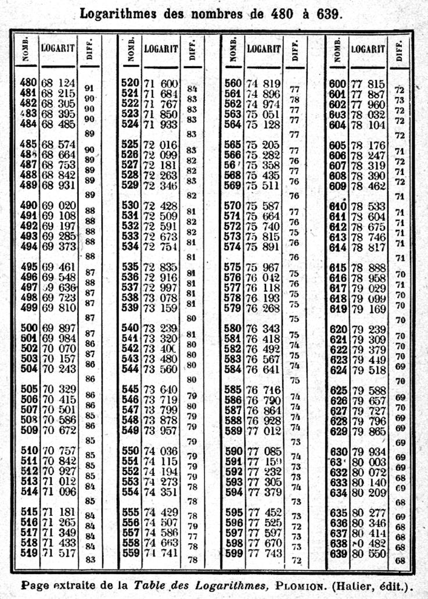

---

\newpage

# Définition et propriétés de la fonction logarithme décimal

## Définition : Logarithme décimal

Soit la fonction $f$ définie sur $\mathbb{R}$ par $f\left( x \right) = 10^{x}$.

L'équation $10^{x} = b$, avec $b > 0$, admet une unique solution dans $\mathbb{R}$.

Cette solution se note $\log{b}$.

### Exemple : {-}

$10^{x}=14 \Leftrightarrow x=\log{14}\approx 1,146$

\begin{center}
\tikzset{every picture/.style={line width=0.75pt}} 
\begin{tikzpicture}[x=0.75pt,y=0.75pt,yscale=-1,xscale=1]
\draw   (90,118) .. controls (90,113.58) and (93.58,110) .. (98,110) -- (162,110) .. controls (166.42,110) and (170,113.58) .. (170,118) -- (170,142) .. controls (170,146.42) and (166.42,150) .. (162,150) -- (98,150) .. controls (93.58,150) and (90,146.42) .. (90,142) -- cycle ;
\draw    (130,110) .. controls (170.1,72.13) and (249.88,69.79) .. (290.77,108.81) ;
\draw [shift={(292,110)}, rotate = 224.82] [color={rgb, 255:red, 0; green, 0; blue, 0 }  ][line width=0.75]    (10.93,-3.29) .. controls (6.95,-1.4) and (3.31,-0.3) .. (0,0) .. controls (3.31,0.3) and (6.95,1.4) .. (10.93,3.29)   ;
\draw   (260,118) .. controls (260,113.58) and (263.58,110) .. (268,110) -- (312,110) .. controls (316.42,110) and (320,113.58) .. (320,118) -- (320,142) .. controls (320,146.42) and (316.42,150) .. (312,150) -- (268,150) .. controls (263.58,150) and (260,146.42) .. (260,142) -- cycle ;
\draw    (290,150) .. controls (250.4,190.34) and (173.56,190.26) .. (131.27,151.2) ;
\draw [shift={(130,150)}, rotate = 403.78] [color={rgb, 255:red, 0; green, 0; blue, 0 }  ][line width=0.75]    (10.93,-3.29) .. controls (6.95,-1.4) and (3.31,-0.3) .. (0,0) .. controls (3.31,0.3) and (6.95,1.4) .. (10.93,3.29)   ;
\draw (123,122) node [anchor=north west][inner sep=0.75pt]   [align=left] {$\displaystyle ?$};
\draw (201,52) node [anchor=north west][inner sep=0.75pt]   [align=left] {$\displaystyle 10^{...}$};
\draw (194,190) node [anchor=north west][inner sep=0.75pt]   [align=left] {$\displaystyle \log ...$};
\draw (281,122) node [anchor=north west][inner sep=0.75pt]   [align=left] {$\displaystyle 14$};
\end{tikzpicture}
\end{center}

{height=3cm}

Graphiquement, on peut trouver ce résultat :

\begin{figure}
\begin{center}
\begin{tikzpicture}[line cap=round,line join=round,>=triangle 45,x=1.0cm,y=1.0cm]
\begin{axis}[
width=12cm,height=7cm,
axis lines=middle,ymajorgrids=true,xmajorgrids=true,
xmin=-0.15,xmax=1.9,ymin=-5.0,ymax=49.0,
xtick={0,.5,...,2},ytick={0,10,...,50}]
\clip(-0.5,-5.) rectangle (2.,50.);
\draw [line width=2.pt,color=blue,smooth,samples=200,domain=-0.5:2.0] plot(\x,{10.0^((\x))});
\draw [color=purple, line width=1.6pt,dashed] (0.,14.)-- (1.1461280356782377,14.);
\draw [color=purple, ->,line width=1.6pt] (1.1461280356782377,14.) -- (1.1461280356782377,0.);
\draw [color=purple] (-0.01,16.5) node[anchor=north east] {$14$};
\draw [color=purple] (1.06,0.18) node[anchor=north west] {$\log{(14)}$};
\draw [fill=black] (1.1461280356782377,0.) circle (2.5pt);
\draw [fill=black] (1.1461280356782377,14.) circle (2.5pt);
\draw [fill=black] (0.,14.) circle (2.5pt);
\end{axis}
\end{tikzpicture}
\end{center}
\caption{Représentation de la fonction $10^{x}$}
\end{figure}

\newpage

## Définition : Fonction Logarithme décimal

On appelle **logarithme décimal** d'un réel strictement positif $b$, l'unique solution de l'équation $10^{x} = b$.

On la note $\log{b}$.

La **fonction logarithme décimal**, notée **log**, est la fonction $f$ définie sur $\left\rbrack 0;+\infty\right\lbrack$ tel que : $$f\left(x\right)=\log{x}$$

### Remarques {-}

a) Pour $b > 0$ : $10^{x} = b$ revient à écrire $x = \log b$
b) $\log 10^{x} = x$
c) Pour $x > 0$, on a : $10^{\log x} = x$

## Propriété : Sens de variation

La fonction **logarithme décimal**, $f(x)=\log{x}$, est **croissante** sur $\left\rbrack 0; + \infty \right\lbrack$.

\begin{figure}
\begin{center}
\begin{tikzpicture}[line cap=round,line join=round,>=triangle 45,x=1.0cm,y=1.0cm]
\begin{axis}[
width=12cm,height=8cm,
axis lines=middle,
ymajorgrids=true,
xmajorgrids=true,
xmin=-1.0,
xmax=11,
ymin=-1,
ymax=1.2,
xtick={0,1,...,10.0},
ytick={-0.8,-0.6,...,1.0},]
\draw[line width=0.5mm,color=black,smooth,samples=200,domain=0.0005:11] plot(\x,{log10((\x))});
\draw [fill=blue] (1.,0.) circle (3.0pt);
\draw [fill=blue] (10.,1.) circle (3.0pt);
\end{axis}
\end{tikzpicture}
\end{center}
\caption{Représentation de la fonction $f(x)=\log{x}$}
\end{figure}

## Propriété : Valeurs particulières

a) $\log{1} = 0$
b) $\log{10} = 1$
c) $\log{\left(\dfrac{1}{10}\right)} = - 1$

## Propriétés algébriques de la fonction logarithme décimale

Pour $a > 0$ et $b > 0$, on a : 

a) $\log{\left(a\times b\right)}=\log{a}+\log{b}$
b) $\log{\left(\dfrac{a}{b}\right)}=\log{a}-\log{b}$
c) $\log{\left(\dfrac{1}{b}\right)}=-\log{b}$
d) $\log{\left(a^{n}\right)}=n\times\log{a}$ avec $n$ un entier naturel

\newpage

## Méthode : Simplifier une expression contenant des logarithmes

Simplifier les expressions suivantes :

a) $A = \log{\left( 2 - \sqrt{2} \right)} + \log{\left( 2 + \sqrt{2} \right)}$
b) $B = 2\times\log{(3)} + \log{(2)} - 4\times\log{(3)}$
c) $C = \log{10^{3}} - \log{\left(\dfrac{1}{5}\right)}$

---

(a)
\begin{align*}
A       &= \log{\left( 2 - \sqrt{2} \right)} + \log{\left( 2 + \sqrt{2} \right)}\\
\quad   &= \log{\left(\left( 2 - \sqrt{2} \right)\times \left( 2 + \sqrt{2} \right)\right)}\\
\quad   &= \log{\left( 2^{2} - \left(\sqrt{2}\right)^{2} \right)}\\
\quad   &= \log{(4-2)} = \log{2}
\end{align*}

(b)
\begin{align*}
B       &= 2\times\log{(3)} + \log{(2)} - 4\times\log{(3)}\\
\quad   &= \log{\left(3^{2}\right)} + \log{(2)} - \log{\left(3^{4}\right)}\\
\quad   &= \log{(9)} + \log{(2)} - \log{(81)}\\
\quad   &= \log{(9 \times 2)} - \log{81}\\
\quad   &= \log{\left(\dfrac{9\times 2}{81}\right)}\\
\quad   &= \log{\left(\dfrac{2}{9}\right)}
\end{align*}

(c)
\begin{align*}
C       &= \log{10^{3}} - \log{\dfrac{1}{5}}\\
\quad   &= 3\times\log{10} - \log{5}\\
\quad   &= 3\times 1 - \log{5}\\
\quad   &= 3 - \log{5}
\end{align*}

\newpage

### Remarque : Transformer un produit en une somme

La première formule permet de transformer un produit en une somme.

Par exemple, si on cherche à effectuer $36 \times 62$, en appliquant cette formule, on a :

$\log{\left(36 \times 62\right)} = \log{36} + \log{62} \approx 1,5563 + 1,7924$ (voir table ci-dessous)

L'addition étant beaucoup plus simple à effectuer que la multiplication, on trouve _facilement_ : $$\log{\left(36 \times 62\right)} \approx 3,3487$$

En cherchant dans la table, le logarithme égal à $3,3487$, on trouve $2232$, soit : $36 \times 62 = 2232$.

|$x$|34|35|36|$\ldots$|61|62|63|$\ldots$|2231|2232|2233|
|:-:|:-:|:-:|:-:|:-:|:-:|:-:|:-:|:-:|:-:|:-:|:-:|
|$\log(x)$|1,5315|1,5441|1,5563|$\ldots$|1,7853|1,7924|1,7993|$\ldots$|3,3485|3,3487|3,3489|

Table: Table de logarithmes

{width=60%}

\newpage

# Équations et inéquations

## Propriétés

Pour $a > 0$ et $b > 0$, on a : 

a) $a=b\quad\Leftrightarrow\quad\log{a}=\log{b}$
b) $a<b\quad\Leftrightarrow\quad\log{a}<\log{b}$\quad (la fonction logarithme décimale est strictement croissante sur $\left\rbrack 0; + \infty \right\lbrack$)

## Méthode : Résoudre une équation ou une inéquation

a) Résoudre dans $\mathbb{R}$ l'équation : $6^{x} = 2$
b) Résoudre dans $\left\rbrack 0; + \infty \right\lbrack$ l'équation : $x^{5} < 3$
c) 8 augmentations successives de $t$% correspondent à une augmentation globale de $30$%. Donner une valeur approchée du taux moyen $t$.

---

(a)
\begin{align*}
6^{x}           &= 2\\
\log{6^{x}}     &= \log{2}\\
x\times \log{6} &= \log{2}\\
x               &= \dfrac{\log{2}}{\log{6}}
\end{align*}

(b)
\begin{align*}
x^{5}           &< 3\\
\log{(x^{5})}   &< \log{3}\\
5\times\log{x}  &< \log{3}\\
\log{x}         &< \dfrac{1}{5}\log{3}\\
\log{x}         &< \log {3^{\frac{1}{5} } }\\
x               &< 3^{\frac{1}{5}}
\end{align*}

L'ensemble solution est $\mathcal{S}=\left\rbrack 0;3^{\frac{1}{5}} \right\lbrack$.

### Remarque : {-}

$3^{\frac{1}{5}}$ se lit **"racine cinquième de 3"** et peut se noter $\sqrt[5]{3}$.

\newpage

(c) 

\begin{center}
\tikzset{every picture/.style={line width=0.75pt}}
\begin{tikzpicture}[x=0.75pt,y=0.75pt,yscale=-1,xscale=1]
\draw   (30,108) .. controls (30,103.58) and (33.58,100) .. (38,100) -- (62,100) .. controls (66.42,100) and (70,103.58) .. (70,108) -- (70,132) .. controls (70,136.42) and (66.42,140) .. (62,140) -- (38,140) .. controls (33.58,140) and (30,136.42) .. (30,132) -- cycle ;
\draw    (50,100) .. controls (60.67,71.87) and (87.71,70.27) .. (99,97.4) ;
\draw [shift={(100,100)}, rotate = 250.42000000000002] [fill={rgb, 255:red, 0; green, 0; blue, 0 }  ][line width=0.08]  [draw opacity=0] (10.72,-5.15) -- (0,0) -- (10.72,5.15) -- (7.12,0) -- cycle    ;
\draw   (90,108) .. controls (90,103.58) and (93.58,100) .. (98,100) -- (122,100) .. controls (126.42,100) and (130,103.58) .. (130,108) -- (130,132) .. controls (130,136.42) and (126.42,140) .. (122,140) -- (98,140) .. controls (93.58,140) and (90,136.42) .. (90,132) -- cycle ;
\draw    (110,100) .. controls (120.67,71.87) and (147.71,70.27) .. (159,97.4) ;
\draw [shift={(160,100)}, rotate = 250.42000000000002] [fill={rgb, 255:red, 0; green, 0; blue, 0 }  ][line width=0.08]  [draw opacity=0] (10.72,-5.15) -- (0,0) -- (10.72,5.15) -- (7.12,0) -- cycle    ;
\draw   (150,108) .. controls (150,103.58) and (153.58,100) .. (158,100) -- (182,100) .. controls (186.42,100) and (190,103.58) .. (190,108) -- (190,132) .. controls (190,136.42) and (186.42,140) .. (182,140) -- (158,140) .. controls (153.58,140) and (150,136.42) .. (150,132) -- cycle ;
\draw    (170,100) .. controls (180.67,71.87) and (207.71,70.27) .. (219,97.4) ;
\draw [shift={(220,100)}, rotate = 250.42000000000002] [fill={rgb, 255:red, 0; green, 0; blue, 0 }  ][line width=0.08]  [draw opacity=0] (10.72,-5.15) -- (0,0) -- (10.72,5.15) -- (7.12,0) -- cycle    ;
\draw   (210,108) .. controls (210,103.58) and (213.58,100) .. (218,100) -- (242,100) .. controls (246.42,100) and (250,103.58) .. (250,108) -- (250,132) .. controls (250,136.42) and (246.42,140) .. (242,140) -- (218,140) .. controls (213.58,140) and (210,136.42) .. (210,132) -- cycle ;
\draw    (230,100) .. controls (240.67,71.87) and (267.71,70.27) .. (279,97.4) ;
\draw [shift={(280,100)}, rotate = 250.42000000000002] [fill={rgb, 255:red, 0; green, 0; blue, 0 }  ][line width=0.08]  [draw opacity=0] (10.72,-5.15) -- (0,0) -- (10.72,5.15) -- (7.12,0) -- cycle    ;
\draw   (270,108) .. controls (270,103.58) and (273.58,100) .. (278,100) -- (302,100) .. controls (306.42,100) and (310,103.58) .. (310,108) -- (310,132) .. controls (310,136.42) and (306.42,140) .. (302,140) -- (278,140) .. controls (273.58,140) and (270,136.42) .. (270,132) -- cycle ;
\draw    (290,100) .. controls (300.67,71.87) and (327.71,70.27) .. (339,97.4) ;
\draw [shift={(340,100)}, rotate = 250.42000000000002] [fill={rgb, 255:red, 0; green, 0; blue, 0 }  ][line width=0.08]  [draw opacity=0] (10.72,-5.15) -- (0,0) -- (10.72,5.15) -- (7.12,0) -- cycle    ;
\draw   (330,108) .. controls (330,103.58) and (333.58,100) .. (338,100) -- (362,100) .. controls (366.42,100) and (370,103.58) .. (370,108) -- (370,132) .. controls (370,136.42) and (366.42,140) .. (362,140) -- (338,140) .. controls (333.58,140) and (330,136.42) .. (330,132) -- cycle ;
\draw    (350,100) .. controls (360.67,71.87) and (387.71,70.27) .. (399,97.4) ;
\draw [shift={(400,100)}, rotate = 250.42000000000002] [fill={rgb, 255:red, 0; green, 0; blue, 0 }  ][line width=0.08]  [draw opacity=0] (10.72,-5.15) -- (0,0) -- (10.72,5.15) -- (7.12,0) -- cycle    ;
\draw   (390,108) .. controls (390,103.58) and (393.58,100) .. (398,100) -- (422,100) .. controls (426.42,100) and (430,103.58) .. (430,108) -- (430,132) .. controls (430,136.42) and (426.42,140) .. (422,140) -- (398,140) .. controls (393.58,140) and (390,136.42) .. (390,132) -- cycle ;
\draw    (410,100) .. controls (420.67,71.87) and (447.71,70.27) .. (459,97.4) ;
\draw [shift={(460,100)}, rotate = 250.42000000000002] [fill={rgb, 255:red, 0; green, 0; blue, 0 }  ][line width=0.08]  [draw opacity=0] (10.72,-5.15) -- (0,0) -- (10.72,5.15) -- (7.12,0) -- cycle    ;
\draw   (450,108) .. controls (450,103.58) and (453.58,100) .. (458,100) -- (482,100) .. controls (486.42,100) and (490,103.58) .. (490,108) -- (490,132) .. controls (490,136.42) and (486.42,140) .. (482,140) -- (458,140) .. controls (453.58,140) and (450,136.42) .. (450,132) -- cycle ;
\draw    (50,140) .. controls (109.5,219.4) and (467.4,219.4) .. (529.09,141.19) ;
\draw [shift={(530,140)}, rotate = 486.62] [fill={rgb, 255:red, 0; green, 0; blue, 0 }  ][line width=0.08]  [draw opacity=0] (10.72,-5.15) -- (0,0) -- (10.72,5.15) -- (7.12,0) -- cycle    ;
\draw    (470,100) .. controls (480.67,71.87) and (507.71,70.27) .. (519,97.4) ;
\draw [shift={(520,100)}, rotate = 250.42000000000002] [fill={rgb, 255:red, 0; green, 0; blue, 0 }  ][line width=0.08]  [draw opacity=0] (10.72,-5.15) -- (0,0) -- (10.72,5.15) -- (7.12,0) -- cycle    ;
\draw   (510,108) .. controls (510,103.58) and (513.58,100) .. (518,100) -- (542,100) .. controls (546.42,100) and (550,103.58) .. (550,108) -- (550,132) .. controls (550,136.42) and (546.42,140) .. (542,140) -- (518,140) .. controls (513.58,140) and (510,136.42) .. (510,132) -- cycle ;
\draw (61,59) node [anchor=north west][inner sep=0.75pt]   [align=left] {$\displaystyle +t\%$};
\draw (121,59) node [anchor=north west][inner sep=0.75pt]   [align=left] {$\displaystyle +t\%$};
\draw (181,59) node [anchor=north west][inner sep=0.75pt]   [align=left] {$\displaystyle +t\%$};
\draw (301,59) node [anchor=north west][inner sep=0.75pt]   [align=left] {$\displaystyle +t\%$};
\draw (241,59) node [anchor=north west][inner sep=0.75pt]   [align=left] {$\displaystyle +t\%$};
\draw (361,59) node [anchor=north west][inner sep=0.75pt]   [align=left] {$\displaystyle +t\%$};
\draw (421,59) node [anchor=north west][inner sep=0.75pt]   [align=left] {$\displaystyle +t\%$};
\draw (292.5,211.5) node   [align=left] {$\displaystyle +30\%$};
\draw (481,59) node [anchor=north west][inner sep=0.75pt]   [align=left] {$\displaystyle +t\%$};
\end{tikzpicture}
\end{center}
Une augmentation globale de $30$% correspond à un coefficient multiplicateur de $1,3$.

**Une** augmentation de $t$% correspond à un coefficient multiplicateur de $1+\dfrac{t}{100}$.

**Huit** augmentations de $t$% correspond à un coefficient multiplicateur de $\left(1+\dfrac{t}{100}\right)^{8}$.

On doit donc résoudre : $\left( 1 + \dfrac{t}{100} \right)^{8} = 1,3$

\begin{align*}
\left( 1 + \dfrac{t}{100} \right)^{8}           &= (1,3)\\
\log{\left( 1 + \dfrac{t}{100} \right)}^{8}     &= \log{(1,3)}\\
8\times \log{\left( 1 + \dfrac{t}{100} \right)} &= \log{(1,3)}\\
\log{\left( 1 + \dfrac{t}{100} \right)}         &= \dfrac{1}{8}\times \log{(1,3)}\\
\log{\left( 1 + \dfrac{t}{100} \right)}         &= \log{\left( {1,3}^{\frac{1}{8}} \right)}\\
1 + \dfrac{t}{100}                              &= {1,3}^{\frac{1}{8}}\\
\dfrac{t}{100}                                  &= {1,3}^{\frac{1}{8}} - 1\\
t                                               &= 100 \times \left( {1,3}^{\frac{1}{8}} - 1 \right)\\
t                                               &\approx 3,3
\end{align*}

Une augmentation globale de $30$% correspond à $8$ augmentations successives d'environ $3,3$%.

### Remarque {-}

Dans ce dernier exercice, on retrouve la propriété établie dans le chapitre "Fonctions exponentielles" :

$$\text{si}\quad x^{n}=a\quad \text{alors}\quad x=a^{\frac{1}{n}}$$

$$\text{si}\quad\left(1+\dfrac{t}{100}\right)^{8}= (1,3)\quad\text{alors}\quad\left(1+\dfrac{t}{100}\right)=(1,3)^{\frac{1}{8}}$$
