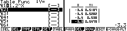
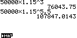
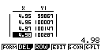
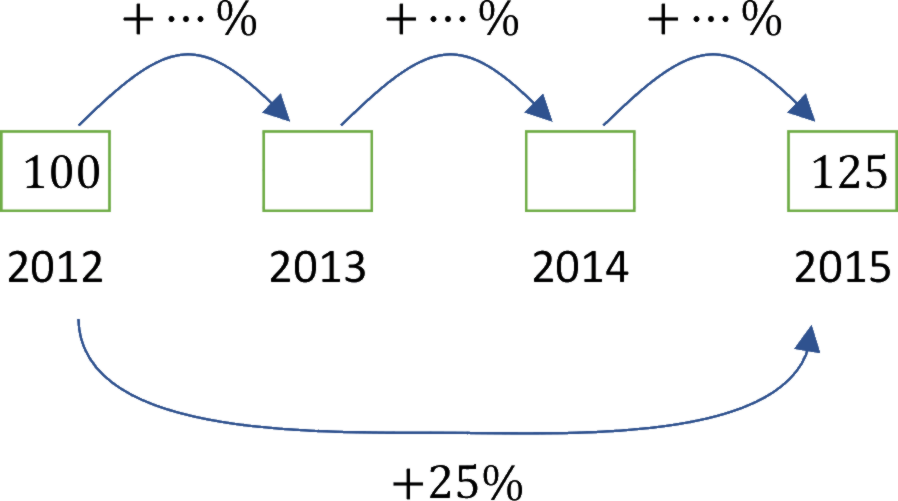

\newpage

# Définition

On considère la suite géométrique de raison $a$ définie par $u_{n} = a^{n}$. Elle est définie pour tout entier naturel $n$.

En prolongeant son ensemble de définition pour tout les nombres réels positifs, on définit la fonction exponentielle de base $a$.

### Exemple : {-}

Pour une suite géométrique de raison $a = 2$ et de premier terme $1$, on a : 

- $u_{0} = 2^{0} = 1$
- $u_{1} = 2^{1} = 2$
- $u_{2} = 2^{2} = 4$
- $u_{3} = 2^{3} = 8$
- $u_{4} = 2^{4} = 16$
- etc ...

Pour la fonction correspondante, on a : $f\left(4\right) = 2^{4}$ mais on a également : $f\left(1,3\right) = 2^{1,3}$.

Et de façon générale, $f\left( x \right) = 2^{x}$ pour tout réel $x$ positif. La fonction $f$ est appelée **fonction exponentielle de base 2**.

\begin{figure}
\begin{center}
\begin{tikzpicture}[line cap=round,line join=round,>=triangle 45,x=1.0cm,y=1.0cm]
\begin{axis}[
width=14cm,height=8cm,
axis lines=middle,
ymajorgrids=true,xmajorgrids=true,
xmin=-3,xmax=5,ymin=-1,ymax=18,
xtick={-4,-3,...,5},ytick={0,2,...,18}
]
\draw[line width=0.5mm,color=blue,smooth,domain=-4:5] plot(\x,{2.0^((\x))});
\draw [fill=black] (0,1) circle (1.0mm);
\draw [fill=black] (1,2) circle (1.0mm);
\draw [fill=black] (2,4) circle (1.0mm);
\draw [fill=black] (3,8) circle (1.0mm);
\draw [fill=black] (4,16) circle (1.0mm);
\end{axis}
\end{tikzpicture}
\end{center}
\caption{Représentation de la fonction $2^x$}
\end{figure}

### Propriété : {-}

Pour tout $x\in\mathbb{R}$, on a : $$a^{- x} = \frac{1}{a^{x}}$$

L’ensemble de définition des fonctions exponentielles peut ainsi être étendu aux valeurs de $x$ négatives.

## Définition : Fonction exponentielle de base a

La fonction $f(x)=a^{x}$ définie sur $\mathbb{R}$, avec $a > 0$, s'appelle **fonction exponentielle de base** $\mathbf{a}$.

### Exemple : {-}

La fonction exponentielle de base $1,2$ est définie sur $\mathbb{R}$ par $f(x)={1,2}^{x}$.

### Remarque : {-}

La fonction exponentielle de base $a$ est strictement **positive** sur $\mathbb{R}$ et il est possible de calculer ses valeurs à l'aide de la calculatrice.

## Repésentation graphique 

Voici la représentation graphique de la fonction $f(x)=a^{x}$ pour plusieurs valeurs de $a$ :

\begin{figure}
\begin{center}
\begin{tikzpicture}[line cap=round,line join=round,>=triangle 45,x=1.0cm,y=1.0cm]
\begin{axis}[
width=10cm,height=8cm,
axis lines=middle,
ymajorgrids=true,xmajorgrids=true,
xmin=-3,xmax=3,ymin=-1,ymax=4,
xtick={-3,-2,...,3},ytick={-1,0,...,4}
]
\draw[line width=0.5mm,color=blue,smooth,domain=-3:3] plot(\x,{2.0^((\x))});
\draw[color=blue] (1.8,3.5) node[anchor=north west] {$2^x$};
\draw[line width=0.5mm,color=green,smooth,domain=-3:3] plot(\x,{1.3^((\x))});
\draw[color=green] (2,2.3) node[anchor=north west] {$1.3^x$};
\draw[line width=0.5mm,color=red,smooth,domain=-3:3] plot(\x,{(.75)^((\x))});
\draw[color=red] (-2,2.2) node[anchor=north west] {$(0.75)^x$};
\draw[line width=0.5mm,color=orange,smooth,domain=-3:3] plot(\x,{(.25)^((\x))});
\draw[color=orange] (-2,3.5) node[anchor=north west] {$(0.25)^x$};
\draw [fill=black] (0,1) circle (1.0mm);
\end{axis}
\end{tikzpicture}
\caption{Représentation de $a^{x}$ pour différentes valeurs de $a$}
\end{center}
\end{figure}

# Propriétés

## Propriétés : Valeurs particulières et relations fonctionnelles

1. $a^{0} = 1$ et $a^{1} = a$
2. $a^{x} \times a^{y} = a^{x + y}$

**Ex :** $2^{5} \times 2^{3} = \left(2\times 2\times 2\times 2\times 2\right) \times \left(2\times 2\times 2\right) = 2^{5+3} =2^{8}$

3. $\dfrac{a^{x}}{a^{y}} = a^{x - y}$

**Ex :** $\dfrac{2^{5}}{2^{3}} = \dfrac{\left(2\times 2\times 2\times 2\times 2\right)}{\left(2\times 2\times 2\right)} = 2^{5-3} =2^{2}$

4. $\left( a^{x} \right)^{n} = a^{nx}$, avec $n$ un entier relatif.

**Ex :** $\left( 5^{3} \right)^{2} = \left(5\times 5\times 5\right)^{2} = \left(5\times 5\times 5\right) \times \left(5\times 5\times 5\right) = 5^{3\times 2} = 5^6$

## Méthode : Simplifier une expression

Simplifier les expressions suivantes :

1. $A = 4^{- 3} \times 4^{- 5}$
\begin{align*}
A     &= 4^{- 3} \times 4^{- 5}\\
\quad &= 4^{- 3 + ( - 5)}\\
\quad &= 4^{- 8}
\end{align*}

1. $B = \dfrac{3^{3} \times 3^{- 2,5}}{9^{5}}$
\begin{align*}
B &= \dfrac{3^{3} \times 3^{- 2,5}}{9^{5}} = \dfrac{3^{3 - 2,5}}{\left(3^{2}\right)^{5}} = \dfrac{3^{0,5}}{3^{10}}\\
\quad &= 3^{0,5 - 10}\\
\quad &= 3^{- 9,5} = \dfrac{1}{3^{9,5}}
\end{align*}

1. $C = \left( {4,8}^{- 2,1} \right)^{3} \times {4,8}^{6,2}$
\begin{align*}
C     &= \left( {4,8}^{- 2,1} \right)^{3} \times {4,8}^{6,2}\\
\quad &= {4,8}^{- 2,1 \times 3} \times {4,8}^{6,2}\\
\quad &= {4,8}^{- 6,3} \times {4,8}^{6,2}\\
\quad &= {4,8}^{- 0,1} = \dfrac{1}{{4,8}^{0,1}}
\end{align*}

## Variations de la fonction exponentielle

- Si $0 < a < 1$ alors $f(x)=a^{x}$ est décroissante sur $\mathbb{R}$
- Si $a > 1$ alors $f(x)=a^{x}$ est croissante sur $\mathbb{R}$ 

\begin{figure}
\begin{center}
\begin{tikzpicture}[line cap=round,line join=round,>=triangle 45,x=1.0cm,y=1.0cm]
\begin{axis}[
width=10cm,height=8cm,
axis lines=middle,
ymajorgrids=true,xmajorgrids=true,
xmin=-3,xmax=3,ymin=-1,ymax=4,
xtick={-3,-2,...,3},ytick={-1,0,...,4}
]
\draw[line width=0.5mm,color=blue,smooth,domain=-3:3] plot(\x,{2.0^((\x))});
\draw[color=blue] (1.8,3.5) node[anchor=north west] {$a>1$};
\draw[line width=0.5mm,color=red,smooth,domain=-3:3] plot(\x,{(.75)^((\x))});
\draw[color=red] (-2,2.2) node[anchor=north west] {$0<a<1$};
\draw [fill=black] (0,1) circle (1.0mm);
\end{axis}
\end{tikzpicture}
\end{center}
\caption{Variations de $a^{x}$ en fonction de la valeur de $a$}
\end{figure}

### Remarques :

- On retrouve les résultats établis pour la variation des suites géométriques.
- Si $a = 1$ alors la fonction exponentielle est constante. En effet, dans ce cas, $a^{x} = 1^{x} = 1$
- Quel que soit $a$, la fonction exponentielle passe par le point $(0;1)$. En effet, $a^{0} = 1$.

## Méthode : Utiliser une fonction exponentielle pour résoudre un problème

Suite à une infection, le nombre de bactéries contenues dans un organisme en fonction du temps (en heures) peut être modélisé par la fonction $f$ définie sur $[0 ; 10$ par :

$f(x) = 50000 \times {1,15}^{x}$

> a) À l'aide de la calculatrice, donner un arrondi au millier près du nombre de bactéries après 3h puis 5h30.
> b) Déterminer les variations de $f$ sur $[0 ; 10]$.
> c) À l'aide de la calculatrice, déterminer au bout de combien de temps le nombre de bactéries a doublé ?

---

(a) $f(3) = 50000 \times {1,15}^{3} \approx 76000$  et  $f(5,5) = 50000 \times {1,15}^{5,5} \approx 108000$

(b) $a = 1,15 > 1$ donc la fonction ${1,15}^{x}$ est strictement croissante sur $[0 ; 10]$. Il en est de même pour la fonction $f$ car $50000$ est positif.

\begin{figure}
\begin{center}
\begin{tikzpicture}[line cap=round,line join=round,>=triangle 45,x=1.0cm,y=1.0cm]
\begin{axis}[
y tick label style={/pgf/number format/.cd, scaled y ticks = false, set thousands separator={~}, fixed},
width=9cm,height=7cm,
axis lines=middle,
ymajorgrids=true,xmajorgrids=true,
xmin=0.0,xmax=10.0,ymin=0.0,ymax=225000.0,
xtick={0,1,...,10},ytick={0.0,50000.0,...,225000.0}
]
\draw[line width=0.5mm,color=blue,smooth,domain=0:10] plot(\x,{50000*1.15^((\x))});
\draw[color=blue] (1.8,3.5) node[anchor=north west] {$1.15^x$};
\end{axis}
\end{tikzpicture}
\caption{Représentation de la fonction $50000\times 1.15^{x}$}
\end{center}
\end{figure}

(c) A l'aide de la calculatrice on a : $f(4.96) \approx 100 007$. Le nombre de bactéries a doublé à partir de $100000$ bactéries, soit au bout d'environ 5h.

## Méthode : Calculer un taux d’évolution moyen

Entre 2012 et 2015, le prix du gaz a augmenté de 25 %.

{width=50%}

> a) Calculer le taux d’évolution moyen annuel.

---

(a) On note *t* le taux d’évolution moyen annuel.

> Le coefficient multiplicateur correspondant à une augmentation **sur un an** est égal à : 
 
$$1 + \frac{t}{100}$$

> Le coefficient multiplicateur correspondant à une augmentation **sur trois ans** (de 2012 à 2015) est égal à : 

$$\left(1+\frac{t}{100}\right) \times \left(1+\frac{t}{100}\right) \times \left(1+\frac{t}{100}\right) = \left( 1 + \frac{t}{100} \right)^{3}$$

Or, sur trois années, le prix a augmenté de 25 % donc ce coefficient multiplicateur est également égal à : $1,25$.

Il reste à résoudre :

\begin{align*}
\left( 1 + \frac{t}{100} \right)^{3}  &= 1,25\\
1 + \frac{t}{100}                     &= {1,25}^{\frac{1}{3}}\\
\dfrac{t}{100}                        &= {1,25}^{\frac{1}{3}} - 1\\
t                                     &= 100 \times \left( {1,25}^{\frac{1}{3}} - 1 \right)\\
t                                     &\approx 7,72
\end{align*}

Trois augmentations de 7,72% $\Rightarrow$ Une augmentation de 25%. Le taux d’évolution moyen annuel est environ de 7,72%.

### Remarque : {-}

$a^{\frac{1}{n}}$ est appelé la **racine n-ième** de $a$. On peut également noté $\sqrt[n]{a}$.

On a, par exemple : $x^{5} = 56 \Leftrightarrow x = \sqrt[5]{56} \approx 2.2368...$

