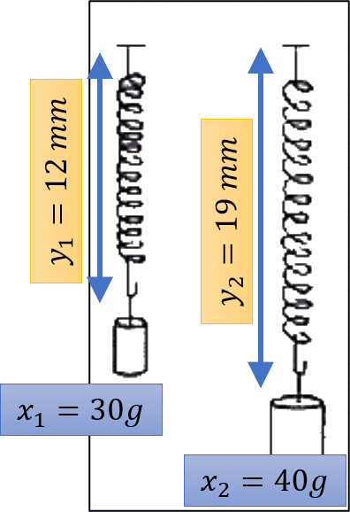
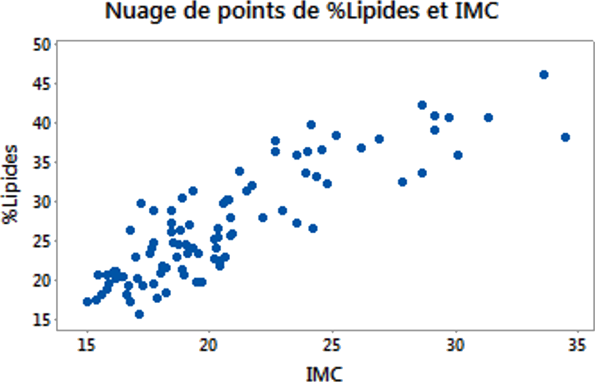
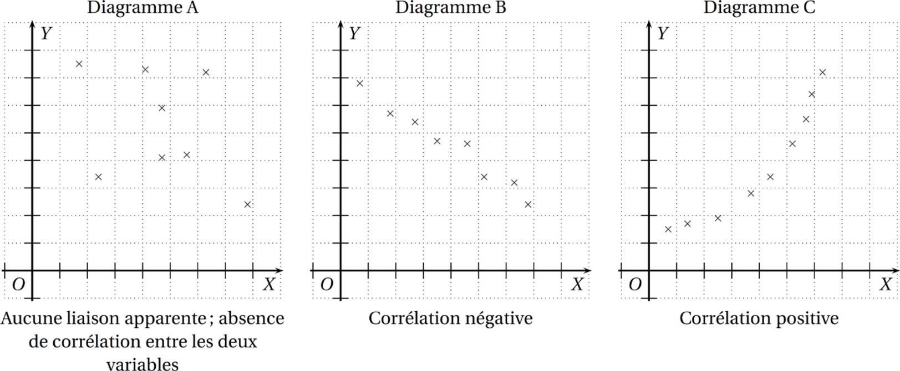
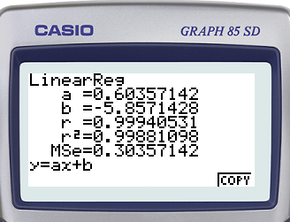

---

\newpage

# Définitions

## Définition : Série statistique à 2 variables

On appelle **série statistique à 2 variables**, l'étude simultatnée de 2 variables statistiques définies sur une même
population.

### Exemples : {-}

- Le poids et la taille de nouveaux nés dans une marternité
- La consommation d'un véhicule et sa vitesse
- Le diamètre et la hauteur des arbres d'un forêt

### Exemple : {-}

On mesure l'allongement $Y$ d'un ressort en fonction de la masse suspendue $X$.

|Masse (en g)|30|40|50|60|70|80|90|100|
|:-:|:-:|:-:|:-:|:-:|:-:|:-:|:-:|:-:|
|Allongement (en mm)|12|19|24|30|37|42|48|55|

{width=4cm}

## Définition : Nuage de points

Le plan étant muni d'un repère orthogonal, on peut associer chaque couple $(x_i ; y_i)$ de la série statistique le point $M_i$ de coordonnées $(x_i ; y_i)$. Le graphique obtenue constitue un **nuage de points**.

{width=7cm}

### Exemple : {-}

|Masse (en g)|30|40|50|60|70|80|90|100|
|:-:|:-:|:-:|:-:|:-:|:-:|:-:|:-:|:-:|
|Allongement (en mm)|12|19|24|30|37|42|48|55|

\begin{center}
\begin{tikzpicture}
\begin{axis}[
height=8cm,width=10cm,
xmin=20,xmax=110,ymin=0,ymax=60,
axis x line=bottom,
axis y line=left,
grid=major,
xlabel={Masse (en g)},
ylabel={Allongement (en mm)},
title={Nuage de points de la série statistique}]
\addplot[mark=x,only marks,mark options ={scale=1,fill=black,solid}] coordinates {(30,12) (40,19) (50,24) (60,30) (70,37) (80,42) (90,48) (100,55)};
\end{axis}
\end{tikzpicture}
\end{center}

## Définition : Point moyen

On appelle **point moyen** du nuage de points, le point $G$ de coordonnées :

$x_G = \text{"moyenne des }x_i\text{"}$ et $y_G = \text{"moyenne des }y_i\text{"}$

### Exemple : {-}

|Masse (en g)|30|40|50|60|70|80|90|100|
|:-:|:-:|:-:|:-:|:-:|:-:|:-:|:-:|:-:|
|Allongement (en mm)|12|19|24|30|37|42|48|55|

Le point $G$ a pour coorodnnées :

$x_G=\dfrac{30+40+...+100}{8} = 65$ et $y_G=\dfrac{12+19+...+55}{8}=33.375$

\begin{center}
\begin{tikzpicture}
\begin{axis}[
height=8cm,width=10cm,
xmin=20,xmax=110,ymin=0,ymax=60,
axis x line=bottom,
axis y line=left,
grid=major,
xlabel={Masse (en g)},
ylabel={Allongement (en mm)},
title={Point moyen}]
\addplot[mark=x,only marks,mark options ={fill=black,solid}] coordinates {(30,12) (40,19) (50,24) (60,30) (70,37) (80,42) (90,48) (100,55)};
\addplot[mark=*,only marks,mark options ={fill=red,solid}] coordinates {(65,33.375)};
\end{axis}
\end{tikzpicture}
\end{center}

### Remarque : {-}

Soient $X$ ey $Y$, deux variables statistiques définies sur la même population. Dans certains cas, on peut soupçonner l'existence d'une relation entre elles.

### Exemple : {-}

- Plus un arbre sera haut, plus son tronc aura un diamêtre important
- Plus un bébé naît grand, plus son poids sera élevé
- Plus le budget publicité d'une entreprise sera élevé, plus les stocks seront faible
- ...

## Définition : Corrélation

Il y a **corrélation** entre deux variables $X$ et $Y$ lorsque $X$ et $Y$ varient dans le même sens (ou sens contraire).

# Ajustement linéaire (ou affine)

## Définition : droite d'ajustement

Lorsque les points d'un nuage sont sensiblement alignés, on peut tracer une droite, appelée **droite d'ajustement** (ou droite de régression), passant au plus près de ces points.

\begin{center}
\begin{tikzpicture}
\begin{axis}[
height=8cm,width=10cm,
xmin=20,xmax=110,ymin=0,ymax=60,
axis x line=bottom,
axis y line=left,
grid=major,
xlabel={Masse (en g)},
ylabel={Allongement (en mm)},
title={Droite d'ajustement tracé à la main}]
\addplot[mark=x,only marks,mark options={scale=2,fill=black,solid}] coordinates {(30,12) (40,19) (50,24) (60,30) (70,37) (80,42) (90,48) (100,55)};
\draw [blue, line width=0.5mm, domain=20:110] plot(\x,{0.6*\x-6});
\end{axis}
\end{tikzpicture}
\end{center}

### Rappel {-}

L'équation d'une droite est de la forme $y=ax+b$

### Méthode : Déterminer l’équation de la droite d’ajustement à l’aide de la série statistique

C'est la méthode des **moindres carrés** que la _calculatrice_ va utiliser pour établir l'équation de la droite.

`Casio Graph 85 SD`

- Menu $\rightarrow$ Stat : Entrer les valeurs de $x_i$ dans `list 1` et de $y_i$ dans `list 2`
- Aller dans `CALC` $\rightarrow$ `REG` $\rightarrow$ `x`
- Vous pouvez lire les valeurs de $a$ et $b$

Dans notre exemple on peut lire : $a\approx 0.603$ et $b\approx -5.857$

{width=6cm}

\begin{center}
\begin{tikzpicture}
\begin{axis}[
height=8cm,width=10cm,
xmin=20,xmax=110,ymin=0,ymax=60,
axis x line=bottom,
axis y line=left,
grid=major,
xlabel={Masse (en g)},
ylabel={Allongement (en mm)},
title={Droite d'ajustement d'équation $y=0.603x-5.857$}]
\addplot[mark=x,only marks,mark options={scale=2,fill=black,solid}] coordinates {(30,12) (40,19) (50,24) (60,30) (70,37) (80,42) (90,48) (100,55)};
\draw [red, line width=0.5mm, domain=20:110] plot(\x,{0.603*\x-5.857});
\end{axis}
\end{tikzpicture}
\end{center}

# Interpolation - Extrapolation

### Remarque : {-}

Nous pouvons prévoir l'allongement du ressort par rapport à la masse. Si le masse est de $x = 150\text{g}$ alors le ressort s'allongera de $y = 0,603\times 150 - 5,8\approx 84.65\text{cm}$

\begin{center}
\begin{tikzpicture}
\begin{axis}[
height=8cm,width=10cm,
xmin=20,xmax=180,ymin=0,ymax=100,
axis x line=bottom,
axis y line=left,
grid=major,
xlabel={Masse (en g)},
ylabel={Allongement (en mm)},
title={Extrapolation pour une masse de $150$g}]
\addplot[mark=x,only marks,mark options={scale=2,fill=black,solid}] coordinates {(30,12) (40,19) (50,24) (60,30) (70,37) (80,42) (90,48) (100,55)};
\addplot[mark=*,only marks,mark options={scale=1,fill=black,solid}] coordinates {(150,84.593)};
\draw [red, line width=0.5mm, domain=20:180] plot(\x,{0.603*\x-5.857});
\draw [blue,line width=0.5mm,dashed,>=latex,->] (150,0)-- (150,84.593);
\draw [blue,line width=0.5mm,dashed,>=latex,->] (150, 84.593)-- (20,84.593);
\end{axis}
\end{tikzpicture}
\end{center}

### Remarque : {-}

Si on veut allonger le ressort de $60$cm, il suffit résoudre : $60=0.603x-5.857$

\begin{align*}
0.603x-5.857 &= 60 \\
0.603x &= 60+5.857 \\
x &= \dfrac{65.857}{0.603}\approx 109.21
\end{align*}

\begin{center}
\begin{tikzpicture}
\begin{axis}[
height=8cm,width=10cm,
xmin=20,xmax=130,ymin=0,ymax=70,
axis x line=bottom,
axis y line=left,
grid=major,
xlabel={Masse (en g)},
ylabel={Allongement (en mm)},
title={Extrapolation pour un allongement de $60$cm}]
\addplot[mark=x,only marks,mark options={scale=2,fill=black,solid}] coordinates {(30,12) (40,19) (50,24) (60,30) (70,37) (80,42) (90,48) (100,55)};
\addplot[mark=*,only marks,mark options={scale=1,fill=black,solid}] coordinates {(109.21,60)};
\draw [red, line width=0.5mm, domain=20:130] plot(\x,{0.603*\x-5.857});
\draw [blue,line width=0.5mm,dashed,>=latex,->] (109.21,60)-- (109.21,0);
\draw [blue,line width=0.5mm,dashed,>=latex,->] (0, 60)-- (109.21,60);
\end{axis}
\end{tikzpicture}
\end{center}

## Définitions : Extrapolation / Interpolation

- L'interpolation et l'extrapolationsont des méthodes qui consistentà estimer une valeur inconnue dans une série statistique.
  - Pour une interpolation, le calcul est réalisé __dans le domaine d'étude__ fourni par les valeurs de la série.
  - Pour une extrapolation, le calcul est réalisé __en dehors du domaine d'étude__.

# Ajustement par changement de variables

Lorsque le nuage de points n'est à priori pas modélisable par une droite, on peut, parfois, réaliser un ajustement linéaire en effectuant un changement de variable.

## Exemple : 

Population d’une grande ville sur 50 ans tous les 5 ans (en milliers).

|Année $x_i$ |0 | 5 | 10 | 15 | 20 | 25 | 30 | 35 | 40 | 45 | 50 |
|:-:|:-:|:-:|:-:|:-:|:-:|:-:|:-:|:-:|:-:|:-:|:-:|
| Population $y_i$ | 19,4 | 19,4 | 27,6 | 40,3 | 50 | 59 | 69 | 87 | 132 | 166 | 216 |

\begin{center}
\begin{tikzpicture}
\begin{axis}[
height=8cm,width=10cm,
xmin=0,xmax=55,ymin=0,ymax=240,
axis x line=bottom,
axis y line=left,
grid=major,
xlabel={Année : $x$},
ylabel={Population (en millliers) : $y$},
title={Population d’une grande ville}]
\addplot[mark=x,only marks,mark options={scale=2,fill=black,solid}] coordinates {(0,19.4) (5,19.4) (10,27.6) (15,40.3) (20,50) (25,59) (30,69) (35,87) (40,132) (45,166) (50,216)};
\draw (20,175) node[text width=5cm] {Pas d'ajustement linéaire};
\end{axis}
\end{tikzpicture}
\end{center}

On effectue le changement de variable $z=\log{y}$

|Année $x_i$ |0 | 5 | 10 | 15 | 20 | 25 | 30 | 35 | 40 | 45 | 50 |
|:-:|:-:|:-:|:-:|:-:|:-:|:-:|:-:|:-:|:-:|:-:|:-:|
| Population $y_i$ | 19,4 | 19,4 | 27,6 | 40,3 | 50 | 59 | 69 | 87 | 132 | 166 | 216 |
| $z_i$ | 1,29 | 1,29 | 1,44 | 1,61 | 1,7 | 1,77 | 1,84 | 1,94 | 2,12 | 2,22 | $\log{216}=2,33$ |

\begin{center}
\begin{tikzpicture}
\begin{axis}[
height=8cm,width=10cm,
xmin=0,xmax=55,ymin=0,ymax=3,
axis x line=bottom,
axis y line=left,
grid=major,
xlabel={Année : $x$},
ylabel={$z=\log{y}$},
title={Population d’une grande ville}]
\addplot[mark=x,only marks,mark options={scale=2,fill=black,solid}] coordinates {(0,1.29) (5,1.29) (10,1.44) (15,1.61) (20,1.7) (25,1.77) (30,1.84) (35,1.94) (40,2.12) (45,2.22) (50,2.33)};
\draw [red, line width=0.5mm, domain=0:60] plot(\x,{0.0214*\x+1.24});
\end{axis}
\end{tikzpicture}
\end{center}

La droite d'ajustement a pour équation : $z = 0,0213 x + 1,2427$

.png){width=6cm}

On a donc $z = 0,0213 x + 1,2427$ et $z=\log{y}$ donc :

\begin{align*}
\log{y} &= 0,0213 x + 1,2427 \\
y &= 10^{0,0213 x + 1,2427} \\
y &= 10^{0,0213 x}\times 10^{1,2427} \\
y &= 10^{0,0213 x}\times 17,4864 =17,4864\times 10^{0,0213 x}
\end{align*}

\begin{center}
\begin{tikzpicture}
\begin{axis}[
height=8cm,width=10cm,
xmin=0,xmax=55,ymin=0,ymax=240,
axis x line=bottom,
axis y line=left,
grid=major,
xlabel={Année : $x$},
ylabel={Population (en millliers) : $y$},
title={Population d’une grande ville : $y=17,4864 \times 10^{0,0213 x}$ }]
\addplot[mark=x,only marks,mark options={scale=2,fill=black,solid}] coordinates {(0,19.4) (5,19.4) (10,27.6) (15,40.3) (20,50) (25,59) (30,69) (35,87) (40,132) (45,166) (50,216)};
\draw [red, line width=0.5mm, domain=0:60] plot( \x , {17.4864*exp(ln(10) * 0.0213 * \x)} );
\end{axis}
\end{tikzpicture}
\end{center}
