---

\newpage

# Suites arithmétiques

## Définition : Suite arithmétique

Une suite $u_{n}$ est une suite **arithmétique** s'il existe un nombre $r$ tel que pour tout entier $n$, on a : $$u_{n+1}=u_{n}+r$$

.png){width=70%}

## Rappel : Reconnaître une suite arithmétique

### Exemple {-}

On considère la liste des trois nombres suivants : $-2$, $5$ et $12$. Dans cet ordre, ces nombres peuvent-ils être les termes consécutifs d'une suite arithmétique ?

Pour y répondre, il faut s'assurer que la **différence** entre deux termes consécutifs reste la même.

$12 - 5 = 7\quad$ et $\quad5 - (-2) = 7\quad$Cette différence reste égale à $7$.

$-2$, $5$ et $12$ sont bien les termes consécutifs d'une suite arithmétique de raison $7$.

Si on note $u_{n}$ cette suite, on a : $u_{n + 1} = u_{n} + 7$.

## Méthode : Exprimer une suite arithmétique en fonction de $n$

Pour préparer une course, un athlète décide de s'entraîner de façon progressive.

Il commence son entraînement au "jour 0" par un petit footing d'une longueur de $3000$m. Au "jour 1", il court $3150$m. Au "jour 2", il court $3300$m puis ainsi de suite en parcourant chaque jour $150$m de plus que la veille.

On note $u_{n}$ la distance parcourue au "jour $n$" d'entraînement.

> a) Calculer $u_{3}$ et $u_{4}$.
> b) Quelle est la nature de la suite $u_{n}$ ? On donnera son premier terme et sa raison.
> c) Exprimer $u_{n + 1}$ en fonction de $u_{n}$.
> d) Donner la variation de la suite $u_{n}$.
> e) Exprimer $u_{n}$ en fonction de $n$.

---

(a) Calcul de $u_{3}$ et $u_{4}$

$u_{0}=3000$

$u_{1}=u_{0}+150=3000+150=3150$

$u_{2}=u_{1}+150=3150+150=3300$

$u_{3}=u_{2}+150=3300+150=3450$

$u_{4}=u_{3}+150=3450+150=3600$

(b) $u_{n}$ est une suite **arithmétique** de premier terme $u_{0} = 3000$ et de raison $r = 150$. On parle de **croissance linéaire**.

(c) $u_{n + 1} = u_{n} + 150$

(d) $r = 150 > 0$ donc la suite $u_{n}$ est croissante.

(e) Expression de $u_{n}$ en fonction de $n$

Après $1$ jour, il parcourt : $u_{1} = 3000 + 150 \times 1$

Après $2$ jours, il parcourt : $u_{2} = 3000 + 150 \times 2$

Après $3$ jours, il parcourt : $u_{3} = 3000 + 150 \times 3$

De manière générale, après $n$ jours, il parcourt : $u_{n} = 3000 + 150\times n$

## Propriété : Expression du terme général d'une suite arithmétique

Si $u_{n}$ est une suite arithmétique de raison $r$, on a :
\begin{align*}
u_{n}&=u_{0}+n\times r\\
u_{n}&=u_{1}+\left(n-1\right)\times r
\end{align*}

.png){width=70%}

## Méthode : Calculer la somme des termes d'une suite arithmétique

Dans l'exemple précédent, $u_{n}$ représente la distance parcourue par le sportif au jour $n$. Nous avons établit que $u_{n}=3000+150\times n$

> a) Quelle distance aura-t-il parcourue **au total** lorsqu'il sera au "jour 15" de son entraîneent ?
> b) Quelle distance aura-t-il parcourue **au total** entre le "jour 8" et le "jour 12" ?

---

(a) La distance parcourue au total au "jour 15" d'entraînement est :

$$u_{0} + u_{1} + u_{2} + \ldots + u_{15}$$

Pour l'obtenir, on utilise la calculatrice.

- [Texas Instruments]
  1. Pour accéder au catalogue : **```2nde```** puis **```0```**.
  2. Appuyer sur **```ln```** pour accéder aux fonctionnalités commençant par **```S```**.
  3. Choisir **```som(```** ou **```somme(```** ou **```sum(```** (suivant les modèles).
  4. Procéder de même pour afficher **```suite(```** ou **```seq(```** (suivant les modèles).
  5. Et compléter pour afficher : **```som(suite(3000+150X,X,0,15))```**
- [Casio]
  1. Pour accéder au catalogue : **```SHIFT```** puis **```4```**.
  2. Appuyer sur {height=12pt} pour accéder aux fonctionnalités commençant par **```S```**.
  3. Choisir {height=12pt}
  4. Et compléter pour afficher : 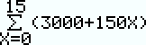{height=24pt}

| 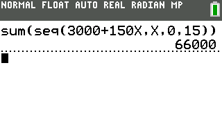{height=3cm} | 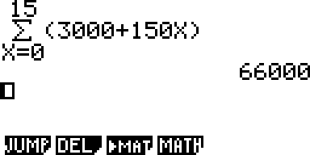{height=3cm} |
|:--------------------------------:|:-----------------------------------:|
| Somme des termes de $u_{n}$ avec une TI-84 CE | Somme des termes de $u_{n}$ avec une Casio Graph 35+ |

La calculatrice affiche $66 000$. Ce qui signifie que l'athlète a parcouru $66 000$m soit $66$km au "jour 15" d'entraînement.

Pour noter une telle somme, on peut utiliser le symbole $\sum_{}^{}$:

$$u_{0} + u_{1} + u_{2} + \ldots + u_{15} = \sum_{k = 0}^{15}u_{k} = 66000$$

(b) La distance parcourue au total entre le "jour 8" et le "jour 12" d'entraînement est :

$$u_{8} + u_{9} + u_{10} + u_{11} + u_{12} = \sum_{k = 8}^{12}u_{k}$$

On saisit sur la calculatrice :

- [Sur TI :] **```som(suite(3000+150X,X,8,12))```**
- [Sur Casio :] 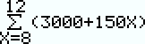{height=24pt}

La calculatrice affiche $22 500$. Ce qui signifie que l'athlète a parcouru $22,5$km au total entre le "jour 8" et le "jour 12 "d'entraînement.

$$u_{8} + u_{9} + u_{10} + u_{11} + u_{12} = \sum_{k = 8}^{12}u_{k} = 22500$$

## Propriété : Somme des $n$ premiers termes d'une suite arithmétique

Soit $u_{n}$ une suite arithmétique de raison $r$ et de 1^er^ terme $u_{0}$. La somme des $n$ premiers termes de $u_{n}$ est :

$$S=n\times\dfrac{u_{0}+u_{n-1}}{2}=\text{nombre de termes}\times\dfrac{\text{1er terme}+\text{dernier terme}}{2}$$

### Exemple {-}

Soit $u_{n}$ une suite arithmétique de raison $150$ et de 1^er^ terme $3000$. La somme des $16$ premiers termes de $u_{n}$ est :

$$S=u_{0} + u_{1} + u_{2} + \ldots + u_{15} = \sum_{k = 0}^{15}u_{k}$$

$$S=16\times\dfrac{u_{0}+u_{15}}{2}=16\times\dfrac{(3000)+(3000+150\times 15)}{2}=16\times\dfrac{8250}{2}=66000$$

\newpage

## Défition : Moyenne arithmétique de deux nombres

En mathématiques, la **moyenne arithmétique** d'une liste de nombres est la **somme des valeurs** divisée par **le nombre de valeurs**.

## Méthode : Calculer une moyenne arithmétique de deux nombres

> a) Calculer la moyenne arithmétique des nombres $-3$ et $19$.
> b) Peut-on affirmer que chaque terme d'une suite arithmétique est la **moyenne arithmétique** du terme qui le précède et du terme qui le suit ?

---

(a) La moyenne arithmétique d'une suite de valeurs est donc la moyenne que l'on connait depuis le collège.

$$m = \frac{- 3 + 19}{2} = \frac{16}{2} = 8$$

(b) Si on note $u_{n}$ le terme d'une suite arithmétique, on a :

$u_{n + 1} = u_{n} + r$, où $r$ est la raison de la suite.

Et on a également : $u_{n} = u_{n - 1} + r$ donc $u_{n - 1} = u_{n} - r$

La moyenne arithmétique du terme qui précède $u_{n}$ et du terme qui le suit est égale à :
\begin{align*}
m     &= \dfrac{u_{n - 1} + u_{n + 1}}{2}\\
\quad &= \dfrac{u_{n} - r + u_{n} + r}{2}\\
\quad &= \dfrac{2\times {u}_{n}}{2}\\
\quad &= u_{n}
\end{align*}

Donc $u_{n}$ est la moyenne arithmétique du terme qui le précède et du terme qui le suit.

\newpage

## Résumé

| Résumé| $u_{n}$ une **suite arithmétique** de raison $r$ et de 1^er^ terme $u_{0}$ | Exemple : $r=-0.5$ et $u_{0} = 4$ |
|:-:|:-:|:-:|
| Définition | $$u_{n + 1} = u_{n} + r$$| $$u_{n + 1} = u_{n} - 0.5$$ |
| Propriété  | $$u_{n} = u_{0} + n\times r$$  $$u_{n} = u_{1} + \left( n - 1 \right)r$$ | $$u_{n}=4+n\times0.5$$ $$u_{n}=3.5+(n-1)\times0.5$$|
| Variation  | $$r>0 \Rightarrow u_{n} \text{ croissante}$$ $$r<0 \Rightarrow u_{n} \text{ décroissante}$$ | $$r=0.5<0 \Rightarrow u_{n} \text{ décroissante}$$|
| Représentation graphique |                                 |                                                 |
|  | Les points de la représentation graphique sont alignés. |                                                 |
|  | On parle de croissance linéaire.                        |                                                 |
|  |                                                         | 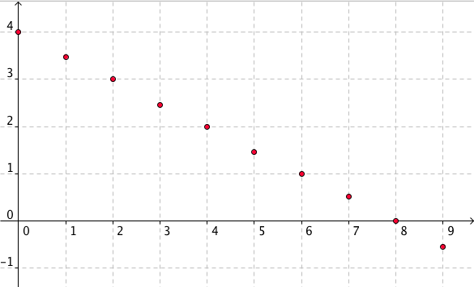{height=5cm} |


\newpage

# Suites géométriques

## Définition : Suite géométrique

Une suite $u_{n}$ est une suite **géométrique** s'il existe un nombre $q$ tel que pour tout entier $n$, on a : $$u_{n+1}=u_{n}\times q$$

.png){width=70%}

## Rappel : Reconnaître une suite géométrique

### Exemple {-}

On considère la liste des trois nombres suivants : $4$, $12$ et $36$. Dans cet ordre, ces nombres peuvent-ils être les termes consécutifs d'une suite géométrique ?


Pour y répondre, il faut s'assurer que le **rapport** entre deux termes consécutifs reste la même.

$\dfrac{36}{12} = 3\quad$ et $\quad\dfrac{12}{4}=3\quad$ Ce rapport reste égale à $3$.

$4$, $12$ et $36$ sont bien les termes consécutifs d'une suite géométrique de raison $3$.

Si on note $u_{n}$ cette suite, on a : $u_{n + 1} = u_{n} \times 3$.

## Méthode : Exprimer une suite arithmétique en fonction de $n$

On place un capital de $500$€ sur un compte dont les intérêts annuels s'élèvent à $4$% par an.

On note $u_{n}$ la valeur du capital après $n$ années.

> a) Calculer $u_{2}$ et $u_{3}$.
> b) Quelle est la nature de la suite $u_{n}$ ? On donnera son premier terme et sa raison.
> c) Exprimer $u_{n + 1}$ en fonction de $u_{n}$.
> d) Donner la variation de la suite $u_{n}$.
> e) Exprimer $u_{n}$ en fonction de $n$.

---

(a) Calcul de $u_{2}$ et $u_{3}$

Une augmentation de $4$% correspond à un coefficient multiplicateur de $1.04$

$u_{0}=500$

$u_{1}=u_{0}\times 1.04=500\times 1.04=520$

$u_{2}=u_{1}\times 1.04=520\times 1.04=540.8$

$u_{3}=u_{2}\times 1.04=540.8\times 1.04\approx 562.4$

(b) $u_{n}$ est une suite **géométrique** de premier terme $u_{0} = 500$ et de raison $q = 1.04$. On parle de **croissance exponentielle**.

(c) $u_{n + 1} = u_{n} \times 1.04$

(d) $q = 1.04 > 1$ donc la suite $u_{n}$ est croissante.

(e) Expression de $u_{n}$ en fonction de $n$

Après $1$ an, le capital est : $u_{1} = 500 \times 1.04$

Après $2$ ans, le capital est : $u_{2} = 500 \times 1.04\times 1.04=500\times 1.04^{2}$

Après $3$ ans, le capital est : $u_{3} = 500 \times 1.04^{2}\times 1.04=500\times 1.04^{3}$

De manière générale, après $n$ années, le capital est : $u_{n} = 500 \times 1.04^{n}$

## Propriété : Expression du terme général d'une suite géométrique

Si $u_{n}$ est une suite géométrique de raison $q$, on a :
\begin{align*}
u_{n}&=u_{0}\times q^{n}\\
u_{n}&=u_{1}\times q^{(n-1)}
\end{align*}

## Méthode : Calculer la somme des termes d'une suite géométrique

Soit $u_{n}$ une suite géométrique de raison $q=2$ et de 1^er^ terme $u_{1}=5$.

> a) Exprimer $u_{n}$ en fonction de $n$.
> b) A l'aide de la calculatrice, calculer la somme des termes de $u_{5}$ à $u_{20}$.

---

(a) $u_{n}$ est une suite géométrique de raison $q=2$ et de 1^er^ terme $u_{1}=5$ donc $u_{n}=5\times 2^{(n-1)}$.

(b) Calcul de $\sum_{k=5}^{20}u_{k}$

| 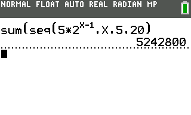{height=3cm} | 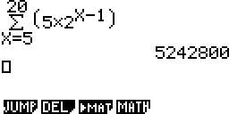{height=3cm} |
|:--------------------------------:|:-----------------------------------:|
| $\sum_{k=5}^{20}u_{k}$ avec une TI-84 CE | $\sum_{k=5}^{20}u_{k}$ avec une Casio Graph 35+ |

$$\sum_{k=5}^{20}u_{k}=\sum_{k=5}^{20}5\times 2^{(k-1)}=u_{5}+u_{6}+\ldots+u_{20}=5~242~800$$

\newpage

## Propriété : Somme des $n$ premiers termes d'une suite géométrique

Soit $u_{n}$ une suite géométrique de raison $q$ et de 1^er^ terme $u_{0}$. La somme des $n$ premiers termes de $u_{n}$ est :

$$S=\sum_{k=0}^{n-1}u_{k}=u_{0}+u_{1}+\ldots+u_{n-1}=u_{0}\times\dfrac{1-q^{n}}{1-q}$$
$$S=\text{1er terme}\times\dfrac{1-\text{raison}^{(\text{nombre de terme})}}{1-\text{raison}}$$

### Exemple {-}

Soit $u_{n}$ une suite géométrique de raison $q=2$ et de 1^er^ terme $u_{1}=5$.

- La somme des 20 premiers termes de $u_{n}$ est :
\begin{align*}
S_1   &=u_{1} + u_{2} + \ldots + u_{20}\\
\quad &=\sum_{k = 1}^{20}u_{k}\\
\quad &=u_{1}\times\dfrac{1-q^{20}}{1-q}\\
\quad &=5\times\dfrac{1-2^{20}}{1-2}\\
\quad &=5~242~875
\end{align*}
- La somme des termes de $u_{5}$ à $u_{20}$ est :
\begin{align*}
S_2   &=u_{5} + \ldots + u_{20}=\sum_{k = 5}^{20}u_{k}\\
\quad &=(u_{1} + \ldots + u_{20})-(u_{1} + \ldots + u_{4})\\
\quad &=\sum_{k = 1}^{20}u_{k}-\sum_{k = 1}^{4}u_{k}\\
\quad &=S_1 - 5\times \dfrac{1-2^{4}}{1-2}\\
\quad &=5~242~875-75=5~242~800
\end{align*}

\newpage

## Défition : Moyenne géométrique de deux nombres

En mathématiques, la **moyenne géométrique** de deux nombres $a$ et $b$ est :

$$m=\sqrt{a\times b}$$

## Méthode : Calculer une moyenne géométrique de deux nombres

> a) Calculer la moyenne géométrique des nombres $4$ et $36$.
> b) Peut-on affirmer que chaque terme d'une suite géométrique est la **moyenne géométrique** du terme qui le précède et du terme qui le suit ?

---

(a) La moyenne géométrique de $4$ et de $36$ est :

$$m = \sqrt{4 \times 36} = \sqrt{144} = 12$$

(b) Si on note $u_{n}$ le terme d'une suite géométrique de raison $q>0$ et $u_{n}>0$, on a :

$u_{n + 1} = u_{n} \times q$ 

On a également : $u_{n} = u_{n - 1} \times q$ donc $u_{n - 1} = \dfrac{u_{n}}{q}$

La moyenne géométrique du terme qui précède $u_{n}$ et du terme qui le suit est égale à :
\begin{align*}
m     &= \sqrt{u_{n-1} \times u_{n+1}}\\
\quad &= \sqrt{ \left(\dfrac{u_{n}}{q}\right) \times \left(u_{n} \times q\right)}\\
\quad &= \sqrt{{u}_{n}^{2}}\\
\quad &= u_{n}
\end{align*}

Donc $u_{n}$ est la moyenne géométrique du terme qui le précède et du terme qui le suit.

\newpage

## Résumé

| Résumé| $u_{n}$ une **suite géométrique** de raison $q$ et de 1^er^ terme $u_{0}$ | Exemple : $q=2$ et $u_{0}=4$ |
|:-:|:-:|:-:|
| Définition | $$u_{n + 1} = u_{n} \times q$$| $$u_{n + 1} = u_{n} \times 2$$ |
| Propriété  | $$u_{n} = u_{0} \times q^{n}$$  $$u_{n} = u_{1} \times q^{n-1}$$ | $$u_{n}=4\times 2^{n}$$ $$u_{n}=8\times 2^{n-1}$$|
| Variation  | $$q>1 \Rightarrow u_{n} \text{ croissante}$$ $$0<q<1 \Rightarrow u_{n} \text{ décroissante}$$ | $$q=2>1 \Rightarrow u_{n} \text{ croissante}$$|
| Représentation graphique |                                 |                                                 |
|  | Les points de la représentation graphique ne sont pas alignés. |                                                 |
|  | On parle de croissance exponentielle.                        |                                                 |
|  |                                                         | 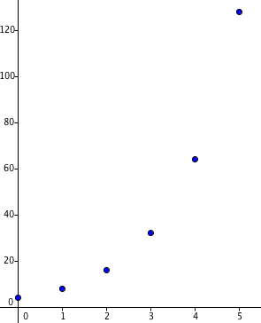{height=5cm} |

\newpage

# Comparaison de suites

## Exemple : comparaison de placements proposés par une banque

Une banque propose deux options de placement :

- Placement A : On dépose un capital de départ. Chaque année, la banque nous reverse $6$% du **capital de départ**.
- Placement B : On dépose un capital de départ. Chaque année, la banque nous reverse $4$% du **capital de l’année précédente**.

On suppose que le placement initial est de $200$€.

L’objectif est de savoir à partir de combien d’années un placement est plus intéressant que l’autre.

On note :

- $u_{n}$ la valeur du capital après $n$ années pour le placement A
- $v_{n}$ la valeur du capital après $n$ années pour le placement B.

> a) Calculer $u_{1}$, $u_{2}$ et $u_{3}$.
> b) Calculer $v_{1}$, $v_{2}$ et $v_{3}$.
> c) Quelle est la nature des suites $u_{n}$ et $v_{n}$ ? On donnera le premier terme et la raison.
> d) Exprimer $u_{n}$ et $u_{n}$ en fonction de $n$.
> e) Déterminer le plus petit entier $n$, tel que $v_{n}$>$u_{n}$. Interpréter ce résultat.

---

(a) Avec le placement A, on gagne chaque année $6$% de $200$€$=12$€.

$u_{0}=200$

$u_{1}=u_{0}+12=200+12=212$

$u_{2}=u_{1}+12=212+12=224$

$u_{3}=u_{2}+12=224+12=236$

(b) Avec le placement B, chaque année le capital est multiplié par $1.04$.

$v_{0}=200$

$v_{1}=v_{0} \times 1.04 = 200\times 1.04=208$

$v_{2}=v_{1} \times 1.04=208\times 1.04=216.32$

$v_{3}=v_{2}\ times 1.04=216.32\times 1.04\approx 225$

(c) Nature de $u_{n}$ et $v_{n}$

$u_{n}$ est une suite **arithmétique** de premier terme $200$ et de raison $12$.

$v_{n}$ est une suite **géométrique** de premier terme $200$ et de raison $1.04$.

(d) Terme général de $u_{n}$ et $v_{n}$

$u_{n} = u_{0} + r\times n = 200 + 12\times n$

$v_{n} = v_{0} \times q^{n} = 200 \times 1.04^{n}$

(e) Tableau de valeurs de $u_{n}$ et $v_{n}$

Saisir l’expression du terme général, comme pour une fonction et paramétrer avec un pas de 1.

| 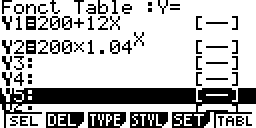{height=3cm} | 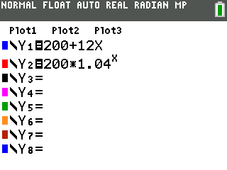{height=4cm} |
|:-:|:-:|
| 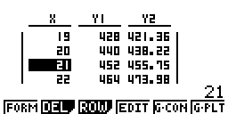{height=3cm} | 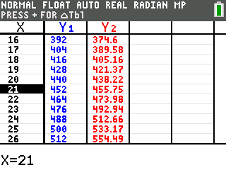{height=4cm} |
| Casio Graph 32+| TI-84 CE |

Le plus petit entier $n$, tel que $v_{n}$>$u_{n}$ est $21$. 

Cela signifie qu’à partir de $21$ années, le placement B devient plus rentable que le placement A.

\begin{figure}
\begin{center}
\begin{tikzpicture}[line cap=round,line join=round,>=triangle 45,x=1.0cm,y=1.0cm]
\begin{axis}[
width=18cm,height=14cm,axis lines=middle,ymajorgrids=true,xmajorgrids=true,
xmin=0,xmax=32,ymin=150,ymax=690,
xtick={0,5,...,32},
ytick={150.0,200.0,...,650.0}]
\draw [color=red](20,570) node[anchor=north west] {\textbf{Placement B}};
\draw [color=blue](25,490) node[anchor=north west] {\textbf{Placement A}};
\begin{scriptsize}
\draw [fill=blue] (0.,200.) circle (2.0pt);
\draw [fill=blue] (1.,212.) circle (2.0pt);
\draw [fill=blue] (2.,224.) circle (2.0pt);
\draw [fill=blue] (3.,236.) circle (2.0pt);
\draw [fill=blue] (4.,248.) circle (2.0pt);
\draw [fill=blue] (5.,260.) circle (2.0pt);
\draw [fill=blue] (6.,272.) circle (2.0pt);
\draw [fill=blue] (7.,284.) circle (2.0pt);
\draw [fill=blue] (8.,296.) circle (2.0pt);
\draw [fill=blue] (9.,308.) circle (2.0pt);
\draw [fill=blue] (10.,320.) circle (2.0pt);
\draw [fill=blue] (11.,332.) circle (2.0pt);
\draw [fill=blue] (12.,344.) circle (2.0pt);
\draw [fill=blue] (13.,356.) circle (2.0pt);
\draw [fill=blue] (14.,368.) circle (2.0pt);
\draw [fill=blue] (15.,380.) circle (2.0pt);
\draw [fill=blue] (16.,392.) circle (2.0pt);
\draw [fill=blue] (17.,404.) circle (2.0pt);
\draw [fill=blue] (18.,416.) circle (2.0pt);
\draw [fill=blue] (19.,428.) circle (2.0pt);
\draw [fill=blue] (20.,440.) circle (2.0pt);
\draw [fill=blue] (21.,452.) circle (2.0pt);
\draw [fill=blue] (22.,464.) circle (2.0pt);
\draw [fill=blue] (23.,476.) circle (2.0pt);
\draw [fill=blue] (24.,488.) circle (2.0pt);
\draw [fill=blue] (25.,500.) circle (2.0pt);
\draw [fill=blue] (26.,512.) circle (2.0pt);
\draw [fill=blue] (27.,524.) circle (2.0pt);
\draw [fill=blue] (28.,536.) circle (2.0pt);
\draw [fill=blue] (29.,548.) circle (2.0pt);
\draw [fill=blue] (30.,560.) circle (2.0pt);
\draw [fill=blue] (31.,572.) circle (2.0pt);
\draw [fill=blue] (0.,200.) circle (2.0pt);
\draw [fill=blue] (1.,212.) circle (2.0pt);
\draw [fill=blue] (2.,224.) circle (2.0pt);
\draw [fill=blue] (3.,236.) circle (2.0pt);
\draw [fill=blue] (4.,248.) circle (2.0pt);
\draw [fill=blue] (5.,260.) circle (2.0pt);
\draw [fill=blue] (6.,272.) circle (2.0pt);
\draw [fill=blue] (7.,284.) circle (2.0pt);
\draw [fill=blue] (8.,296.) circle (2.0pt);
\draw [fill=blue] (9.,308.) circle (2.0pt);
\draw [fill=blue] (10.,320.) circle (2.0pt);
\draw [fill=blue] (11.,332.) circle (2.0pt);
\draw [fill=blue] (12.,344.) circle (2.0pt);
\draw [fill=blue] (13.,356.) circle (2.0pt);
\draw [fill=blue] (14.,368.) circle (2.0pt);
\draw [fill=blue] (15.,380.) circle (2.0pt);
\draw [fill=blue] (16.,392.) circle (2.0pt);
\draw [fill=blue] (17.,404.) circle (2.0pt);
\draw [fill=blue] (18.,416.) circle (2.0pt);
\draw [fill=blue] (19.,428.) circle (2.0pt);
\draw [fill=blue] (20.,440.) circle (2.0pt);
\draw [fill=blue] (21.,452.) circle (2.0pt);
\draw [fill=blue] (22.,464.) circle (2.0pt);
\draw [fill=blue] (23.,476.) circle (2.0pt);
\draw [fill=blue] (24.,488.) circle (2.0pt);
\draw [fill=blue] (25.,500.) circle (2.0pt);
\draw [fill=blue] (26.,512.) circle (2.0pt);
\draw [fill=blue] (27.,524.) circle (2.0pt);
\draw [fill=blue] (28.,536.) circle (2.0pt);
\draw [fill=blue] (29.,548.) circle (2.0pt);
\draw [fill=blue] (30.,560.) circle (2.0pt);
\draw [fill=blue] (31.,572.) circle (2.0pt);
\draw [fill=red] (0.,200.) circle (2.0pt);
\draw [fill=red] (1.,208.) circle (2.0pt);
\draw [fill=red] (2.,216.32) circle (2.0pt);
\draw [fill=red] (3.,224.9728) circle (2.0pt);
\draw [fill=red] (4.,233.97171200000005) circle (2.0pt);
\draw [fill=red] (5.,243.33058048000004) circle (2.0pt);
\draw [fill=red] (6.,253.06380369920007) circle (2.0pt);
\draw [fill=red] (7.,263.18635584716804) circle (2.0pt);
\draw [fill=red] (8.,273.71381008105476) circle (2.0pt);
\draw [fill=red] (9.,284.662362484297) circle (2.0pt);
\draw [fill=red] (10.,296.0488569836689) circle (2.0pt);
\draw [fill=red] (11.,307.8908112630157) circle (2.0pt);
\draw [fill=red] (12.,320.2064437135363) circle (2.0pt);
\draw [fill=red] (13.,333.01470146207777) circle (2.0pt);
\draw [fill=red] (14.,346.3352895205609) circle (2.0pt);
\draw [fill=red] (15.,360.1887011013833) circle (2.0pt);
\draw [fill=red] (16.,374.59624914543866) circle (2.0pt);
\draw [fill=red] (17.,389.58009911125623) circle (2.0pt);
\draw [fill=red] (18.,405.1633030757065) circle (2.0pt);
\draw [fill=red] (19.,421.3698351987348) circle (2.0pt);
\draw [fill=red] (20.,438.2246286066842) circle (2.0pt);
\draw [fill=red] (21.,455.75361375095156) circle (2.0pt);
\draw [fill=red] (22.,473.9837583009896) circle (2.0pt);
\draw [fill=red] (23.,492.9431086330292) circle (2.0pt);
\draw [fill=red] (24.,512.6608329783504) circle (2.0pt);
\draw [fill=red] (25.,533.1672662974844) circle (2.0pt);
\draw [fill=red] (26.,554.4939569493838) circle (2.0pt);
\draw [fill=red] (27.,576.6737152273593) circle (2.0pt);
\draw [fill=red] (28.,599.7406638364536) circle (2.0pt);
\draw [fill=red] (29.,623.7302903899118) circle (2.0pt);
\draw [fill=red] (30.,648.6795020055083) circle (2.0pt);
\draw [fill=red] (31.,674.6266820857286) circle (2.0pt);
\draw [fill=red] (0.,200.) circle (2.0pt);
\draw [fill=red] (1.,208.) circle (2.0pt);
\draw [fill=red] (2.,216.32) circle (2.0pt);
\draw [fill=red] (3.,224.9728) circle (2.0pt);
\draw [fill=red] (4.,233.97171200000005) circle (2.0pt);
\draw [fill=red] (5.,243.33058048000004) circle (2.0pt);
\draw [fill=red] (6.,253.06380369920007) circle (2.0pt);
\draw [fill=red] (7.,263.18635584716804) circle (2.0pt);
\draw [fill=red] (8.,273.71381008105476) circle (2.0pt);
\draw [fill=red] (9.,284.662362484297) circle (2.0pt);
\draw [fill=red] (10.,296.0488569836689) circle (2.0pt);
\draw [fill=red] (11.,307.8908112630157) circle (2.0pt);
\draw [fill=red] (12.,320.2064437135363) circle (2.0pt);
\draw [fill=red] (13.,333.01470146207777) circle (2.0pt);
\draw [fill=red] (14.,346.3352895205609) circle (2.0pt);
\draw [fill=red] (15.,360.1887011013833) circle (2.0pt);
\draw [fill=red] (16.,374.59624914543866) circle (2.0pt);
\draw [fill=red] (17.,389.58009911125623) circle (2.0pt);
\draw [fill=red] (18.,405.1633030757065) circle (2.0pt);
\draw [fill=red] (19.,421.3698351987348) circle (2.0pt);
\draw [fill=red] (20.,438.2246286066842) circle (2.0pt);
\draw [fill=red] (21.,455.75361375095156) circle (2.0pt);
\draw [fill=red] (22.,473.9837583009896) circle (2.0pt);
\draw [fill=red] (23.,492.9431086330292) circle (2.0pt);
\draw [fill=red] (24.,512.6608329783504) circle (2.0pt);
\draw [fill=red] (25.,533.1672662974844) circle (2.0pt);
\draw [fill=red] (26.,554.4939569493838) circle (2.0pt);
\draw [fill=red] (27.,576.6737152273593) circle (2.0pt);
\draw [fill=red] (28.,599.7406638364536) circle (2.0pt);
\draw [fill=red] (29.,623.7302903899118) circle (2.0pt);
\draw [fill=red] (30.,648.6795020055083) circle (2.0pt);
\draw [fill=red] (31.,674.6266820857286) circle (2.0pt);
\end{scriptsize}
\end{axis}
\end{tikzpicture}
\end{center}
\caption{Représentation de l'évolution du capital pour le placement A et B}
\end{figure}