---

\newpage

# Espérance d'une variable aléatoire

## Définition : Espérance mathématique d'une variable aléatoire

L'**espérance mathématique** de $X$ est :

\begin{align*}
E(X)   &= x_{1} \times P\left( X = x_{1} \right) + x_{2} \times P\left( X = x_{2} \right) + \ldots +x_{n} \times P(X = x_{n})\\
~      &= \sum_{i = 1}^{n}{x_{i} \times P(X = x_{i})}
\end{align*}

## Méthode : Calculer l'espérance d'une variable aléatoire

Soit l'expérience aléatoire : "On tire une carte dans un jeu de 32 cartes."

On considère le jeu suivant :

- Si on tire un **coeur**, on gagne 2€.
- Si on tire un **roi**, on gagne 5€.
- Si on tire une **autre carte**, on perd 1€.

On appelle $X$ la variable aléatoire qui à une carte tirée associe un gain ou une perte.

> a) Déterminer la loi de probabilité de $X$.
> b) Calculer l'espérance de $X$ et interpréter le résultat.

---

(a) La variable aléatoire $X$ peut prendre les valeurs $2$, $5$, $-1$ mais aussi $7$.

En effet, si on tire le **roi de coeur**, on gagne 5(roi) + 2(coeur) = 7€.

- Si la carte tirée est un coeur (autre que le roi de coeur), $X = 2\quad \Rightarrow P(X = 2) = \dfrac{7}{32}$.
- Si la carte tirée est un roi (autre que le roi de coeur), $X = 5\quad \Rightarrow P(X = 5) = \dfrac{3}{32}$.
- Si la carte tirée est le roi de coeur, $X = 7\quad \Rightarrow P(X = 7) = \dfrac{1}{32}$.
- Si la carte tirée n'est ni un coeur, ni un roi, $X = -1\quad \Rightarrow P(X = -1) = \dfrac{21}{32}$.

La loi de probabilité de $X$ est :

  $$x_{i}$$          -1                  2                  5                  7
  ------------------ ------------------- ------------------ ------------------ ------------------
  $$P(X = x_{i})$$   $$\dfrac{21}{32}$$   $$\dfrac{7}{32}$$   $$\dfrac{3}{32}$$   $$\dfrac{1}{32}$$

(b)
\begin{align*}
E(X) &= \left( - 1 \right) \times\dfrac{21}{32} + 2 \times\dfrac{7}{32} + 5 \times\dfrac{3}{32} + 7 \times \dfrac{1}{32}\\
\quad    &= \dfrac{15}{32}
\end{align*}

L'espérance est la moyenne que l'on peut espérer si l'on répète l'expérience un grand nombre de fois.

L'espérance est égale à $\dfrac{15}{32} \approx 0,50$ signifie qu'en jouant un grand nombre de fois, on peut espérer gagner en moyenne environ 0,50 €.

\newpage

# Schéma de Bernoulli, loi binomiale

## Définition : Épreuve de Bernoulli

Une **épreuve de Bernoulli** est une expérience aléatoire à deux issues que l'on peut nommer "succès" ou "échec".

\begin{center}
\begin{tikzpicture}
\tikzset{grow=right,level distance=3cm,sibling distance=1cm}
\tikzset{edge from parent/.append style={line width=0.5mm}}
\tikzset{every tree node/.style={anchor=base west}}
\tikzset{execute at begin node=\strut}
\Tree   [.{}
            \edge node[auto=right]{$1-p$};
            [.$\overline{S}$ ]
            \edge node[auto=left]{$p$};
            [.$S$ ]
        ]
\end{tikzpicture}
\end{center}


### Exemples {-}

> a) Le jeu du pile ou face : On considère comme succès "obtenir pile" et comme échec "obtenir face". La probabilité d'un succès est égale à $p = \dfrac{1}{2}$.

\begin{center}
\begin{tikzpicture}
\tikzset{grow=right,level distance=2cm,sibling distance=0.5cm}
\tikzset{edge from parent/.append style={line width=0.5mm}}
\tikzset{every tree node/.style={anchor=base west}}
\tikzset{execute at begin node=\strut}
\Tree   [.{}
            \edge node[auto=right]{$\frac{1}{2}$};
            [.$\overline{PILE}$ ]
            \edge node[auto=left]{$\frac{1}{2}$};
            [.$PILE$ ]
        ]
\end{tikzpicture}
\end{center}

> b) On lance un dé et on considère comme succès "obtenir un six" et comme échec "ne pas obtenir un six". La probabilité d'un succès est égale à $p = \dfrac{1}{6}$.

## Définition : Schéma de Bernoulli

Un **schéma de Bernoulli** est la répétition de $n$ épreuves de Bernoulli identiques et indépendantes pour lesquelles la probabilité du succès est $p$.

\begin{center}
\begin{tikzpicture}
\tikzset{grow=right,level distance=2cm,sibling distance=0cm}
\tikzset{edge from parent/.append style={line width=0.5mm}}
\tikzset{every tree node/.style={anchor=base west}}
\tikzset{execute at begin node=\strut}
\Tree   [.{}
            [.$E$
                [.$E$ \edge[dashed];[.~ ] \edge[dashed];[.~ ] ]
                [.$S$ \edge[dashed];[.~ ] \edge[dashed];[.~ ] ]
            ]
            \edge node[auto=left]{$p$};
            [.$S$
                [.$E$
                    [.$E$ \edge[dashed];[.~ ] \edge[dashed];[.~ ] ]
                    \edge node[auto=left]{$p$};
                    [.$S$ \edge[dashed];[.~ ] \edge[dashed];[.~ ] ]
                ]
                \edge node[auto=left]{$p$};
                [.$S$
                    [.$E$ \edge[dashed];[.~ ] \edge[dashed];[.~ ] ]
                    \edge node[auto=left]{$p$};
                    [.$S$ \edge[dashed];[.~ ] \edge[dashed];[.~ ] ]
                ]
            ]
        ]
\end{tikzpicture}
\end{center}

### Exemple  {-}

La répétition de $4$ lancers d'une pièce de monnaie est un schéma de Bernoulli de paramètres $n = 4$ et $p = \dfrac{1}{2}$.

\begin{center}
\begin{tikzpicture}
\tikzset{level distance=2.5cm,sibling distance=0.5cm}
\tikzset{edge from parent/.append style={line width=0.5mm}}
\Tree [.{} [.P [.P [.P [.P ] [.F ] ] [.F [.P ] [.F ] ] ] [.F [.P [.P ] [.F ] ] [.F [.P ] [.F ] ] ] ] [.F [.P [.P [.P ] [.F ] ] [.F [.P ] [.F ] ] ] [.F [.P [.P ] [.F ] ] [.F [.P ] [.F ] ] ] ] ]
\end{tikzpicture}
\end{center}

### Remarque {-}

Si dans un schéma de Bernoulli, on répète la même expérience $n$ fois, alors il est possible d'obtenir 0 succès, 1 succès, 2 succès, ... ou $n$ succès.

\newpage

## Définition : Loi binomiale

On réalise un schéma de Bernoulli composé de $n$ épreuves de Bernoulli identiques et indépendantes. Une **loi binomiale** est une loi de probabilité qui donne le nombre de succès de l'expérience.

### Remarque {-}

$n$ et $p$ sont les paramètres de la loi binomiale et on note $X\leadsto\mathcal{B}\left(n;p\right)$.

### Exemple {-}

\begin{center}
\begin{tikzpicture}
\tikzset{grow=right,level distance=2cm,sibling distance=0.2cm}
\tikzset{every tree node/.style={anchor=base west}}
\tikzset{edge from parent/.append style={line width=0.5mm}}
\Tree [.{} 
        [.$E$ 
            [.$E$ 
                [.$E\longrightarrow{EEE}$ ]
                \edge node[auto=left]{$p$};[.$S\longrightarrow{EES}$ ]
            ]
        \edge node[auto=left]{$p$};[.$S$
                [.$E\longrightarrow{ESE}$ ]
                \edge node[auto=left]{$p$};[.$S\longrightarrow{ESS^{(*)}}$ ]
            ]
        ] 
        \edge node[auto=left]{$p$};[.$S$
            [.$E$
                [.$E\longrightarrow{SEE}$ ]
                \edge node[auto=left]{$p$};[.$S\longrightarrow{SES^{(*)}}$ ]
            ]
            \edge node[auto=left]{$p$};[.$S$
                [.$E\longrightarrow{SSE^{(*)}}$ ]
                \edge node[auto=left]{$p$};[.$S\longrightarrow{SSS}$ ]
            ]
        ]
    ]
\end{tikzpicture}
\end{center}

On a représenté dans un arbre de probabilité les issues d'une expérience suivant un schéma de Bernoulli composé de $3$ épreuves de Bernoulli de paramètre $p$.

$X$ est la variable aléatoire qui donne le nombre de succès.

On a :

- $P(X = 3) = p^3$.

En effet, en suivant les branches sur le haut de l'arbre, on arrive à 3 succès avec une probabilité de $p \times p \times p = p^3$.

- $X = 2$ correspond aux suites d'issues suivantes :
  - (Succès ; Succès ; échec)
  - (Succès ; échec ; Succès)
  - (échec ; Succès ; Succès)

Donc $P(X = 2) = 3 \times p^2 \times (1 - p)$

En effet, les branches qui correspondent à 2 succès et 1 échec, donne une probabilité de $p \times p \times (1 - p) = p^2\times(1 - p)$.

Il y a 3 branches de ce type, soit : $3 \times p^2 \times (1 - p)$

\newpage

## Méthode :  Calculer une probabilité avec une loi binomiale à l'aide d'un arbre

On tire trois fois de suite avec remise une carte parmi les 4 As. On considère comme succès l'événement "Obtenir l' **As de coeur**."

$X$ est la variable aléatoire qui compte le nombre de succès.

> a) Calculer $P\left( X = 2 \right).$ Interpréter le résultat.

---

(a) La variable aléatoire $X$ suit la loi binomiale de paramètres $n = 3$ et $p = \dfrac{1}{4}$.

On représente dans un arbre de probabilité les issues de l'expérience composée de 3 tirages et à l'issue de chaque chemin, on comptabilise le nombre de succès.

\begin{center}
\begin{tikzpicture}
\tikzset{grow=right,level distance=2.5cm,sibling distance=0.2cm}
\tikzset{every tree node/.style={anchor=base west}}
\tikzset{edge from parent/.append style={line width=0.5mm}}
\Tree [.{} 
        \edge node[auto=right]{$\frac{3}{4}$};[.$E$ 
            \edge node[auto=right]{$\frac{3}{4}$};[.$E$ 
                \edge node[auto=right]{$\frac{3}{4}$};[.$E\longrightarrow{X=0}$ ]
                \edge node[auto=left]{$\frac{1}{4}$};[.$S\longrightarrow{X=1}$ ]
            ]
        \edge node[auto=left]{$\frac{1}{4}$};[.$S$
                \edge node[auto=right]{$\frac{3}{4}$};[.$E\longrightarrow{X=1}$ ]
                \edge node[auto=left]{$\frac{1}{4}$};[.$S\longrightarrow{X=2}$ ]
            ]
        ] 
        \edge node[auto=left]{$\frac{1}{4}$};[.$S$
            \edge node[auto=right]{$\frac{3}{4}$};[.$E$
                \edge node[auto=right]{$\frac{3}{4}$};[.$E\longrightarrow{X=1}$ ]
                \edge node[auto=left]{$\frac{1}{4}$};[.$S\longrightarrow{X=2}$ ]
            ]
            \edge node[auto=left]{$\frac{1}{4}$};[.$S$
                \edge node[auto=right]{$\frac{3}{4}$};[.$E\longrightarrow{X=2}$ ]
                \edge node[auto=left]{$\frac{1}{4}$};[.$S\longrightarrow{X=3}$ ]
            ]
        ]
    ]
\end{tikzpicture}
\end{center}


On cherche à calculer $P\left( X = 2 \right)$, on repère donc les chemins présentant deux succès $\quad\Rightarrow 3$ chemins.

Chacun de ces chemins correspond au calcul de probabilité : $\dfrac{3}{4} \times \left( \dfrac{1}{4} \right)^{2}$

Et donc :

\begin{align*}
P\left( X = 2 \right) &= 3 \times \dfrac{3}{4} \times \left( \dfrac{1}{4} \right)^{2}\\
~&= 3 \times \dfrac{3}{4} \times \dfrac{1}{16}\\
~&= \dfrac{9}{64}
\end{align*}

La probabilité d'obtenir deux fois la carte *As de coeur* sur 3 tirages est égale à $\dfrac{9}{64}$.

\newpage

## Méthode :  Calculer une probabilité avec une loi binomiale à l'aide de la calculatrice ou d'un tableur

On lance 7 fois de suite un dé à 6 faces.

Soit $X$ la variable aléatoire égale au nombre de fois que le dé affiche un nombre supérieur ou égal à 3.

> a) Quelle est la loi suivie par $X$ ?
> b) Calculer la probabilité $P(X = 5)$.
> c) Calculer la probabilité $P(X \leq 5)$.
> d) Calculer la probabilité $P(X \geq 3)$.

---

(a) On répète **7 fois** une expérience à deux issues : {3 ; 4 ; 5 ; 6} et {1 ; 2}.

Le **succès** est d'obtenir {3 ; 4 ; 5 ; 6}.

La **probabilité du succès** sur un tirage est égale à $\dfrac{4}{6} = \dfrac{2}{3}$.

$X$ suit donc une loi binomiale de paramètres : $n = 7$ et $p = \dfrac{2}{3}$. $\quad X \leadsto \mathcal{B}\left(7;\dfrac{2}{3}\right)$

(b) $P(X = 5)$

- [Avec Texas Instruments :]
    1. Touches **```2nd```** et **```VAR```** puis choisir **```binomFdP```** (ou **```binompdf```**).
    2. Saisir les paramètres de l'énoncé : **```binomFdP(7,2/3,5)```**
    3. 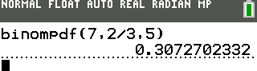{width=25%}

- [Avec Casio :]
    1. Touche **```OPTN```** puis choisir **```STAT```**, **```DIST```**, **```BINM```** et **```Bpd```**.
    2. Saisir les paramètres de l'énoncé : **```BinominalePD(5,7,2/3)```**
    3. 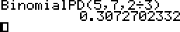{width=25%}

- [Avec le tableur :]
    1. Saisir dans une cellule : **```=LOI.BINOMIALE(5;7;2/3;0)```**
    2. {width=25%}

On trouve $P(X = 5) \approx 0,31$. La probabilité d'obtenir 5 fois un nombre supérieur ou égal à 3 est environ égale à 0,31.

(c) $P(X \leq 5)$

- [Avec Texas Instruments :]
    1. Touches **```2nd```** et **```VAR```** puis choisir **```binomFRép```** (ou **```binomcdf```**).
    2. Saisir les paramètres de l'énoncé : **```binomFRép(7,2/3,5)```**
    3. 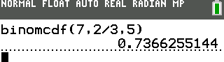{width=25%}

- [Avec Casio :]
    1. Touche **```OPTN```** puis choisir **```STAT```**, **```DIST```**, **```BINM```** et **```Bcd```**
    2. Saisir les paramètres de l'énoncé : **```BinominaleCD(5,7,2/3)```**
    3. 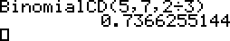{width=25%}

- [Avec le tableur :]
    1. Saisir dans une cellule : **```=LOI.BINOMIALE(5;7;2/3;1)```**
    2. 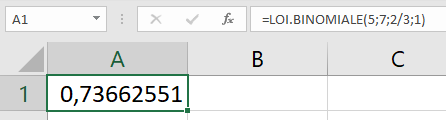{width=25%}

On trouve $P\left( X \leq 5 \right) \approx 0,74$.

La probabilité d'obtenir au plus 5 fois un nombre supérieur ou égal à 3 est environ égale à 0,74.

(d) $P(X \geq 3)$

$P(X \geq 3) = 1 - P(X \leq 2) \approx 1 - 0,045$ (à l'aide de la calculatrice ou du tableur)

$P(X \geq 3) \approx 0,955$.

## Méthode : Établir une loi binomiale avec une calculatrice ou un tableur

Soit $X$ une variable aléatoire qui suit une loi binomiale de paramètre $n = 5$ et $p = 0,4$.

Représenter graphiquement la loi suivie par $X$ par un diagramme en bâtons.

On commence par afficher le tableau de valeurs exprimant $P(X = k)$ pour $k$ entier, $0 \leq k \leq 5$.

- [Avec Texas Instruments :]
    1. Touche **```Y=```** et saisir comme dans le paragraphe précédent
    2. Afficher la table : Touches **```2nd```** et **```GRAPH```**
    3. 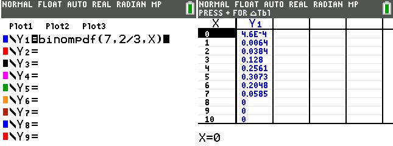{width=50%}

- [Avec Casio :]
    1. Dans **```MENU```**, choisir **```TABLE```** et saisir comme dans le paragraphe précédent
    2. Afficher la table : Touche **```TABL```**
    3. 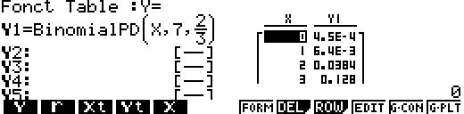{width=50%}

- [Avec le tableur :]
    1. Saisir dans la cellule ```B1``` : **```=LOI.BINOMIALE(A1;5;0,4;0)```**
    2. Copier cette formule vers le bas
    4. 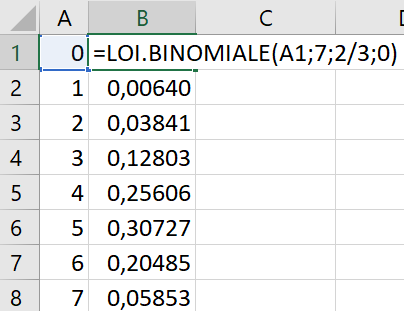{width=25%}

\newpage

## Représentation graphique de la loi binomiale

On peut, représenter une loi binomiale à l'aide d'un diagramme en bâtons. On représentera

- En abscisse, le nombre de succès $k$
- En ordonnée, $P(X=K)$

Voici la représentation de la loi binomiale $\mathcal{B}\left( 7 , \dfrac{2}{3} \right)$
\begin{center}
\begin{tikzpicture}
\begin{axis}[
width=10cm,height=7cm,
xtick={0,1,...,8},ytick={0.0,0.05,...,0.35},
y tick label style={/pgf/number format/.cd,fixed},ymajorgrids = true,ybar,
xlabel={$k$},ylabel={$P(X=k)$}]
\addplot coordinates{(0,4.5724737082761794E-4)(1,0.006401463191586647)(2,0.0384087791495199)(3,0.128029263831733)(4,0.25605852766346604)(5,0.30727023319615915)(6,0.20484682213077263)(7,0.058527663465935055)};
\end{axis}
\end{tikzpicture}
\end{center}

## Propriété : Espérance de la loi binomiale

Soit la variable aléatoire $X$ qui suit la loi binomiale de paramètres $n$ et $p$. On a : $$E(X) = n \times p$$

### Exemple {-}

On lance **5 fois** un dé à six faces.

On considère comme **succès** le fait d'**obtenir 5 ou 6**.

On considère la variable aléatoire $X$ donnant le nombre de succès.

On a donc : $p = \dfrac{2}{6} = \dfrac{1}{3}$ et $n = 5$.

Ainsi : $E\left( X \right) = 5 \times \dfrac{1}{3} = \dfrac{5}{3} \approx 1,7$

On peut espérer obtenir environ $1,7$ fois un 5 ou un 6, en 5 lancers.

## Méthode : Calculer l'espérance d'une loi binomiale

Un QCM comporte 8 questions. A chaque question, trois solutions sont proposées ; une seule est exacte. On répond au hasard à chaque question.

> a) Combien de bonnes réponses peut-on espérer obtenir ?

---

(a) Soit $X$ la variable aléatoire qui compte le nombre de bonnes réponses.

$X$ suit une loi binomiale de paramètre $n = 8$ et $p=\dfrac{1}{3}$.

$$E\left( X \right) = 8 \times \dfrac{1}{3} = \dfrac{8}{3}$$

On peut espérer obtenir $\dfrac{8}{3}$ bonnes réponses en répondant au hasard.

# Coefficients binomiaux

### Exemple : {-}

\begin{center}
\begin{tikzpicture}
\tikzset{grow=right,level distance=3cm,sibling distance=0cm}
\tikzset{every tree node/.style={anchor=base west}}
\tikzset{edge from parent/.append style={line width=0.5mm}}
\Tree [.{} 
        [.$E$ 
            [.$E$ 
                [.$E\longrightarrow{EEE}$ ]
                \edge node[auto=left]{$p$};[.$S\longrightarrow{EES}$ ]
            ]
        \edge node[auto=left]{$p$};[.$S$
                [.$E\longrightarrow{ESE}$ ]
                \edge node[auto=left]{$p$};[.$S\longrightarrow{ESS}$ ]
            ]
        ] 
        \edge node[auto=left]{$p$};[.$S$
            [.$E$
                [.$E\longrightarrow{SEE}$ ]
                \edge node[auto=left]{$p$};[.$S\longrightarrow{SES}$ ]
            ]
            \edge node[auto=left]{$p$};[.$S$
                [.$E\longrightarrow{SSE}$ ]
                \edge node[auto=left]{$p$};[.$S\longrightarrow{SSS}$ ]
            ]
        ]
    ]
\end{tikzpicture}
\end{center}

On a représenté dans un arbre de probabilité les issues d'une expérience suivant un schéma de Bernoulli composé de $3$ épreuves de Bernoulli de paramètre $p$.

$X$ est la variable aléatoire qui donne le nombre de succès.

Combien existe-t-il de chemins conduisant à $2$ succès parmi $3$ épreuves ?

On dit aussi : "Combien existe-t-il de **combinaisons** de $2$ parmi $3$ ?"

- (Succès ; Succès ; Échec)
- (Succès ; Échec ; Succès)
- (Échec ; Succès ; Succès)

Il existe donc trois combinaisons de 2 parmi 3 et on note : $\begin{pmatrix}3\\2\end{pmatrix} = 3$.

## Définition : Coefficient binomial

On réalise une expérience suivant un schéma de Bernoulli de paramètre $n$ et $p$.

On appelle **coefficient binomial** ou **combinaison de $k$ parmi $n$**, noté  $\begin{pmatrix}n\\k\end{pmatrix}$, le nombre de chemins conduisant à $k$ succès parmi $n$ épreuves sur l'arbre représentant l'expérience.

## Propriétés : Coefficients binomiaux remarquables

(a) $\begin{pmatrix}n\\0\end{pmatrix} = 1$

$\longrightarrow$ Il n'y a qu'un seul chemin correspondant à 0 succès parmi $n$ épreuves : **(Échec, Échec, ... , Échec)**
  
(b) $\begin{pmatrix}n\\n\end{pmatrix} = 1$

$\longrightarrow$ Il n'y a qu'un seul chemin correspondant à $n$ succès parmi $n$ épreuves : **(Succès, Succès, ... , Succès)**

(c) $\begin{pmatrix}n\\1\end{pmatrix} = n$ 

$\longrightarrow$ Il n'y a $n$ chemins correspondant à 1 succès parmi $n$ épreuves :

> - **(Succès, Échec, Échec, ... , Échec)**
> - **(Échec, Succès, Échec, ... , Échec)**
> - **(Échec, Échec, Succès, ... , Échec)**
> - **...**
> - **(Échec, Échec, Échec, ... , Succès)**

## Méthode : Déterminer un coefficient binomial à l'aide de la calculatrice ou d'un tableur

Il est possible de vérifier les résultats à l'aide d'une calculatrice ou d'un tableur.
 
Pour calculer $\begin{pmatrix}25\\20\end{pmatrix}$, on saisie : **```25 combinaison 20```** ou **```25 nCr 20```** suivant le modèle de calculatrice.

- [Avec Texas Instruments :] Pour accéder à **```nCr```** , il faut appuyer sur **```MATH```** >
Avec un tableur, la fonction se nomme **```COMBIN```**.

- [Avec Excel :] Pour calculer $\begin{pmatrix}25\\20\end{pmatrix}$, on saisie : **```=COMBIN(25;20)```**

| 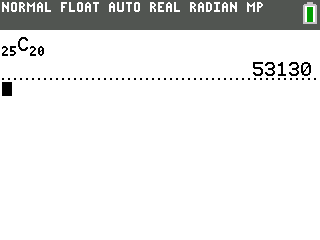{width=30%} | 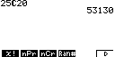{width=30%} | 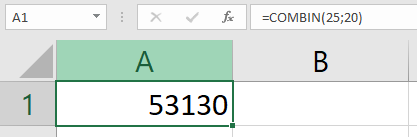{width=30%}|
|:-:|:-:|:-:|
| Texas Instruments TI-84 CE | Casio Graph 85 | Tableur |

\newpage

## Triangle de Pascal

Le tableau ci-dessous permet de déterminer un coefficient binomial. Pour construire ce tableau, il faut remarquer que le nombre présent dans une case est égale à la somme de **la case d'au-dessus** et de **la case d'au-dessus à gauche**.

| $n$\\$k$ || 0 | 1 | 2 | 3 | 4 | 5 | 6 |
|:-:|:-:|:-:|:-:|:-:|:-:|:-:|:-:|:-:|
| 0 ||  1  |     |     |     |     |     |     |
| 1 ||  1  |  1  |     |     |     |     |     |
| 2 ||  1  |  2  |  1  |     |     |     |     |
| 3 ||  1  |  3  |  3  |  1  |     |     |     |
| 4 ||  1  |  4  |  6  |  4  |  1  |     |     |
| 5 ||  1  |  5  |  10 | 10  |  5  |  1  |     |
| 6 ||  1  |  6  |  15 | 20  | 15  |  6  |  1  |
| 7 ||  1  | ... | ... | ... | ... | ... | ... |

### Exemple : {-}

On peut lire dans le tableau $\begin{pmatrix}4\\2\end{pmatrix}=6$

| $n$\\$k$ || 0 | 1 | **2** | 3 | 4 | 5 | 6 |
|:-:|:-:|:-:|:-:|:-:|:-:|:-:|:-:|:-:|
| 0 ||  1  |     |     |     |     |     |     |
| 1 ||  1  |  1  |     |     |     |     |     |
| 2 ||  1  |  2  |  1  |     |     |     |     |
| 3 ||  1  |  3  |  3  |  1  |     |     |     |
| **4** ||  1  |  4  |  **6**  |  4  |  1  |     |     |
| 5 ||  1  |  5  |  10 | 10  |  5  |  1  |     |
| 6 ||  1  |  6  |  15 | 20  | 15  |  6  |  1  |
| 7 ||  1  | ... | ... | ... | ... | ... | ... |

En effet, $\begin{pmatrix}4\\2\end{pmatrix} = \begin{pmatrix}3\\2\end{pmatrix}+\begin{pmatrix}3\\1\end{pmatrix}=3+3=6$

### Propriété : Coefficients du triangle de Pascal

$$\begin{pmatrix}n\\k\end{pmatrix} = \begin{pmatrix}n - 1 \\k - 1\end{pmatrix} + \begin{pmatrix}n - 1 \\k\end{pmatrix}$$

### Démonstration pour $n = 5$, $k = 3$ : {-}

$$\begin{pmatrix}5\\3\end{pmatrix} = \begin{pmatrix}4\\2\end{pmatrix} + \begin{pmatrix}4\\3\end{pmatrix}$$

Il y a deux **types de chemins** comportant 3 succès parmi 5 épreuves :

- Ceux qui commencent par un **succès** : il y en a 2 parmi 4, soit $\begin{pmatrix}4\\2\end{pmatrix}$.
  - En effet, dans l'arbre, il reste à dénombrer 2 succès parmi 4 expériences.
- Ceux qui commencent par un **échec** : il y en a 3 parmi 4, soit $\begin{pmatrix}4\\3\end{pmatrix}$.
  - En effet, dans l'arbre, il reste à dénombrer 3 succès parmi 4 expériences.

Ces deux types de chemins sont disjoints, donc : $\begin{pmatrix}5\\3\end{pmatrix} = \begin{pmatrix}4\\2\end{pmatrix} + \begin{pmatrix}4\\3\end{pmatrix}$.

## Propriété : Application à la loi binomiale

Soit une variable aléatoire $X$ qui suit la loi binomiale $\mathcal{B}\left(n;p\right)$.

$$P\left( X = k \right) = \begin{pmatrix}n\\k\end{pmatrix}p^{k}\left( 1 - p \right)^{n - k}$$

## Méthode : Calculer les probabilités d'une loi binomiale

Une urne contient $5$ boules gagnantes et $7$ boules perdantes. Une expérience consiste à tirer au hasard 4 fois de suite une boule et de la remettre.

On appelle $X$ la variable aléatoire qui associe le nombre de tirages gagnants.

> a) Prouver que $X$ suit une loi binomiale.

> b) Calculer la probabilité d'obtenir $3$ boules gagnantes.

---

(a) On répète 4 fois une expérience à deux issues : boules gagnantes ($5$ issues) ; boules perdantes ($7$ issues).

Le **succès** est "obtenir une boule gagnante".

La **probabilité du succès** sur un tirage est égale à $\dfrac{5}{12}$.

Les paramètres de la loi binomiale sont donc : $n=4$ et $p=\dfrac{5}{12}$.

(b) $P\left( X = 3 \right)$

\begin{align*}
P\left( X = 3 \right) &= \begin{pmatrix}4\\3\end{pmatrix}\times\left(\dfrac{5}{12}\right)^{3}\times\left( 1 - \frac{5}{12} \right)^{4 - 3}\\
\quad &= \begin{pmatrix}4\\3\end{pmatrix}\times \left( \frac{5}{12} \right)^{3}\times \left( \frac{7}{12} \right)^{4 - 3}\\
\quad &= \begin{pmatrix}4\\3\end{pmatrix}\times \left( \frac{5}{12} \right)^{3} \times \frac{7}{12}\\
\quad &= \begin{pmatrix}4\\3\end{pmatrix}\times \frac{125}{1728} \times \frac{7}{12}\\
\quad &= \begin{pmatrix}4\\3\end{pmatrix}\times \frac{875}{20736}
\end{align*}

On détermine la valeur de la combinaison $\begin{pmatrix}4\\3\end{pmatrix}$ à l'aide du triangle de Pascal.

| $n$\\$k$ || 0 | 1 | 2 | **3** | 4 | 5 | 6 |
|:-:|:-:|:-:|:-:|:-:|:-:|:-:|:-:|:-:|
| 0 ||  1  |     |     |     |     |     |     |
| 1 ||  1  |  1  |     |     |     |     |     |
| 2 ||  1  |  2  |  1  |     |     |     |     |
| 3 ||  1  |  3  |  3  |  1  |     |     |     |
| **4** ||  1  |  4  |  6  |  **4**  |  1  |     |     |
| 5 ||  1  |  5  |  10 | 10  |  5  |  1  |     |

On a donc $\begin{pmatrix}4\\3\end{pmatrix} = 4$, et donc :

$$P\left( X = 3 \right) = 4 \times \frac{875}{20736} = \frac{875}{5184} \approx 0,17.$$
