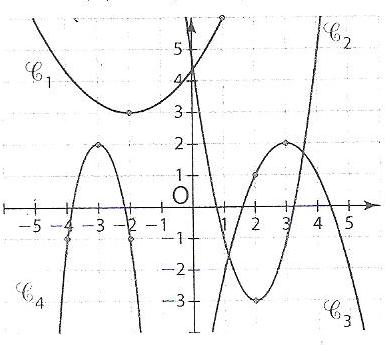
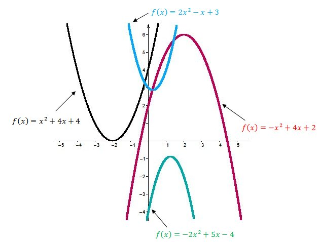
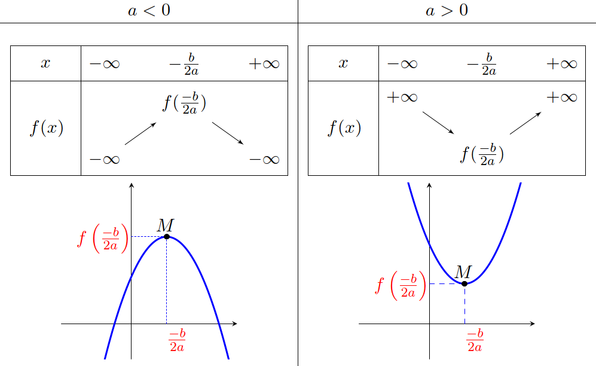

# Définition et représentation

## Définition : Fonction du 2^nd^ degré

On appelle **fonction polynôme de degré 2** toute fonction $f$ définie sur $\mathbb{R}$ par une expression de la forme 

$$f\left( x \right) = ax^{2} + bx + c$$

où **$a$**, **$b$** et **$c$** $\in \mathbb{R}$ avec $a \neq 0$.

### Remarque : {-}

Une fonction polynôme de degré 2 s'appelle fonction **trinôme du 2^nd^ degré** ou **"trinôme"**.

---

### Exemples et contre-exemples : {-}

(1) $f\left( x \right) = 3x^{2} - 7x + 3$

> Fonction du 2^nd^ degré $\Rightarrow a=3$ , $b=-7$ et $c=3$

\quad

. . .

(2) $g\left( x \right) = \dfrac{1}{2}x^{2} - 5x + \dfrac{3}{5}$

> Fonction du 2^nd^ degré $\Rightarrow a=\dfrac{1}{2}$ , $b=-5$ et $c=\dfrac{3}{5}$

\quad

. . .

(3) $h\left( x \right) = 4 - 2x^{2}$

> Fonction du 2^nd^ degré $\Rightarrow a=-2$ , $b=0$ et $c=4$

---

(4) $k\left( x \right) = \left( x - 4 \right)\left( 5 - 2x \right)$

> $\begin{aligned}
(x-4)(5-2x) & =(5\times x)-(2x\times x)-(4\times 5)+(2\times 4x) \\
            & =-2x^2+13x-20
\end{aligned}$

> $k(x)=-2x^2+13x-20\Rightarrow$ Fonction du 2^nd^ degré $\Rightarrow a=-2$ , $b=13$ et $c=-20$

. . .

(5) $m\left( x \right) = 5x - 3$ 

> $m(x)$ est une fonction polynôme de degré 1 (fonction affine).

. . .

(6) $n\left( x \right) = 5x^{4} - 7x^{3} + 3x - 8$

> $n(x)$ est une fonction polynôme de degré 4.

---

## Variations et représentation graphique

### Exemple {-}

Soit $f$ définie sur $\mathbb{R}$ par : $f(x) = 2x^2-4x+5$.

> Calculons quelques valeurs de $f(x)$.

. . .

- $f(-2)=2\times (-2)^2-4\times (-2)+5=21$
- $f(-1)=2\times (-1)^2-4\times (-1)+5=11$
- $f(0)=2\times (0)^2-4\times (0)+5=5$
- ...

. . .

|   $x$  | -2 | -1 | 0 | 1 | 2 |  3 |  4 |
|:------:|:--:|:--:|:-:|:-:|:-:|:--:|:--:|
| $f(x)$ | 21 | 11 | 5 | 3 | 5 | 11 | 21 |

---

|   $x$  | -2 | -1 | 0 | 1 | 2 |  3 |  4 |
|:------:|:--:|:--:|:-:|:-:|:-:|:--:|:--:|
| $f(x)$ | 21 | 11 | 5 | 3 | 5 | 11 | 21 |

. . .

\begin{center}
\begin{tikzpicture}[line cap=round,line join=round,>=triangle 45,x=1.0cm,y=0.2cm]
\begin{axis}[x=1.0cm,y=0.2cm,axis lines=middle,ymajorgrids=true,xmajorgrids=true,xmin=-2.5,xmax=4.5,ymin=-2.0,ymax=25.0,xtick={-2.0,-1.0,...,4.0},ytick={-0.0,5.0,...,25.0},]
\clip(-2.5,-2.) rectangle (4.5,25.);
\draw[line width=1.pt,color=blue,smooth,samples=100,domain=-2.5:4.5] plot(\x,{2.0*(\x)^(2.0)-4.0*(\x)+5.0});
\begin{scriptsize}
\draw [fill=black] (3.,11.) circle (1.5pt);
\draw [fill=black] (2.,5.) circle (1.5pt);
\draw [fill=black] (1.,3.) circle (1.5pt);
\draw [fill=black] (0.,5.) circle (1.5pt);
\draw [fill=black] (-2.,21.) circle (1.5pt);
\draw [fill=black] (-1.,11.) circle (1.5pt);
\draw [fill=black] (4.,21.) circle (1.5pt);
\end{scriptsize}
\end{axis}
\end{tikzpicture}
\end{center}

---

### Remarque {-}
- La représentation graphique d'une fonction du 2^nd^ degré est une **parabole**.

. . .

{width="30%"}
{width="30%"}
{width="30%"}

---

### Propriété : Minimum et maximum

Soit $f$ une fonction définie sur $\mathbb{R}$ par $f(x) = ax^2+bx+c$, avec $a \neq 0$.

. . .

- Si $a > 0$, $f$ admet un **minimum** pour $x=\dfrac{-b}{2a}$.

> Ce **minimum** est égal à $f\left(\dfrac{-b}{2a}\right)$.

. . .

- Si $a < 0$, $f$ admet un **maximum** pour $x=\dfrac{-b}{2a}$.

> Ce **maximum** est égal à $f\left(\dfrac{-b}{2a}\right)$.

. . .

On appelle :

- $\alpha=\dfrac{-b}{2a}$

- $\beta=f\left(\dfrac{-b}{2a}\right)$

---

### Propriété : Variations de $f(x)=ax^2+bx+c$

{width="80%"}

---

{width="60%"}

---

### Méthode : Etudier les variations d'une fonction du 2^nd^ degré {-}

> Variations de $f\left( x \right) = -x^{2} + 4x - 1$.

. . .

On a $a=-1$ , $b=4$ et $c=-1$. 

\quad

$\alpha=\dfrac{-b}{2a} = \dfrac{-4}{2\times (-1)}= 2$ et $\beta=f(\alpha)=f(2)=-(2)^2+4\times 2 -1 =3$

. . .

\quad

Sommet de la parabole $\Rightarrow S(2;3)$.

---

Sommet de la parabole $\Rightarrow S(2;3)$.

\quad

. . .

$a<0$ donc le tableau de variation de $f$ est :
\begin{tikzpicture}
   \tkzTabInit{$x$ / 0.75 , $f(x)$ / 1.5}{$+\infty$, $2$, $+\infty$}
   \tkzTabVar{-/ $-\infty$, +/ $3$, -/ $-\infty$}
\end{tikzpicture}

---

\begin{center}
\begin{tikzpicture}
   \tkzTabInit{$x$ / 0.75 , $f(x)$ / 1.5}{$+\infty$, $2$, $+\infty$}
   \tkzTabVar{-/ $-\infty$, +/ $3$, -/ $-\infty$}
\end{tikzpicture}
\end{center}

\begin{center}
\begin{tikzpicture}[line cap=round,line join=round,>=triangle 45,x=1.0cm,y=1.0cm]
\begin{axis}[x=1.0cm,y=1.0cm,axis lines=middle,ymajorgrids=true,xmajorgrids=true,xmin=-0.5,xmax=4.5,ymin=-1.5,ymax=4.0,xtick={-0.0,1.0,...,4.0},ytick={-1.0,0.0,...,4.0},]
\clip(-0.5,-1.5) rectangle (4.5,4.);
\draw[line width=2.pt,color=blue,smooth,samples=100,domain=-0.5:4.5] plot(\x,{0-(\x)^(2.0)+4.0*(\x)-1.0});
\draw [line width=1.pt,dash pattern=on 2pt off 2pt] (0.,3.)-- (2.,3.);
\draw [line width=1.pt,dash pattern=on 2pt off 2pt] (2.,3.)-- (2.,0.);
\begin{scriptsize}
\draw [color=black] (2.,3.)-- ++(-2.5pt,-2.5pt) -- ++(5.0pt,5.0pt) ++(-5.0pt,0) -- ++(5.0pt,-5.0pt);
\draw[color=black] (2.0951127605442115,3.252050267803505) node {$S$};
\end{scriptsize}
\end{axis}
\end{tikzpicture}
\end{center}

---

# Forme factorisée

Il se peut que le polynôme du 2^nd^ degré ne se présente pas sous la forme **developpée** mais sous une forme **factorisée** comme par exemple : $$f(x)= (x-1)(x-2)$$

En effet :

$\begin{aligned}
f(x) & = (x-1)(x-2) \\
     & = x^2-2x-1x+2 \\
     & = x^2-3x+2 \\
     & \Rightarrow a=1 \text{ , } b=-3 \text{ et } c=2
\end{aligned}$

---

## Définition

----------------J'en suis là