# Vecteurs et produit scalaire

---

## Rappels sur les vecteurs

### Caractéristiques 

Un vecteur a pour caractéristiques :

* Une longueur (ou norme)
* Une direction (une droite parallèle à ce vecteur)
* Un sens (de $A$ vers $B$ ou l'inverse)

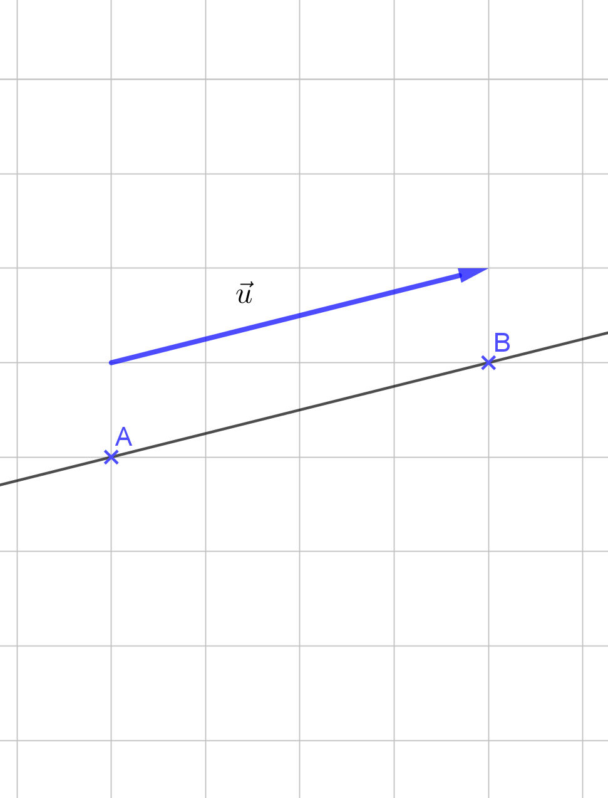

---

### Norme d'un vecteur

On note la norme (longueur) d'un vecteur avec des $\left\lVert\ldots\right\lVert$

#### Exemple

$$\left\lVert\overrightarrow{AB}\right\lVert=\left\lVert\vec{u}\right\lVert=AB=\sqrt{17}$$

---

### Vecteurs égaux

Deux vecteurs sont égaux s'ils ont :

* même longueur (même norme)
* même direction et même sens

#### Exemple

$\vec{u}=\vec{v}\quad$ et $\quad\vec{t}=\overrightarrow{AB}$
Mais $\quad\vec{t}\neq\overrightarrow{BA}\quad$ (sens contraires)

---

### Multiplication par un nombre

Le produit du vecteur $\vec{u}\neq\vec{0}$ par le réel $k\neq0$ est un vecteur noté $~k\vec{u}~$ tel que :

* si $k > 0$, alors
  * $\vec{u}$ et $k\vec{u}$ ont la même direction, le même sens.
  * $\left\lVert k\vec{u}\right\lVert=k\times\left\lVert\vec{u}\right\lVert$

* si $k < 0$, alors
  * $\vec{u}$ et $k\vec{u}$ ont la même direction mais sens **contraire**.
  * $\left\lVert k\vec{u}\right\lVert=-k\times\left\lVert\vec{u}\right\lVert$

---

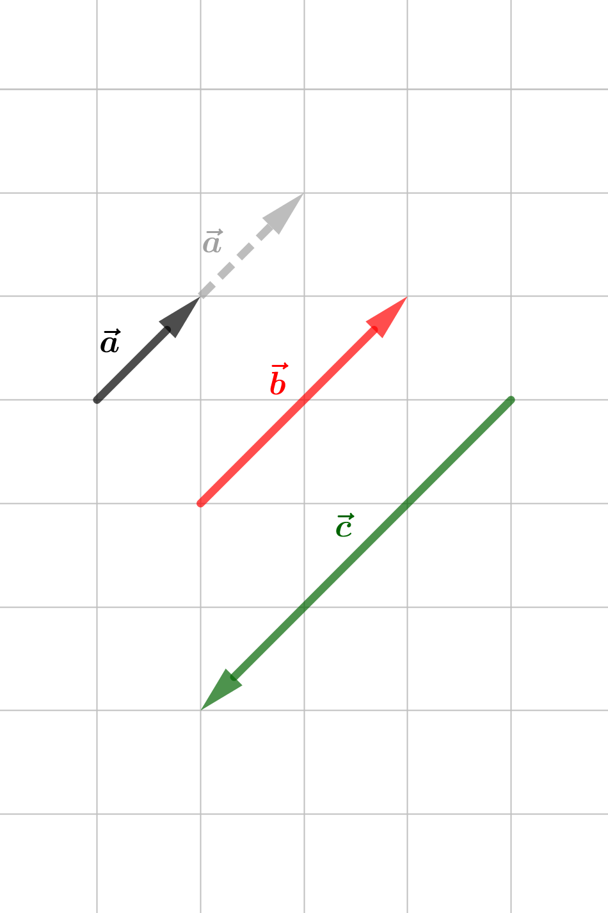

#### Exemple

$\vec{b}=2\times \vec{a}\quad$ et $\quad\vec{c}=-3\times \vec{a}$

---

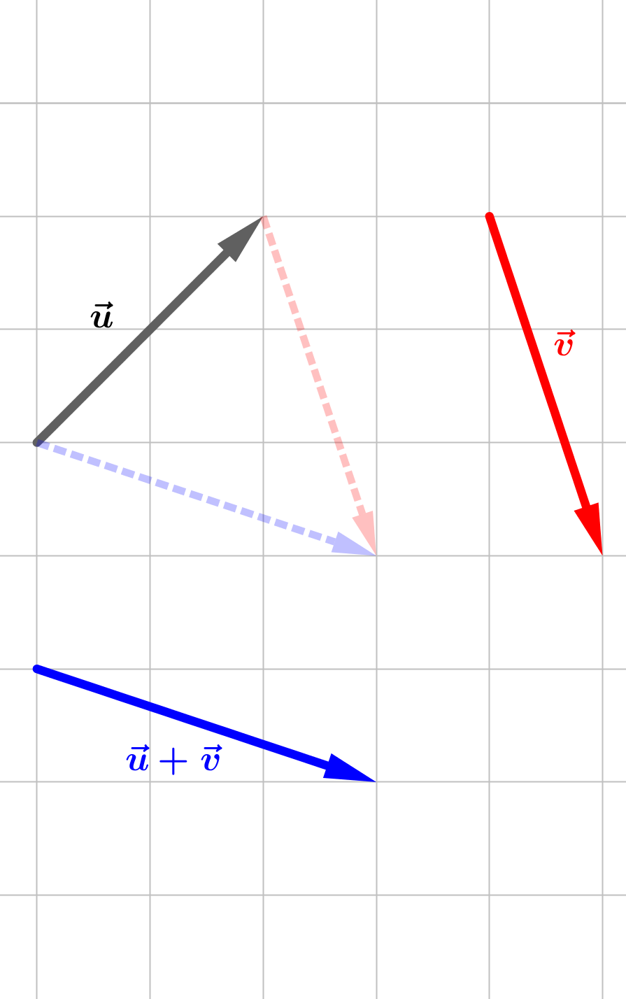

### Somme de vecteurs

L'enchaînement d'une **translation de vecteur $\vec{u}$** et d'une **translation de vecteur $\vec{v}$** est une **translation de vecteur $\vec{u}+\vec{v}$**.

Ce vecteur $\vec{u}+\vec{v}$ est appelé **somme** des vecteurs $\vec{u}$ et $\vec{v}$.

---

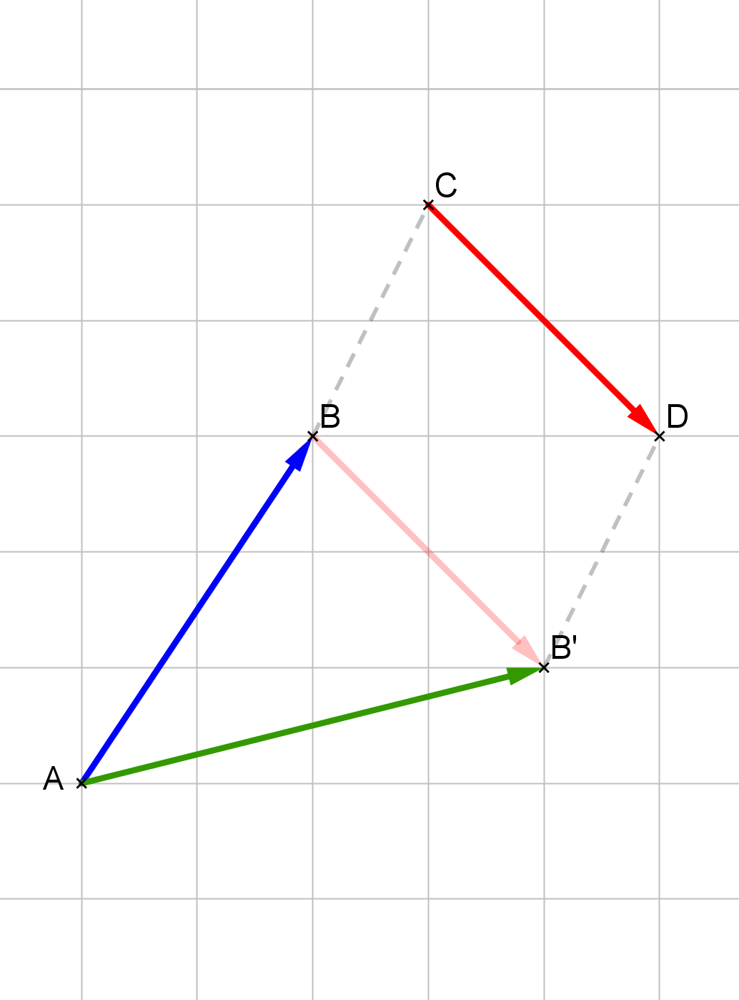

#### Exemple

$\overrightarrow{BB^\prime}$ est un représentant de $\overrightarrow{CD}$ donc :

$$\overrightarrow{BB^\prime}=\overrightarrow{CD}$$

On a donc :

$$\color{blue}\overrightarrow{AB}\color{black}+\color{red}\overrightarrow{CD}\color{black}=\color{green}\overrightarrow{AB^\prime}\color{black}$$

---

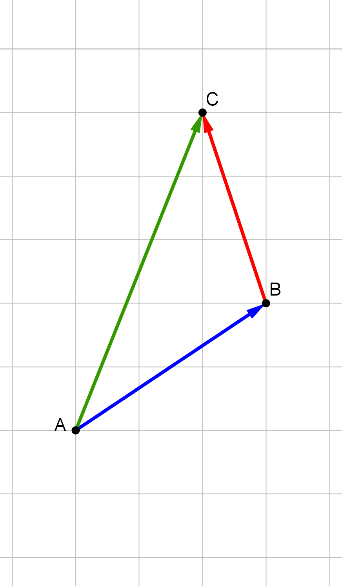

### Relation de Chasles

Quels que soient les points $A$, $B$ et $C$ du plan on a :

$$\color{blue}\overrightarrow{AB}\color{black}+\color{red}\overrightarrow{BC}\color{black}=\color{green}\overrightarrow{AC}\color{black}$$

---

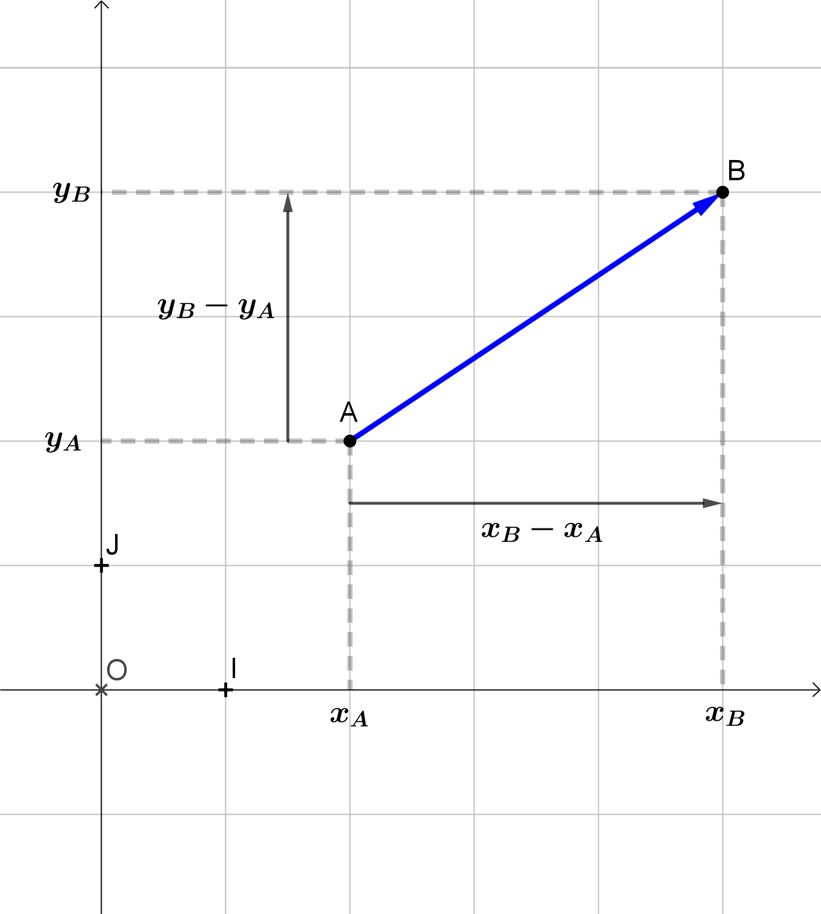

### Vecteurs dans un repère orthonormé

Dans le plan muni du repère $\left(O,I,J\right)$, les coordonnées du vecteur $\overrightarrow{AB}$ sont :

$$\overrightarrow{AB}\left(x_B-x_A~,~y_B-y_A\right)$$

On peut noter :
$$\overrightarrow{AB}\begin{pmatrix}x_B-x_A\\y_B-y_A\end{pmatrix}$$

---

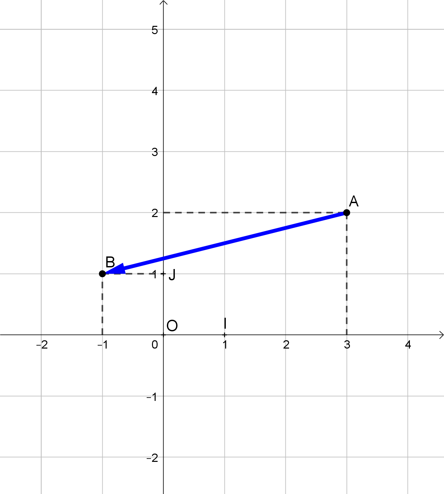

#### Exemple

Soit $\color{green}A(3,2)$ et $\color{red}B(-1,1)$, on a :

$$\overrightarrow{AB}\begin{pmatrix}\color{red}(-1)\color{black}-\color{green}3\\\color{red}1\color{black}-\color{green}2\end{pmatrix}~\rightarrow\overrightarrow{AB}\begin{pmatrix}-4\\-1\end{pmatrix}$$

---

### Égalité, somme de vecteurs et produit par un réel

Soit $\vec{u}\begin{pmatrix}x_{\vec{u}}\\y_{\vec{u}}\end{pmatrix}$ , $\vec{v}\begin{pmatrix}x_{\vec{v}}\\y_{\vec{v}}\end{pmatrix}$ et un réel $k\neq0$.

* $\vec{u}=\vec{v}\Leftrightarrow\begin{cases}x_{\vec{u}}=x_{\vec{v}}\\y_{\vec{u}}=y_{\vec{v}}\end{cases}\quad\rightarrow~$ Deux vecteurs de même coordonnées sont égaux
* $\vec{u}+\vec{v}\begin{pmatrix}x_{\vec{u}}+x_{\vec{v}}\\y_{\vec{u}}+y_{\vec{v}}\end{pmatrix}\quad\rightarrow~$On peut additionner les coordonnées des vecteurs
* $k\vec{u}\begin{pmatrix}k\times x_{\vec{u}}\\k\times y_{\vec{u}}\end{pmatrix}\quad\rightarrow~$On peut multiplier les coordonnées des vecteurs par $k$

---

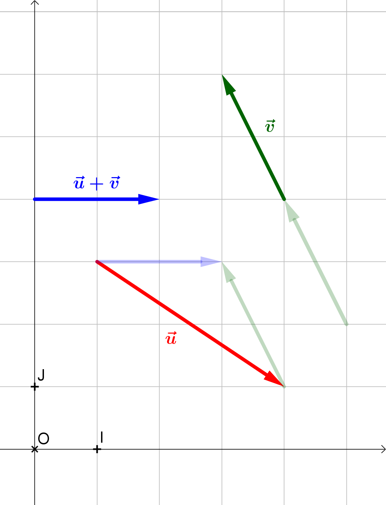

#### Exemple

Soit $\vec{u}\begin{pmatrix}3\\-2\end{pmatrix}$ , $\vec{v}\begin{pmatrix}-1\\2\end{pmatrix}$ et $k=2$.

On a :

* $\vec{u}+\vec{v}\begin{pmatrix}3+(-1)\\(-2)+2\end{pmatrix}~~~\rightarrow\vec{u}+\vec{v}\begin{pmatrix}2\\0\end{pmatrix}$
$$~$$
* $2\vec{v}\begin{pmatrix}2\times (-1)\\2\times 2\end{pmatrix}~~~\rightarrow2\vec{v}\begin{pmatrix}-2\\4\end{pmatrix}$

---

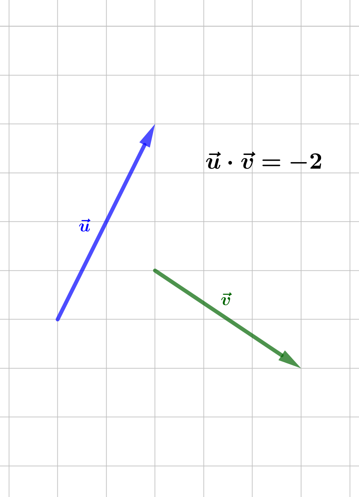

## Produit scalaire

Le **produit scalaire** de deux vecteurs est un **nombre réel**.

Il se note

$$\vec{u}\cdot\vec{v}$$

---

### Produit scalaire dans un repère orthonormé

Soit $\vec{u}\begin{pmatrix}x_{\vec{u}}\\y_{\vec{u}}\end{pmatrix}$ et $\vec{v}\begin{pmatrix}x_{\vec{v}}\\y_{\vec{v}}\end{pmatrix}$.

On a :

$$\boxed{\vec{u}\cdot\vec{v} = \left(x_{\vec{u}}\times x_{\vec{v}}\right) + \left(y_{\vec{u}}\times y_{\vec{v}}\right)}$$

---

#### Exemple

Soit $\vec{u}\begin{pmatrix}2\\4\end{pmatrix}$ et $\vec{v}\begin{pmatrix}3\\-2\end{pmatrix}$.

On a :

$$\begin{aligned}
\vec{u}\cdot\vec{v} & = \left(x_{\vec{u}}\times x_{\vec{v}}\right) + \left(y_{\vec{u}}\times y_{\vec{v}}\right)\\
                    & =  \left(2\times 3\right) + \left(4\times -2\right)\\
                    & =  6 + (-8) = -2
\end{aligned}$$

---

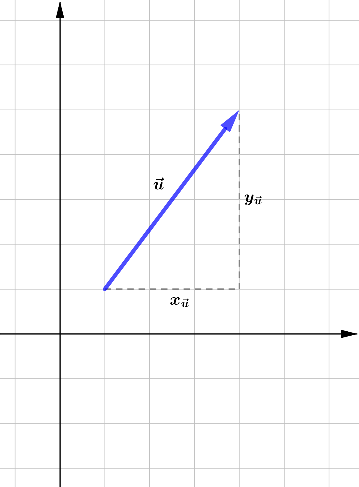

### Norme d'un vecteur

Soit $\vec{u}\begin{pmatrix}x_{\vec{u}}\\y_{\vec{u}}\end{pmatrix}$.

On a :

$$\left\lVert\vec{u}\right\lVert=\sqrt{\left(x_{\vec{u}}\right)^2+\left(y_{\vec{u}}\right)^2}$$

---

#### Exemple

Soit $\vec{u}\begin{pmatrix}2\\4\end{pmatrix}$ et $\vec{v}\begin{pmatrix}3\\-2\end{pmatrix}$.

On a :

$$\begin{aligned}
\color{blue}\left\lVert\vec{u}\right\lVert &\color{blue}=\sqrt{\left(x_{\vec{u}}\right)^2+\left(y_{\vec{u}}\right)^2}\\
& =\sqrt{2^2+4^2} = \sqrt{20}\\
\color{green}\left\lVert\vec{v}\right\lVert &\color{green}=\sqrt{\left(x_{\vec{v}}\right)^2+\left(y_{\vec{v}}\right)^2}\\
& =\sqrt{3^2+(-2)^2} = \sqrt{13}\\
\end{aligned}$$

---

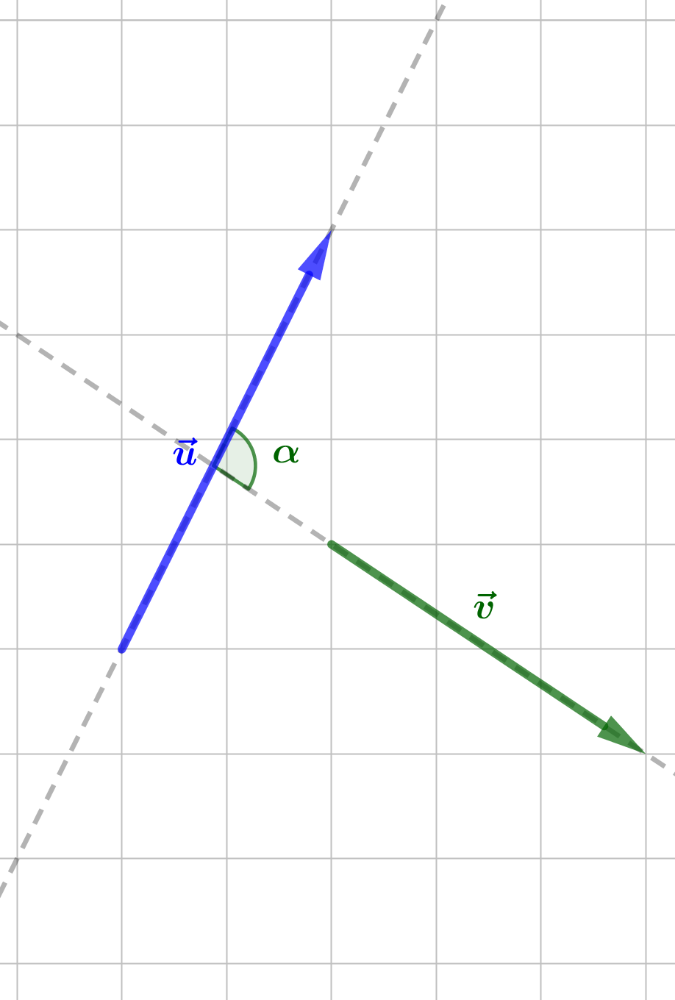

### Produit scalaire (2)

Soit $\vec{u}$ et $\vec{v}$, deux vecteurs du plan et $\alpha$ l'angle $\left(\vec{u} ; \vec{v}\right)$.

On a :

$$\boxed{\vec{u}\cdot\vec{v} = \left\lVert\vec{u}\right\lVert\times \left\lVert\vec{v}\right\lVert\times \cos\alpha}$$

---

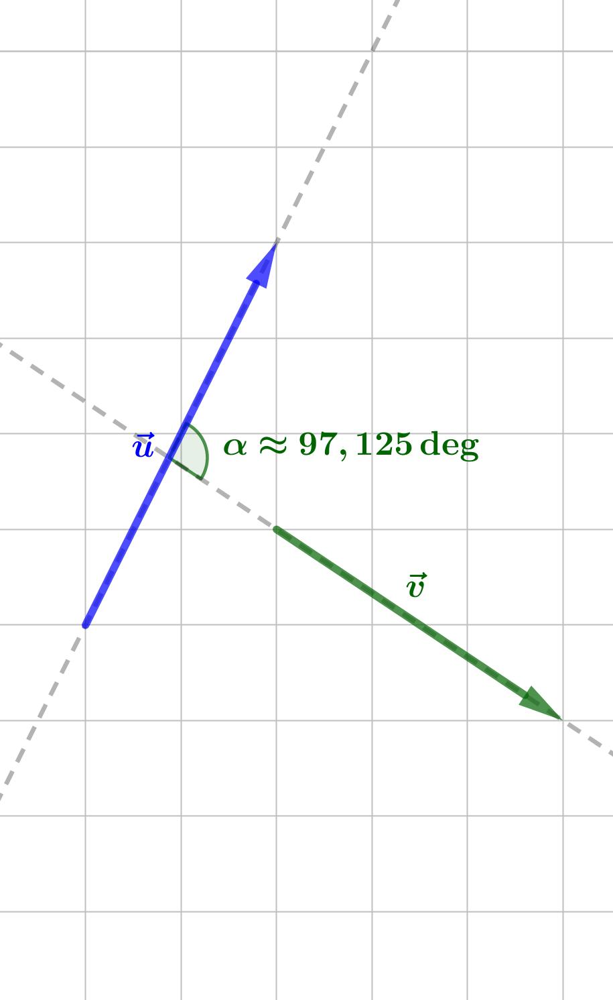

#### Exemple

$$\begin{aligned}
\vec{u}\cdot\vec{v} & = \left\lVert\vec{u}\right\lVert\times \left\lVert\vec{v}\right\lVert\times \cos\alpha\\
                    & = \sqrt{20} \times \sqrt{13}\times \cos(97,125\ldots)\\
                    & = \sqrt{260}\times \cos(97,125\ldots)\\
                    & = -2
\end{aligned}$$

---

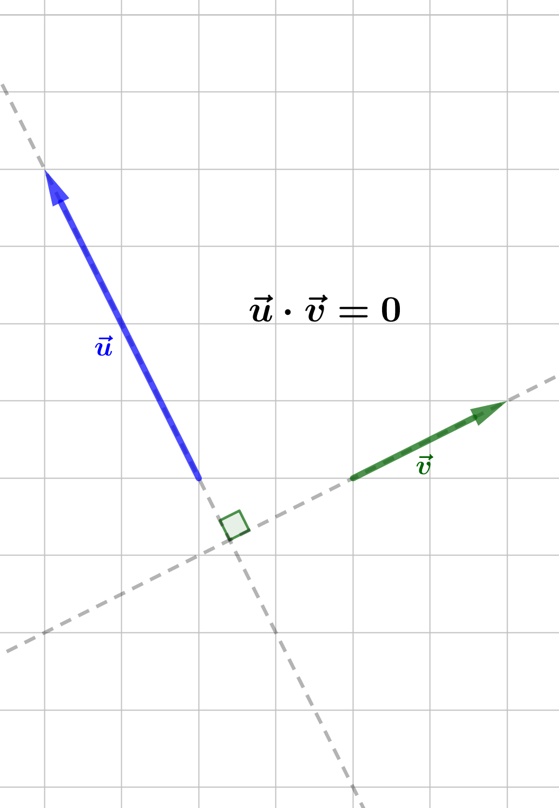

### Théorème fondamental :triangular_flag_on_post:

Soit $\vec{u}$ et $\vec{v}$, deux vecteurs du plan.

On a :

$$\boxed{\vec{u}\cdot\vec{v}=0~~\Leftrightarrow~~\vec{u}\perp\vec{v}}$$

---

#### Preuve

* Soit $\vec{u}$ et $\vec{v}$ tel que $\vec{u}\perp\vec{v}$.

$$\vec{u}\cdot\vec{v} = \left\lVert\vec{u}\right\lVert\times \left\lVert\vec{v}\right\lVert\times \cos(90^\circ)= \left\lVert\vec{u}\right\lVert\times \left\lVert\vec{v}\right\lVert\times 0 = 0$$

* Soit $\vec{u}$ et $\vec{v}$ tel que $\vec{u}\cdot\vec{v} = 0$.

$$\begin{aligned}
&~~\vec{u}\cdot\vec{v} = \left\lVert\vec{u}\right\lVert\times \left\lVert\vec{v}\right\lVert\times \cos(\alpha)= 0\\
\Leftrightarrow &~~\cos(\alpha)=0\\
\Leftrightarrow &~~\begin{cases}\alpha=90^\circ\\ \alpha=-90^\circ\end{cases}\Leftrightarrow\vec{u}\perp\vec{v}\\
\end{aligned}$$

---

### Propriétés du produit scalaire

* Commutativité : $~\vec{a}\cdot\vec{b}=\vec{b}\cdot\vec{a}$
* Associativité :
  * $\vec{a}\cdot\vec{b}\cdot\vec{c}=\vec{a}\cdot\left(\vec{b}\cdot\vec{c}\right)=\left(\vec{a}\cdot\vec{b}\right)\cdot\vec{c}$
  * $k\vec{a}\cdot\vec{b}=k\left(\vec{a}\cdot\vec{b}\right)=\vec{a}\cdot k\vec{b}$
* Distributivité :
  * $k\left(\vec{a}+\vec{b}\right)=k\vec{a}+k\vec{b}$
  * $\vec{a}\left(\vec{b}+\vec{c}\right)=\vec{a}\cdot\vec{b}+\vec{a}\cdot\vec{c}$

---

* Vecteur "au carré" : $\vec{a}^2=\vec{a}\cdot\vec{a}=\left\lVert\vec{a}\right\lVert^2$

* Identités remarquables :
  * $(\vec{a}+\vec{b})^2=\vec{a}^2+2\cdot\vec{a}\cdot\vec{b}+\vec{b}^2$
  * $(\vec{a}-\vec{b})^2=\vec{a}^2-2\cdot\vec{a}\cdot\vec{b}+\vec{b}^2$
  * $(\vec{a}-\vec{b})(\vec{a}+\vec{b})=\vec{a}^2-\vec{b}^2$

---

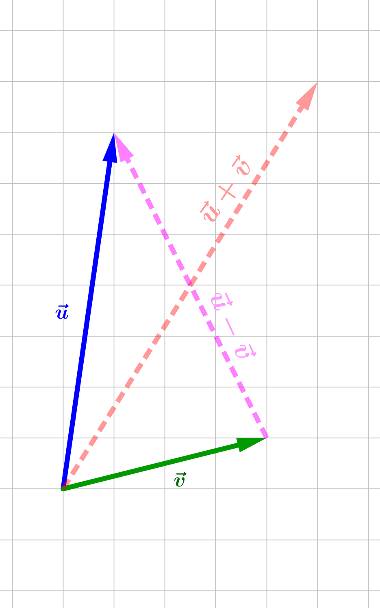

### Produit scalaire (3)

Soit $\vec{u}$ et $\vec{v}$, deux vecteurs du plan.

On a :

$$\boxed{\vec{u}\cdot\vec{v}=\dfrac{1}{2}\left(\left\lVert\vec{u}+\vec{v}\right\lVert^2-\left\lVert\vec{u}\right\lVert^2-\left\lVert\vec{v}\right\lVert^2\right)}$$

$$\boxed{\vec{u}\cdot\vec{v}=\dfrac{1}{2}\left(\left\lVert\vec{u}\right\lVert^2+\left\lVert\vec{v}\right\lVert^2-\left\lVert\vec{u}-\vec{v}\right\lVert^2\right)}$$

---

#### Preuve

$\begin{aligned}
                &\quad\left(\vec{u}+\vec{v}\right)^2  &=&\quad\vec{u}^2+2\vec{u}\cdot\vec{v}+\vec{v}^2\\
\Leftrightarrow &\quad2\vec{u}\cdot\vec{v}            &=&\quad\left(\vec{u}+\vec{v}\right)^2-\vec{u}^2-\vec{v}^2\\
\Leftrightarrow &\quad\vec{u}\cdot\vec{v}             &=&\quad\frac{1}{2}\left(\left(\vec{u}+\vec{v}\right)^2-\vec{u}^2-\vec{v}^2\right)\\
\Leftrightarrow &\quad\vec{u}\cdot\vec{v}             &=&\quad\frac{1}{2}\left(\left\lVert\vec{u}+\vec{v}\right\lVert^2-\left\lVert\vec{u}\right\lVert^2-\left\lVert\vec{v}\right\lVert^2\right)
\end{aligned}$

La seconde proposition se démontre de la même manière avec $\left(\vec{u}-\vec{v}\right)^2$

---

### :warning: Résumé :warning:

* $\boxed{\vec{u}\cdot\vec{v} = \left(x_{\vec{u}}\times x_{\vec{v}}\right) + \left(y_{\vec{u}}\times y_{\vec{v}}\right)}$
* $\boxed{\vec{u}\cdot\vec{v} = \left\lVert\vec{u}\right\lVert\times \left\lVert\vec{v}\right\lVert\times \cos\alpha}$
* $\boxed{\vec{u}\cdot\vec{v}=\dfrac{1}{2}\left(\left\lVert\vec{u}+\vec{v}\right\lVert^2-\left\lVert\vec{u}\right\lVert^2-\left\lVert\vec{v}\right\lVert^2\right)}$
* $\boxed{\vec{u}\cdot\vec{v}=\dfrac{1}{2}\left(\left\lVert\vec{u}\right\lVert^2+\left\lVert\vec{v}\right\lVert^2-\left\lVert\vec{u}-\vec{v}\right\lVert^2\right)}$

---

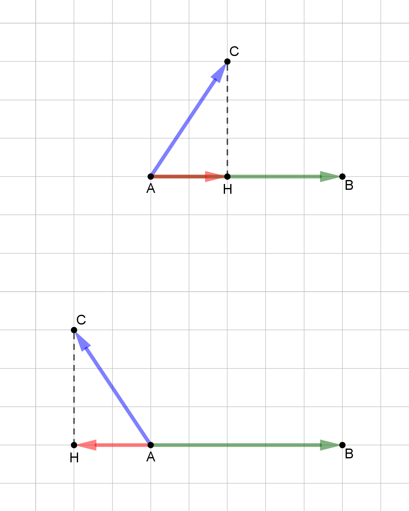

### Produit scalaire et projeté orthogonal

Soient $A$, $B$, $C$ trois points du plan et $H$ le projeté orthogonal de $C$ sur la $(AB)$.

On a :

$$\boxed{\overrightarrow{AB}\cdot\overrightarrow{AC}=\overrightarrow{AB}\cdot\overrightarrow{AH}}$$

Donc :

* Si $H\in\left[AB\right)\Rightarrow\overrightarrow{AB}\cdot\overrightarrow{AC}=AB\times AH$
* Si $H\notin\left[AB\right)\Rightarrow\overrightarrow{AB}\cdot\overrightarrow{AC}=-AB\times AH$

---

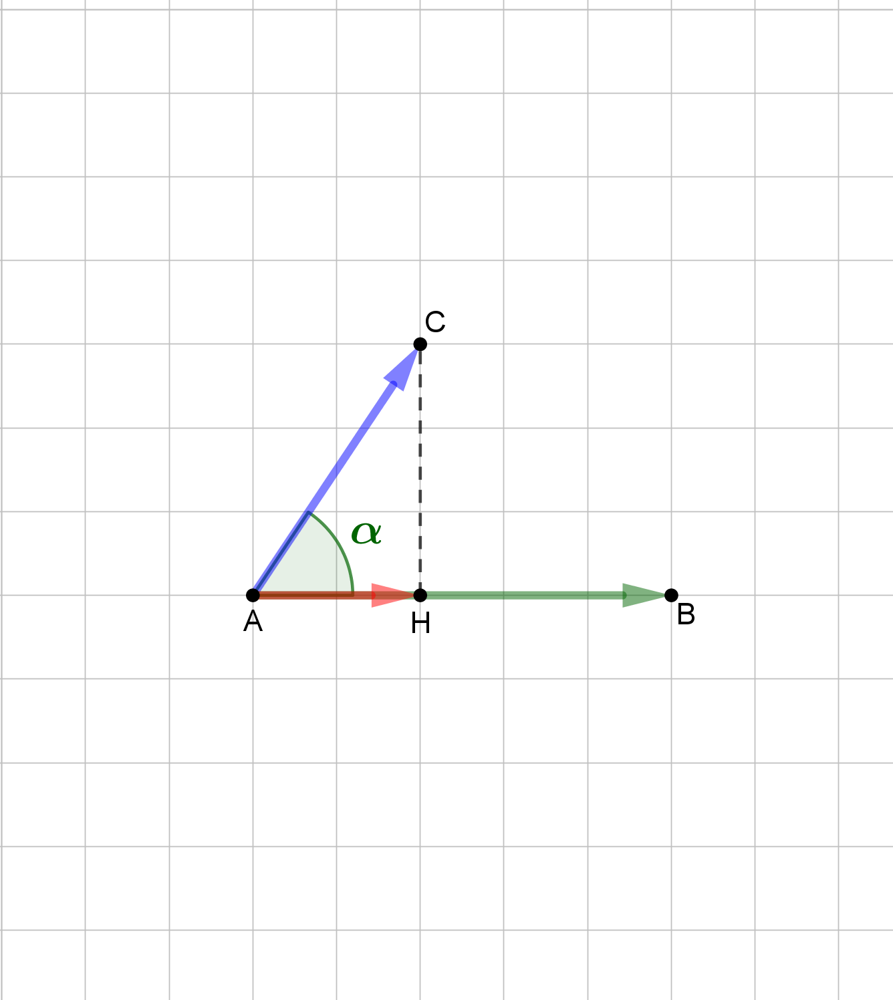

### Preuve

Cas où $H\in\left[AB\right)$

On a :

* $\overrightarrow{AB}\cdot\overrightarrow{AC}= AB\times AC\times \cos\alpha$
* $\cos\alpha=\frac{AH}{AC}=\frac{\text{Adjacent}}{\text{Hypothénuse}}$

Donc
$\begin{aligned}\overrightarrow{AB}\cdot\overrightarrow{AC}&= AB\times AC\times\frac{AH}{AC}\\&=AB\times AH\end{aligned}$

---

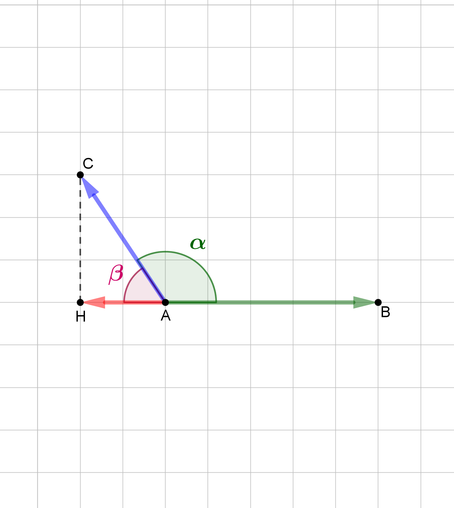

Cas où $H\notin\left[AB\right)$

On a $\quad\alpha=180^\circ-\beta\quad$ donc :

$\begin{aligned}
\cos\alpha&=\cos(180^\circ-\beta)\\&=-\cos(\beta)=\frac{-AH}{AC}\\\end{aligned}$

Donc
$\begin{aligned}\overrightarrow{AB}\cdot\overrightarrow{AC}&= AB\times AC\times\frac{-AH}{AC}\\&=-AB\times AH\end{aligned}$
