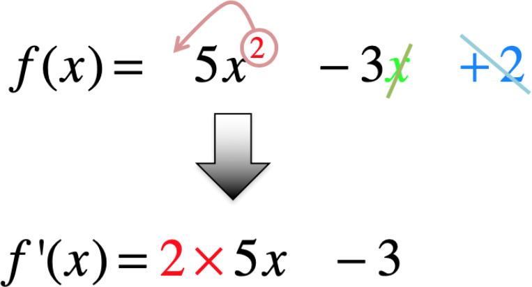
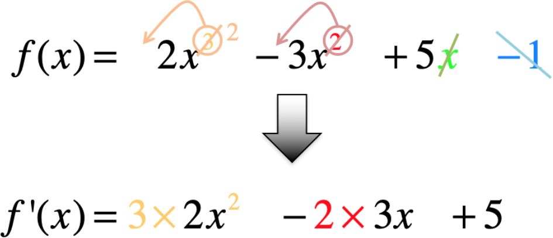
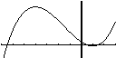
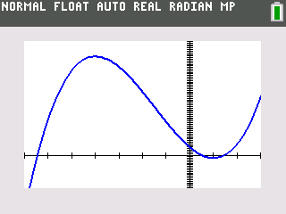

---

\newpage

# Fonction dérivée

## Définition : Fonction dérivée

La fonction qui à tout réel $x$ associe le nombre dérivé de $f$ en $x$ est appelée **fonction dérivée** de $f$ et se note $f^{'}$.

## Formules de dérivation de fonctions usuelles :

  Fonction $f$                                  Dérivée $f^{'}$
  --------------------------------------------- ---------------------------------
  $f\left( x \right) = a$, $a\in\mathbb{R}$     $f^{'}\left( x \right) = 0$
  $f\left( x \right) = ax$, $a\in\mathbb{R}$    $f^{'}\left( x \right) = a$
  $f\left( x \right) = x^{2}$                   $f^{'}\left( x \right) = 2x$
  $f\left( x \right) = x^{3}$                   $f^{'}\left( x \right) = 3x^{2}$

## Formules d'opération sur les fonctions dérivées :

  $\left( f + g \right)^{'} = f^{'} + g^{'}$
  ------------------------------------------------------------------------------------
  $\left( k\times f \right)^{'} = k\times f^{'}\qquad\text{avec}\quad k \in\mathbb{R}$

## Méthode : Calculer des fonctions dérivées

Dans chaque cas, calculer la fonction dérivée de la fonction $f$ :

> a) $f\left( x \right) = 3x$
> b) $f\left( x \right) = x^{2} + 5$
> c) $f\left( x \right) = 5x^{3}$
> d) $f\left( x \right) = 3x^{2} + 4x$

---

(a) $f\left( x \right) = 3x$
\begin{align*}
f^{'}(x) &= 3\times\left( x \right)^{'}\\
         &= 3\times 1\\
         &= 3
\end{align*}
$$f\left( x \right) = 3x\Rightarrow f^{'}\left( x \right) = 3$$

(b) $f\left( x \right) = x^{2} + 5$
\begin{align*}
f^{'}(x) &= \left( x^{2} \right)^{'} + \left( 5 \right)^{'}\\
         &= 2x + 0\\
         &= 2x
\end{align*}
$$f\left(x\right)=x^{2}+5\Rightarrow f^{'}(x)=2x$$

(c) $f\left( x \right) = 5x^{3}$
\begin{align*}
f^{'}(x) &= 5\times \left( x^{3} \right)^{'}\\
         &= 5 \times {3x}^{2}\\ 
         &= 15x^{2}
\end{align*}
$$f\left(x\right)=5x^{3}\Rightarrow f^{'}(x)=15x^{2}$$

(d) $f\left( x \right) = 3x^{2} + 4x$
\begin{align*}
f^{'}(x) &= 3\times \left( x^{2} \right)^{'} + 4\times \left(x\right)^{'}\\
         &= 3\times 2x + 4\times 1\\
         &= 6x+4 
\end{align*}
$$f\left( x \right) = 3x^{2} + 4x\Rightarrow f^{'}(x)=6x+4$$

# Fonction dérivée d'une fonction polynôme

## Définition : Dérivée d'une fonction polynôme de degré 2

Soit $f$ une fonction polynôme du second degré définie sur $\mathbb{R}$ par $f\left( x \right) = ax^{2} + bx + c$.

On appelle **fonction dérivée** de $f$, notée $f^{'}$, la fonction définie sur $\mathbb{R}$ par $f^{'}\left( x \right) = 2ax + b$.

### Remarque : {-}

Soit $f$ une fonction polynôme du second degré définie par $f\left( x \right) = 5x^{2} - 3x + 2$.

Pour déterminer la fonction dérivée $f^{'}$, on applique la technique suivante :

{width=50%}

## Méthode : Déterminer la fonction dérivée d'une fonction polynôme de degré 2

Déterminer les fonctions dérivées des fonctions suivantes :

> a) $f\left( x \right) = 4x^{2} - 6x + 1$ 
> b) $g\left( x \right) = x^{2} - 2x + 6$
> c) $h\left( x \right) = -3x^{2} + 2x + 8$
> d) $k\left( x \right) = x^{2} + x + 1$
> e) $l\left( x \right) = {5x}^{2} + 5$ 
> f) $m\left( x \right) = - x^{2} + 7x$

---

(a) $f\left( x \right) = 4x^{2} - 6x + 1$ 
\begin{align*}
f^{'}\left( x \right) &= \left(4x^{2}\right)^{'} - \left(6x\right)^{'} + \left(1\right)^{'}\\
                      &= 4 \times 2x - 6 \times 1 + 0\\
                      &= 8x - 6
\end{align*}

(b) $g\left( x \right) = x^{2} - 2x + 6$
\begin{align*}
g^{'}\left( x \right) &= \left(x^{2}\right)^{'} - \left(2x\right)^{'} + \left(6\right)^{'}\\
                      &= 2 \times x - 2 \times 1 + 0\\
                      &= 2x - 2\\
                      &= 2\left(x-1\right)
\end{align*}

Avec la même méthode on trouve :

| Fonction | Dérivée |
|:-|:-|
| $h\left( x \right) = - 3x^{2} + 2x + 8$ | $h^{'}\left( x \right) = -3 \times \left( 2x \right) + 2= -6x+2$ |                                                 |
| $k\left( x \right) = x^{2} + 1x + 1$    | $k^{'}\left( x \right) = 2x + 1$                          |
| $l\left( x \right) = 5{x}^{2} + 5$      | $l^{'}\left( x \right) = 5 \times 2x = 10x$               |
| $m\left( x \right) = - x^{2} + 7x$      | $m^{'}\left( x \right) = -2x + 7$                         |

## Définition : Dérivée d'une fonction polynôme de degré 3

Soit $f$ une fonction polynôme de degré 3 définie sur $\mathbb{R}$ par $f\left( x \right) = ax^{3} + bx^{2} + cx + d$.

On appelle **fonction dérivée** de $f$, notée $f^{'}$, la fonction définie sur $\mathbb{R}$ par $$\ f^{'}\left( x \right) = 3ax^{2} + 2bx + c$$.

### Remarque {-}

Soit $f$ une fonction polynôme du troisième degré définie par : $f\left( x \right) = 2x^{3} - 3x^{2} + 5x - 1$.

Pour déterminer la fonction dérivée $f^{'}$, on applique la technique suivante :

{width=50%}

## Méthode : Déterminer la fonction dérivée d'une fonction polynôme de degré 3

Déterminer les fonctions dérivées des fonctions suivantes :

> a) $f\left( x \right) = x^{3}- 3x^{2} + 2x - 5$
> b) $g\left( x \right) = 5x^{3}+ 2x^{2} + 2x - 7$
> c) $h\left( x \right) = - 2x^{3}- 3x^{2} - 7x + 8$
> d) $k\left( x \right) = -x^{3}+ x^{2} + 1$
> e) $l\left( x \right) = 4x^{3} + 1$
> f) $m\left( x \right) = -x^{3} + 7x$

---

a) $f\left( x \right) = x^{3}- 3x^{2} + 2x - 5$
\begin{align*}
f^{'}\left( x \right) &= \left(x^{3}\right)^{'} -\left(3x^{2}\right)^{'} + \left(2x\right)^{'} - \left(5\right)^{'}\\
                      &= 3 \times x^{2} - 3 \times 2x + 2-0\\
                      &= 3x^{2}-6x+2
\end{align*}

b)$\text{\ g}\left( x \right) = 5x^{3}+ 2x^{2} + 2x - 7$
\begin{align*}
g^{'}\left( x \right) &= \left(5x^{3}\right)^{'} +\left(2x^{2}\right)^{'} + \left(2x\right)^{'} - \left(7\right)^{'}\\
                      &= 5 \times 3x^{2} + 2 \times 2x + 2-0\\
                      &= 15x^{2}+4x+2
\end{align*}

c) $h\left( x \right) = -2x^{3}-3x^{2} - 7x + 8$
\begin{align*}
h^{'}\left( x \right) &= \left(-2x^{3}\right)^{'} -\left(3x^{2}\right)^{'} - \left(7x\right)^{'} + \left(8\right)^{'}\\
                      &= -2 \times 3x^{2} - 3 \times 2x -7+0\\
                      &= -6x^{2}-6x-7
\end{align*}

Avec la même méthode on trouve :

| Fonction | Dérivée |
|:-|:-|
| $k\left( x \right) = {- x}^{3}{+ x}^{2} + 1$  | $k'\left( x \right) = - 3x^{2} + 2 \times x = - 3x^{2} + 2x$  |
| $l\left( x \right) = {4x}^{3} + 1$            | $l^{'}(x) = 3 \times 4x^{2} = 12x^{2}$                        |
| $m\left( x \right) = {- x}^{3} + 7x$          | $m'\left( x \right) = - 3x^{2} + 7$                           |

# Variations d'une fonction polynôme

## Théorème : Signe de la dérivée et variation d'une fonction

- Si $f^{'}(x) \leq 0$, alors $f$ est **décroissante**.
- Si $f^{'}(x) \geq 0$, alors $f$ est **croissante**.

## Méthode : Étudier les variations d'une fonction polynôme de degré 2

Soit la fonction $f$ définie sur $\mathbb{R}$ par $f\left( x \right) = 2x^{2} - 8x + 1$.

> a) Calculer la fonction dérivée de $f$.
> b) Déterminer le signe de $f^{'}$ en fonction de $x$.
> c) Dresser le tableau de variations de $f$.

---

(a) On a : $f^{'}\left( x \right) = 2 \times 2x - 8 = 4x - 8$.

(b) On commence par résoudre l'équation $f^{'}(x) > 0$.
\begin{align*}
f^{'}(x) &> 0\\
4x-8 &>0\\
4x &> 8\\
x &>2
\end{align*}

La fonction $f^{'}$ est une fonction affine représentée par une droite dont le coefficient directeur $4$ est positif.

Elle est donc d'abord négative (avant $x = 2$) puis ensuite positive (après $x = 2$).

(c) On dresse alors le tableau de variations en appliquant le théorème :
\begin{center}
\begin{tikzpicture}
   \tkzTabInit[lgt = 5]{$x$ / 1 , $f^{'}(x)=4x-8$ / 1, $f\left( x \right) = 2x^{2} - 8x + 1$ /2}{$-\infty$, $2$, $+\infty$}
   \tkzTabLine{, - , z, + , }
   \tkzTabVar{+/ $+\infty$, -/$f(2)=-7$ , +/ $+\infty$}
\end{tikzpicture}
\end{center}

On a : $f\left( 2 \right) = 2{\times 2}^{2} - 8 \times 2 + 1 = - 7$.

La fonction $f$ admet un minimum égal à $-7$ en $x = 2$.

Vérification :

\begin{figure}
\begin{center}
\begin{tikzpicture}[line cap=round,line join=round,>=triangle 45,x=1.0cm,y=1.0cm]
\begin{axis}[
width=14cm,height=8cm,axis lines=middle,ymajorgrids=true,xmajorgrids=true,
xmin=-1,xmax=5,ymin=-10,ymax=10,
xtick={-9.0,-8.0,...,9.0},ytick={-10.0,-5.0,...,10.0},]
\draw [line width=1.5pt,color=red!20,domain=-6:2] plot(\x,{4.0*(\x)-8.0});
\draw [line width=1.5pt,color=green!20,domain=2:5] plot(\x,{4.0*(\x)-8.0});
\draw (3,5) [line width=1.5pt,color=black!20,dashed] node[anchor=south] {$\mathcal{C}_{f^{'}}$};
\draw [line width=2.pt,color=blue,smooth,domain=-6:5] plot(\x,{2.0*(\x)^(2.0)-8.0*(\x)+1.0});
\draw [color=blue,line width=1.pt,->] (0,10) -- (1,0);
\draw [color=blue,line width=1.pt,->] (3,0) -- (4,10);
\draw [color=black!50,line width=1.pt,dashed] (2,-7) -- (0,-7);
\draw [color=black!50,line width=1.pt,dashed] (2,0) -- (2,-7);
\draw (0,-7) node[anchor=east] {$f(2)=-7$};
\draw (3,-5) node[anchor=north west] {$\mathcal{C}_{f}$};
\draw [fill=black] (2,-7) circle (2.0pt);
\end{axis}
\end{tikzpicture}
\end{center}
\caption{Représentation graphique $f(x)=2x^2-8x+1$ et de sa dérivée}
\end{figure}

\newpage

## Méthode : Étudier les variations d'une fonction polynôme de degré 3

Soit la fonction $f$ définie sur $\mathbb{R}$ par $f\left( x \right) = x^{3} + \frac{9}{2}x^{2} - 12x + 5$.

> a) Calculer la fonction dérivée de $f$.
> b) Démontrer que $f^{'}\left( x \right) = 3\left( x + 4 \right)\left( x - 1 \right)$.
> c) Déterminer le signe de $f^{'}$ en fonction de $x$.
> d) Dresser le tableau de variations de $f$.
> e) À l'aide de la calculatrice, représenter graphiquement la fonction $f$.

---

(a) On a : $f\left( x \right) = x^{3} + \frac{9}{2}x^{2} - 12x + 5$
\begin{align*}
f^{'}\left( x \right) &= \left(x^{3}\right)^{'} +\left(\frac{9}{2}x^{2}\right)^{'} - \left(12x\right)^{'} + \left(5\right)^{'}\\
                      &= 3 \times x^{2} + \frac{9}{2} \times 2x - 12 +0\\
                      &= 3x^{2}+9x-12
\end{align*}

On a donc : $f^{'}\left( x \right) = 3x^{2} + 9x - 12$\qquad $\longleftarrow$ Fonction polynôme de degré 2

(b) Développons $3\left( x + 4 \right)\left( x - 1 \right)$ :
\begin{align*}
3\left( x + 4 \right)\left( x - 1 \right) &=\left( 3x + 12 \right)\left( x - 1 \right)\\
                                          &= (3x\times x) - (3\times x) + (12\times x) - (12\times 1)\\
                                          &= 3x^{2} + 9x - 12\\
                                          &= f^{'}(x)
\end{align*}

Donc $f^{'}\left( x \right) = 3\left( x + 4 \right)\left( x - 1 \right)$.

(c) Commençons par résoudre l'équation $f^{'}\left( x \right) = 0$ :
$$3\left( x + 4 \right)\left( x - 1 \right) = 0$$
\begin{align*}
x + 4 & =0    & x-1 & =0\\
x     & =-4   & x   & =1
\end{align*}

La dérivée s'annule en $-4$ et $1$.

\newpage

Le coefficient de $x^{2}$, égal à $3$, est **positif**, donc la parabole est tournée dans le sens **cuvette**. La dérivée est donc **positive** à l'extérieur de ses racines $-4$ et $1$.

\begin{figure}
\begin{center}
\begin{tikzpicture}[line cap=round,line join=round,>=triangle 45,x=1.0cm,y=1.0cm]
\begin{axis}[
width=14cm,height=8cm,axis lines=middle,ymajorgrids=true,xmajorgrids=true,
xmin=-6,xmax=4,ymin=-20,ymax=40,
xtick={-9.0,-8.0,...,9.0},ytick={-50.0,-40.0,...,50.0},]
\draw [line width=2.pt,color=green,smooth,samples=100,domain=-6:-4] plot(\x,{3.0*((\x)+4.0)*((\x)-1.0)});
\draw [line width=2.pt,color=red,smooth,samples=100,domain=-4:1] plot(\x,{3.0*((\x)+4.0)*((\x)-1.0)});
\draw [line width=2.pt,color=green,smooth,samples=100,domain=1:4] plot(\x,{3.0*((\x)+4.0)*((\x)-1.0)});
\draw [color=olive](-5,30) node[anchor=north west] {$f^{'}(x)>0$};
\draw [color=olive](2,20) node[anchor=north west] {$f^{'}(x)>0$};
\draw [color=red](-2,-10) node[anchor=north west] {$f^{'}(x)<0$};
\draw (3,40) node[anchor=north west] {$\mathcal{C}_{f^{'}}$};
\draw [fill=black] (-4.,0.) circle (2.0pt);
\draw [fill=black] (1.,0.) circle (2.0pt);
\end{axis}
\end{tikzpicture}
\end{center}
\caption{Représentation graphique de la dérivée de $f(x)$}
\end{figure}

(d) On en déduit le tableau de variations de $f$ :
\begin{center}
\begin{tikzpicture}
   \tkzTabInit[lgt = 5]{$x$ / 1 , $f^{'}\left( x \right) = 3\left( x + 4 \right)\left( x - 1 \right)$ / 1, $f\left( x \right) = x^{3} + \frac{9}{2}x^{2} - 12x + 5$ /2}{$-\infty$, $-4$, $1$, $+\infty$}
   \tkzTabLine{, + , z, - , z , + , }
   \tkzTabVar{-/ $+\infty$, +/ $f(-4)=61$ , -/ $f(1)=-\frac{3}{2}$, +/ +$\infty$}
\end{tikzpicture}
\end{center}

On a  : 

- $f\left(-4\right)=\left(-4\right)^{3}+\dfrac{9}{2}{\times\left(-4\right)}^{2}-12\times\left(-4\right)+5=61$
- $f\left( 1 \right) = 1^{3} + \dfrac{9}{2}{\times 1}^{2} - 12 \times 1 + 5 = -\dfrac{3}{2}$

\newpage

Vérification :

\begin{figure}
\begin{center}
\begin{tikzpicture}[line cap=round,line join=round,>=triangle 45,x=1.0cm,y=1.0cm]
\begin{axis}[
width=14cm,height=8cm,axis lines=middle,ymajorgrids=true,xmajorgrids=true,
xmin=-7,xmax=3,ymin=-20,ymax=70,
xtick={-9.0,-8.0,...,9.0},ytick={-100.0,-90.0,...,100.0},]
\draw[line width=1.pt,color=green!20,smooth,samples=100,domain=-7:-4] plot(\x,{3.0*((\x)+4.0)*((\x)-1.0)});
\draw[line width=1.pt,color=red!20,smooth,samples=100,domain=-4:1] plot(\x,{3.0*((\x)+4.0)*((\x)-1.0)});
\draw[line width=1.pt,color=green!20,smooth,samples=100,domain=1:3] plot(\x,{3.0*((\x)+4.0)*((\x)-1.0)});
\draw (2,20) [line width=1.5pt,color=black!20,dashed] node[anchor=south east] {$\mathcal{C}_{f^{'}}$};
\draw[line width=1.pt,color=blue,smooth,samples=100,domain=-7:3] plot(\x,{(\x)^(3.0)+9.0/2.0*(\x)^(2.0)-12.0*(\x)+5.0});
\draw (-2,40) node[anchor=south west] {$\mathcal{C}_{f}$};
\draw [fill=black] (-4,0) circle (2.0pt);
\draw [fill=black] (1,0) circle (2.0pt);
\end{axis}
\end{tikzpicture}
\end{center}
\caption{Représentation graphique $f(x)$ et $f^{'}(x)$}
\end{figure}

(e) Représentation à l'aide de la calculatrice

{height=3cm}

{height=4cm}