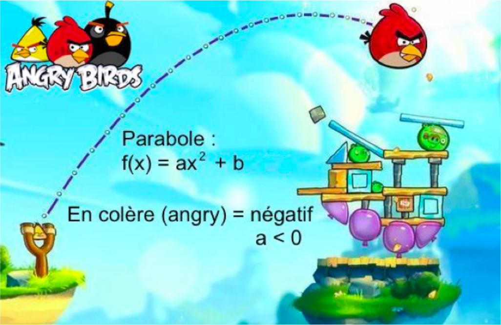

---

\newpage

# Définition et représentation graphique

## Définition : Fonctions polynômes du 2^nd^ degré

Les fonctions définies sur $\mathbb{R}$ par $x \longmapsto ax^{2}$ ou $x \longmapsto ax^{2} + b$ sont des **fonctions polynômes du 2^nd^ degré**.

Les coefficients $a$ et $b$ sont des réels donnés avec $a \neq 0$.

### Exemples et contre-exemples : {-}

- $f\left( x \right) = 3x^{2} + 3$
- $g\left( x \right) = x^{2} - 4$ sont des fonctions polynômes du 2^nd^ degré.
- $h\left( x \right) = 4 - 2x^{2}$
- $m\left( x \right) = 5x - 3$ est une fonction polynôme de degré 1 (fonction affine).
- $n\left( x \right) = 5x^{4} - x^{3} + 6x - 8$ est une fonction polynôme de degré 4.

## Représentation graphique

\begin{figure}
\begin{center}
\begin{tikzpicture}[line cap=round,line join=round,>=triangle 45,x=1.0cm,y=1.0cm]
\begin{axis}[width=10cm,height=10cm,axis lines=middle,ymajorgrids=true,xmajorgrids=true,xmin=-3,xmax=3,ymin=-3,ymax=3,xtick={-9.0,-8.0,...,9.0},ytick={-5.0,-4.0,...,5.0},]
\draw[line width=2pt,color=red,smooth,domain=-3:3] plot(\x,{(\x)^(2.0)-2.0});
\draw (1,-1) node[anchor=north west] {$f(x)=x^{2}-3$};
\end{axis}
\end{tikzpicture}
\end{center}
\caption{Représentation graphique de $f(x)=x^2-2$}
\end{figure}

La représentation graphique d'une fonction polynôme du 2^nd^ degré s'appelle une **parabole**.

\newpage

## Propriétés : Variations d'une fonction polynôme du 2^nd^ degré

Soit $f$ une fonction polynôme du 2^nd^ degré, telle que $f\left( x \right) = ax^{2} + b$.

- Si $a$ est positif, $f$ est d'abord décroissante, puis croissante : **cuvette**.
- Si $a$ est négatif, $f$ est d'abord croissante, puis décroissante : **colline**.

\begin{figure}
\begin{center}
\begin{tikzpicture}[line cap=round,line join=round,>=triangle 45,x=1.0cm,y=1.0cm]
\begin{axis}[width=10cm,height=10cm,axis lines=middle,ymajorgrids=true,xmajorgrids=true,xmin=-2.9,xmax=2.9,ymin=-2.9,ymax=2.9,xtick={-9.0,-8.0,...,9.0},ytick={-5.0,-4.0,...,5.0},]
\draw[line width=2pt,color=red,smooth,domain=-3:3] plot(\x,{(\x)^(2.0)-2.0});
\draw (1,-1) node[anchor=north west] {$a>0$};
\end{axis}
\end{tikzpicture}\quad
\begin{tikzpicture}[line cap=round,line join=round,>=triangle 45,x=1.0cm,y=1.0cm]
\begin{axis}[width=10cm,height=10cm,axis lines=middle,ymajorgrids=true,xmajorgrids=true,xmin=-2.9,xmax=2.9,ymin=-2.9,ymax=2.9,xtick={-9.0,-8.0,...,9.0},ytick={-5.0,-4.0,...,5.0},]
\draw[line width=2pt,color=red,smooth,domain=-3:3] plot(\x,{-1*(\x)^(2.0)+2.0});
\draw (1,2) node[anchor=north west] {$a<0$};
\end{axis}
\end{tikzpicture}
\end{center}
\caption{Représentation d'une fonction du 2$^{\text{nd}}$ degré suivant le signe de $a$}
\end{figure}

{width=50%}

\newpage

## Propriété : Axe de symétrie et sommet

Les paraboles d'équation $y = ax^{2} + b$ ont pour axe de symétrie l'**axe des ordonnées** et pour **sommet** le point de coordonnées $\left(0 ;b\right)$.

### Exemple {-}

La fonction $f$ telle que $f\left( x \right) = - x^{2} + 2$ a pour représentation graphique une parabole dont les branches sont tournées vers le bas et dont le sommet est le point $S\left(0 ; 2\right)$. L'axe de symétrie de la parabole est l'axe des ordonnées.

\begin{figure}
\begin{center}
\begin{tikzpicture}[line cap=round,line join=round,>=triangle 45,x=1.0cm,y=1.0cm]
\begin{axis}[width=8cm,height=8cm,axis lines=middle,ymajorgrids=true,xmajorgrids=true,xmin=-2.9,xmax=2.9,ymin=-2.9,ymax=2.9,xtick={-9.0,-8.0,...,9.0},ytick={-5.0,-4.0,...,5.0},]
\draw[line width=2pt,color=red,smooth,domain=-3:3] plot(\x,{-1.0*(\x)^(2.0)+2.0});
\draw (2,-1) node[anchor=north west] {$\mathcal{C}_f$};
\draw (0,2) node[anchor=south west] {$S\left(0 ; 2\right)$};
\draw [line width=2.pt,dashed] (0.,-5) -- (0.,5.);
\draw [fill=blue] (0.,2.) circle (2.5pt);
\end{axis}
\end{tikzpicture}
\end{center}
\caption{Représentation graphique de $f\left( x \right) = - x^{2} + 2$}
\end{figure}

\newpage

## Méthode : Associer une fonction du 2^nd^ degré à sa représentation graphique

> a) Associer chaque fonction à sa représentation graphique :

\begin{figure}\begin{center}
    \begin{minipage}{0.45\linewidth}
        \begin{tikzpicture}[line cap=round,line join=round,>=triangle 45,x=1.0cm,y=1.0cm]
            \begin{axis}[width=11cm,height=11cm,axis lines=middle,ymajorgrids=true,xmajorgrids=true,xmin=-4.9,xmax=4.9,ymin=-4.9,ymax=5.9,xtick={-9.0,-8.0,...,9.0},ytick={-5.0,-4.0,...,5.0},]
                \draw[line width=2pt,color=red,smooth,domain=-5:5] plot(\x,{-3*(\x)^(2)});
                \draw[line width=2pt,color=yellow,smooth,domain=-5:5] plot(\x,{-0.25*(\x)^(2)+1});
                \draw[line width=2pt,color=green,smooth,domain=-5:5] plot(\x,{-1*(\x)^(2)+3});
                \draw[line width=2pt,color=blue,smooth,domain=-5:5] plot(\x,{0.25*(\x)^(2)+1});
                \draw[line width=2pt,color=black!50,smooth,domain=-5:5] plot(\x,{1*(\x)^(2)+3});
                \draw [fill=black] (0,0) circle (2.5pt);
                \draw [fill=black] (0,1) circle (2.5pt);
                \draw [fill=black] (0,3) circle (2.5pt);
            \end{axis}
        \end{tikzpicture}
    \end{minipage}
    \begin{minipage}{0.45\linewidth}
        \begin{align*}
            f(x)&=-x^{2}+3\\
            g(x)&=-3x^{2}\\
            h(x)&=x^{2}+3\\
            p(x)&=\dfrac{x^{2}}{4}+1\\
            q(x)&=-\dfrac{x^{2}}{4}+1
        \end{align*}
    \end{minipage}
\end{center}\end{figure}

---

(a)

1. La **parabole** \colorbox{red!60}{rouge} est la seule dont le sommet est l'origine $\left(0 ;0\right)$. Donc $b = 0$ dans l'écriture de la fonction $x \longmapsto ax^{2} + b$.

Ainsi, la **parabole** \colorbox{red!60}{rouge} est la fonction $g$ définie par $g\left( x \right) = - 3x^{2}$.

2. La **parabole** \colorbox{green}{verte} et la **parabole** \colorbox{black!40}{noire} ont toutes les deux pour sommet le point de coordonnées $\left(0 ; 3\right)$. Donc $b = 3$ dans l'écriture de la fonction $x \longmapsto ax^{2} + b$.

Ainsi, il faut choisir parmi les expressions :

  - $f\left( x \right) = -x^{2} + 3$ 
  - $h\left( x \right) = x^{2} + 3$

Les branches de la **parabole** \colorbox{black!40}{noire} sont tournées vers le haut donc $a>0$.

Donc, la **parabole** \colorbox{black!40}{noire} représente la fonction $h$ pour qui $a = 1 > 0$. $\quad\longrightarrow  h(x)=x^{2}+3$

Les branches de la **parabole** \colorbox{green}{verte} sont tournées vers le bas donc $a<0$.

Donc, la **parabole** \colorbox{green}{verte} représente la fonction $f$ pour qui $a=-1<0$. $\quad\longrightarrow  f(x)=-x^{2}+3$

3. La **parabole** \colorbox{blue!60}{bleue} et la **parabole** \colorbox{yellow}{jaune} ont toutes les deux pour sommet le point de coordonnées $\left(0 ; 1\right)$. Donc $b = 1$ dans l'écriture de la fonction $x \longmapsto ax^{2} + b$.

Ainsi, il faut choisir parmi les expressions : 

  - $p\left( x \right) =\dfrac{x^{2}}{4}+ 1$ 
  - $q\left( x \right) = -\dfrac{x^{2}}{4}+ 1$

Les branches de la **parabole** \colorbox{blue!60}{bleue} sont tournées vers le haut donc $a>0$.

Donc, la **parabole** \colorbox{blue!60}{bleue} représente la fonction $p$ pour qui $a=\dfrac{1}{4}>0$. $\quad\longrightarrow  p(x)=\dfrac{x^{2}}{4}+1$

Les branches de la **parabole** \colorbox{yellow}{jaune} sont tournées vers le bas donc $a<0$.

Donc, la **parabole** \colorbox{yellow}{jaune} représente la fonction $q$ pour qui $a=-\dfrac{1}{4}<0$.$\quad\longrightarrow  q(x)=-\dfrac{x^{2}}{4}+1$

\newpage

# Forme factorisée d'une fonction polynôme du 2^nd^ degré

## Définition : Forme factorisée d'une fonction du 2^nd^ degré

Les fonctions définies sur $\mathbb{R}$ par $$f\left( x \right) = a\left( x - x_{1} \right)\left( x - x_{2} \right)$$ sont des fonctions polynômes du 2^nd^ degré.

Les coefficients $a$, $x_{1}$ et $x_{2}$ sont des réels avec $a \neq 0$.

## Propriété : Racines d'une fonction du 2^nd^ degré

Soit la fonction $f$ définie sur $\mathbb{R}$ par $f\left( x \right) = a\left( x - x_{1} \right)\left( x - x_{2} \right)$.

L'équation $f\left( x \right) = 0$ possède deux solutions (éventuellement égales) : $x = x_{1}$ et $x = x_{2}$ appelées les **racines** de la fonction polynôme $f$.

## Propriété : Axe de symétrie et sommet

Soit la fonction $f$ définie sur $\mathbb{R}$ par $f\left( x \right) = a\left( x - x_{1} \right)\left( x - x_{2} \right)$.

La droite d'équation $x = p$ avec $p=\dfrac{x_{1} + x_{2}}{2}$ est l'**axe de symétrie** de la parabole représentant la fonction $f$.

Le point $S$ de coordonnées $\left(p ; f\left(p\right) \right)$ est le **sommet** de la parabole représentant la fonction $f$.

### Remarque {-}

Plus généralement, on appelle fonction polynôme du 2^nd^ degré, toute fonction qui s'écrit sous la forme : $$f(x)=ax^{2} + bx + c$$

Par exemple, la fonction $x \longmapsto 3x^{2} - 2x + 1$ est une fonction polynôme du 2^nd^ degré.

### Exemple {-}

La fonction $f$ définie par $f\left( x \right) = 2\left( x - 2 \right)\left( x + 2 \right)$ est une fonction du 2^nd^ degré.

En effet, elle s'écrit aussi sous la forme $x \longmapsto ax^{2} + b$.

$$f\left( x \right) = 2\left( x - 2 \right)\left( x + 2 \right) = 2\left( x^{2} - 4 \right) = 2x^{2} - 8$$

\newpage

## Méthode : Représenter graphiquement une fonction du 2^nd^ degré à partir de sa forme factorisée.

On considère la fonction $f$ définie sur $\mathbb{R}$ par $f\left( x \right) = 2\left( x - 2 \right)\left( x + 4 \right)$ et $\mathcal{C}_f$ sa représentation graphique dans un repère.

> a) Déterminer l'intersection de $\mathcal{C}_f$ avec l'axe des abscisses.
> b) Déterminer l'axe de symétrie de $\mathcal{C}_f$.
> c) Déterminer les coordonnées du sommet de $\mathcal{C}_f$.
> d) Placer ces éléments géométriques dans un repère puis tracer $\mathcal{C}_f$.

---

(a) Pour déterminer l'intersection de $\mathcal{C}_f$ avec l'axe des abscisses, il suffit de résoudre l'équation $f\left( x \right) = 0$.

Soit : $2\left( x - 2 \right)\left( x + 4 \right) = 0$.

Il s'agit d'une équation-produit. On a donc : $(x - 2)=0$ ou $(x + 4)=0$\qquad soit : $x = 2$ ou $x = - 4$.

La courbe de $f$ traverse l'axe des abscisses en $x = - 4$ et en $x = 2$.

\begin{figure}
\begin{center}
\begin{tikzpicture}[line cap=round,line join=round,>=triangle 45,x=1.0cm,y=1.0cm]
\begin{axis}[width=12cm,height=6.5cm,axis lines=middle,ymajorgrids=true,xmajorgrids=true,xmin=-5.9,xmax=5.9,ymin=-22.9,ymax=22.9,xtick={-6.0,-5.0,...,6.0},ytick={-20,-15.0,...,20},]
\draw (-4,0) node[anchor=south east] {$A\left(-4 ; 0\right)$};
\draw [fill=blue] (-4,0) circle (2.5pt);
\draw (2,0) node[anchor=south west] {$B\left(2 ; 0\right)$};
\draw [fill=blue] (2,0) circle (2.5pt);
\end{axis}
\end{tikzpicture}
\end{center}
\caption{Points d'intersection de $\mathcal{C}_f$ avec l'axe des abscisses}
\end{figure}

(b) Ici, $f\left( x \right) = 2\left( x - 2 \right)\left( x + 4 \right)$ donc $x_{1} = 2$ et $x_{2} = - 4$, et donc $p =\dfrac{2 - 4}{2}=-1$.

La droite d'équation $x = - 1$ est l'axe de symétrie de la parabole représentant la fonction $f$.

\begin{figure}
\begin{center}
\begin{tikzpicture}[line cap=round,line join=round,>=triangle 45,x=1.0cm,y=1.0cm]
\begin{axis}[width=12cm,height=6.5cm,axis lines=middle,ymajorgrids=true,xmajorgrids=true,xmin=-5.9,xmax=5.9,ymin=-22.9,ymax=22.9,xtick={-6.0,-5.0,...,6.0},ytick={-20,-15.0,...,20},]
\draw (-4,0) node[anchor=south east] {$A\left(-4 ; 0\right)$};
\draw [fill=blue] (-4,0) circle (2.5pt);
\draw (2,0) node[anchor=south west] {$B\left(2 ; 0\right)$};
\draw [fill=blue] (2,0) circle (2.5pt);
\draw [line width=2pt,fill=black, dashed] (-1,25) -- (-1,-25);
\end{axis}
\end{tikzpicture}
\end{center}
\caption{Axe de symétrie de $\mathcal{C}_f$}
\end{figure}

\newpage

(c) Le sommet $S$ de la parabole se trouve sur l'axe de symétrie, donc il a pour abscisse $p = -1$ et pour ordonnées :
\begin{align*}
f\left( p \right) &= f\left( - 1 \right)\\
\quad             &= 2\left( - 1 - 2 \right)\left( - 1 + 4 \right)\\
\quad             &= 2 \times \left( - 3 \right) \times 3\\
\quad             &= -18
\end{align*}

Le sommet de la parabole $S$ est donc le point de coordonnées $S\left(-1 ;-18\right)$.

\begin{figure}
\begin{center}
\begin{tikzpicture}[line cap=round,line join=round,>=triangle 45,x=1.0cm,y=1.0cm]
\begin{axis}[width=12cm,height=6.5cm,axis lines=middle,ymajorgrids=true,xmajorgrids=true,xmin=-5.9,xmax=5.9,ymin=-22.9,ymax=22.9,xtick={-6.0,-5.0,...,6.0},ytick={-20,-15.0,...,20},]
\draw (-4,0) node[anchor=south east] {$A\left(-4 ; 0\right)$};
\draw [fill=blue] (-4,0) circle (2.5pt);
\draw (2,0) node[anchor=south west] {$B\left(2 ; 0\right)$};
\draw [fill=blue] (2,0) circle (2.5pt);
\draw (-1,-18) node[anchor=north east] {$S\left(-1 ; -18\right)$};
\draw [fill=blue] (-1,-18) circle (2.5pt);
\draw [line width=2pt,fill=black, dashed] (-1,25) -- (-1,-25);
\end{axis}
\end{tikzpicture}
\end{center}
\caption{Sommet de $\mathcal{C}_f$}
\end{figure}

(d) L'expression de la fonction $f$ est $f\left( x \right) = 2\left( x - 2 \right)\left( x + 4 \right)$, donc $a = 2 > 0$.

On en déduit que la parabole représentant la fonction $f$ possède des branches tournées vers le **haut**. Le sommet de la parabole correspond donc **au minimum** de la fonction $f$.

\begin{figure}
\begin{center}
\begin{tikzpicture}[line cap=round,line join=round,>=triangle 45,x=1.0cm,y=1.0cm]
\begin{axis}[width=12cm,height=7cm,axis lines=middle,ymajorgrids=true,xmajorgrids=true,xmin=-5.9,xmax=5.9,ymin=-22.9,ymax=22.9,xtick={-6.0,-5.0,...,6.0},ytick={-20,-15.0,...,20},]
\draw[line width=2pt,color=red,smooth,domain=-8:8] plot(\x,{2*((\x)-2)*((\x)+4)});
\draw (1,10) node[anchor=south west] {$\mathcal{C}_f$};
\draw (-4,0) node[anchor=south west] {$A\left(-4 ; 0\right)$};
\draw [fill=blue] (-4,0) circle (2.5pt);
\draw (2,0) node[anchor=south east] {$B\left(2 ; 0\right)$};
\draw [fill=blue] (2,0) circle (2.5pt);
\draw (-1,-18) node[anchor=north east] {$S\left(-1 ; -18\right)$};
\draw [fill=blue] (-1,-18) circle (2.5pt);
\draw [line width=2pt,fill=black, dashed] (-1,25) -- (-1,-25);
\end{axis}
\end{tikzpicture}
\end{center}
\caption{Représentation graphique de $f\left(x\right)=2\left(x-2\right)\left(x+4\right)$}
\end{figure}

\newpage

## Méthode : Associer une fonction du 2^nd^ degré à sa représentation graphique

> a) Associer chaque fonction à sa représentation graphique :

\begin{figure}\begin{center}
    \begin{minipage}{0.45\linewidth}
        \begin{tikzpicture}[line cap=round,line join=round,>=triangle 45,x=1.0cm,y=1.0cm]
            \begin{axis}[width=11cm,height=11cm,axis lines=middle,ymajorgrids=true,xmajorgrids=true,xmin=-4.9,xmax=4.9,ymin=-12.9,ymax=12.9,xtick={-12.0,-11.0,...,12.0},ytick={-12.0,-10.0,...,12.0},]
                \draw[line width=2pt,color=green,smooth,domain=-5:5] plot(\x,{3*(\x-1)*(\x+3)});
                \draw[line width=2pt,color=red,smooth,domain=-5:5] plot(\x,{-2*(\x-1)*(\x+3)});
                \draw[line width=2pt,color=blue,smooth,domain=-5:5] plot(\x,{5*(\x-1)^2});
                \draw [fill=black] (-3,0) circle (2.5pt);
                \draw [fill=black] (1,0) circle (2.5pt);
            \end{axis}
        \end{tikzpicture}
    \end{minipage}
    \begin{minipage}{0.45\linewidth}
        \begin{align*}
            f(x)&=3(x-1)(x+3)\\
            g(x)&=-2(x-1)(x+3)\\
            h(x)&=5(x-1)^{2}
        \end{align*}
    \end{minipage}
\end{center}\end{figure}

---

(a) On a : $f\left( x \right) = 5\left( x - 1 \right)^{2} = 5\left( x - 1\right)\left( x - 1\right)$.

1. La fonction $h$ est la seule à posséder une **racine double égale à 1**. Cela signifie que la parabole correspondante ne possède qu'un seul point d'intersection avec l'axe des abscisses.

La **parabole** \colorbox{blue!60}{bleue} intercepte l'axe des abscisses en $1$ uniquement, c'est donc la représentation graphique de la fonction $h$.\quad\colorbox{blue!60}{$\longrightarrow h(x)=5(x-1)^{2}$}

2. On a $f\left( x \right) = 3\left( x - 1 \right)\left( x + 3 \right)$ et $g\left( x \right) = - 2\left( x - 1 \right)\left( x + 3 \right)$.

Ces fonctions possèdent donc toutes les deux les mêmes racines : $x_{1} = 1$ et $x_{2} = -3$.

On peut donc les associer à la **parabole** \colorbox{red!60}{rouge} et à la **parabole** \colorbox{green}{verte} qui passent toutes les deux par les points d'abscisse $-3$ et $1$.

Les branches de la **parabole** \colorbox{green}{verte} sont tournées vers le haut donc $a>0$ donc la **parabole** \colorbox{green}{verte} représente la fonction $f$ pour qui $a=3>0$.\quad\colorbox{green}{$\longrightarrow f(x)=3(x-1)(x+3)$}

La **parabole** \colorbox{red!60}{rouge} représente alors la fonction $g$.\quad\colorbox{red!60}{$\quad\longrightarrow g(x)=-2(x-1)(x+3)$}

\newpage

## Méthode : Factoriser une expression du 2^nd^ degré

On considère la fonction $f$ définie sur $\mathbb{R}$ par $f\left( x \right) = 2x^{2} + 4x - 6$.

> a) Conjecturer une racine de la fonction polynôme $f$ et vérifier par calcul.
> b) Factoriser $f$

---

(a) On peut conjecturer que $1$ est racine de la fonction polynôme $f$.

En effet, $f\left( 1 \right) = 2\times 1^{2} + 4 \times 1 - 6 = 2 + 4 - 6 = 0$.

(b) On a $f\left( x \right) = 2x^{2} + 4x - 6$, on peut affirmer que $a = 2$.

Par ailleurs, $1$ est une racine de $f$. Donc, sous sa forme factorisée, $f$ s'écrit :
$$f\left( x \right) = 2\left( x - 1 \right)\left( x - x_{2} \right)$$

Il s'agit donc de déterminer $x_{2}$, tel que : $2x^{2} + 4x - 6 = 2\left( x - 1 \right)\left( x - x_{2} \right)$.

En prenant par exemple $x = 0$, cette égalité s'écrit :
\begin{align*}
2x^{2} + 4x - 6               &= 2\left( x - 1 \right)\left( x - x_{2} \right)\\
2\times 0^{2} + 4\times 0 - 6 &= 2\left( 0 - 1 \right)\left( 0 - x_{2} \right)\\
-6                            &= 2\left( - 1 \right)\left( - x_{2} \right)\\
-6                            &= 2x_{2}\\
  3                           &= x_{2}
\end{align*}

Ainsi, sous sa forme factorisée, la fonction polynôme $f$ s'écrit $f\left( x \right) = 2\left( x - 1 \right)\left( x - \left( - 3 \right) \right)$ ou encore $$f\left( x \right) = 2\left( x - 1 \right)\left( x + 3 \right)$$

## Méthode : Démontrer l'égalité de deux fonctions du 2^nd^ degré

Soit la fonction $f$ définie sur $\mathbb{R}$ par $f(x)=3x^{2} - 3x - 6$

> a) Démontrer que $f(x)=3(x-2)(x+1)$

---

(a) On developpe l'expression $3(x-2)(x+1)$
\begin{align*}
3(x-2)(x+1) &= 3\times\left\lbrack\left(x\times x\right)+\left(x\times 1\right)+\left(-2\times x\right)+\left(-2\times 1\right)\right\rbrack\\
\quad       &= 3\times (x^{2} - x - 2)\\
\quad       &= 3x^{2} - 3x - 6
\end{align*}

\newpage

# Signe d'une fonction polynôme du 2^nd^ degré

## Méthode : Étudier le signe d'un polynôme du 2^nd^ degré

Soit $f$ définie sur $\mathbb{R}$ par $f\left( x \right) = - 2\left( x - 3 \right)\left( x + 2 \right)$.

a) Étudier le signe de la fonction polynôme $f$

---

(a) Le signe de $- 2\left( x - 3 \right)\left( x + 2 \right)$ dépend du signe de chaque facteur $-2$, $(x-3)$ et $(x+2)$

On étudie ainsi le signe de chaque facteur et on présente les résultats dans un tableau de signes.
\begin{align*}
\quad & x-3>0 & \quad & x+2 >0\\
\Leftrightarrow\quad & x>3 & \quad\Leftrightarrow\quad & x>-2
\end{align*}

En appliquant la règle des signes dans le tableau suivant, on peut en déduire le signe du produit $$f\left( x \right) = - 2\left( x - 3 \right)\left( x + 2 \right)$$.

\begin{center}
\begin{tikzpicture}
   \tkzTabInit{$x$ / 1 , $-2$ / 1, $(x-3)$ / 1, $(x+2)$ / 1, $f(x)$ / 1}{$-\infty$, $-2$, $3$, $+\infty$}
   \tkzTabLine{, , , -, , , }
   \tkzTabLine{,   , - ,  , z , + ,}
   \tkzTabLine{, - , z ,  , + ,   ,}
   \tkzTabLine{, - , z , +, z , - ,}
\end{tikzpicture}
\end{center}

On en déduit que :

- $f(x) \geq 0$ pour $x \in \left\lbrack - 2 ;3 \right\rbrack$
- $f(x) \leq 0$ pour $x \in \left\rbrack - \infty ; -2 \right\rbrack \cup \left\lbrack 3 ;  +\infty \right\lbrack$

La représentation de la fonction $f$ à l'aide d'un logiciel permet de confirmer les résultats établis précédemment.

\begin{figure}
\begin{center}
\begin{tikzpicture}[line cap=round,line join=round,>=triangle 45,x=1.0cm,y=1.0cm]
\begin{axis}[width=12cm,height=7cm,axis lines=middle,ymajorgrids=true,xmajorgrids=true,xmin=-3.9,xmax=4.9,ymin=-22.9,ymax=22.9,xtick={-6.0,-5.0,...,6.0},ytick={-20,-15.0,...,20},]
\draw [line width=2pt,color=black!30, dashed] (0.5,25) -- (0.5,-25);
\draw[line width=2pt,color=red,smooth,domain=-8:-2] plot(\x,{-2*((\x)-3)*((\x)+2)});
\draw[line width=2pt,color=green,smooth,domain=-2:3] plot(\x,{-2*((\x)-3)*((\x)+2)});
\draw[line width=2pt,color=red,smooth,domain=3:8] plot(\x,{-2*((\x)-3)*((\x)+2)});
\draw (2,10) node[anchor=south west] {$\mathcal{C}_f$};
\draw (-1,10) node[anchor=south east,color=green]  {$\mathbf{f(x)>0}$};
\draw (-3,-15) node[anchor=north west,color=red]  {$\mathbf{f(x)<0}$};
\draw (4,-15) node[anchor=north east,color=red]   {$\mathbf{f(x)<0}$};
\draw [fill=black] (-2,0) circle (2.5pt);
\draw [fill=black] (3,0) circle (2.5pt);
\draw [fill=black] (0.5,12.5) circle (2.5pt);
\end{axis}
\end{tikzpicture}
\end{center}
\caption{Représentation graphique de $f\left(x\right)=-2\left(x-3\right)\left(x+2\right)$}
\end{figure}

\newpage

# Équation de la forme $x^{2}=c$

## Propriété : Solutions de l'équation $x^{2}=c$

Les solutions dans $\mathbb{R}$ de l'équation $x^{2} = c$ dépendent du signe de c.

- Si $c<0$, alors l'équation n'a pas de solution.
- Si $c=0$, alors l'équation possède une unique solution qui est $0$.
- Si $c>0$, alors l'équation possède deux solutions qui sont $\sqrt{c}$ et $-\sqrt{c}$.

## Méthode : Résoudre une équation du type $x^{2}=c$

Résoudre dans $\mathbb{R}$ les équations :

> a) $x^{2} = 16$
> b) $x^{2} = -8$
> c) ${2x}^{2} - 8 = 120$

---

(a) $16$ est positif donc l'équation $x^{2} = 16$ admet deux solutions $x=\sqrt{16}=4$ et $x=-\sqrt{16}=-4$.
$$x^{2} = 16\quad\Leftrightarrow\quad x=4 \text{ ou } x=-4$$

(b) $-8$ est négatif donc l'équation $x^{2} = -8$ n'a pas de solution dans $\mathbb{R}$.

(c) ${2x}^{2} - 8 = 120$
\begin{align*}
\quad                 & 2x^{2}-8=120\\
\Leftrightarrow\quad  & 2x^{2}=120 + 8\\
\Leftrightarrow\quad  & 2x^{2}=128\\
\Leftrightarrow\quad  & x^{2}=64\\
\Leftrightarrow\quad  & x=\sqrt{64}\text{ ou } x=-\sqrt{64}\\
\Leftrightarrow\quad  & x=8\text{ ou } x=-8
\end{align*}

L'équation admet donc deux solutions $x = \sqrt{64} = 8$ et $x =-\sqrt{64} = -8$.