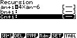
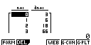
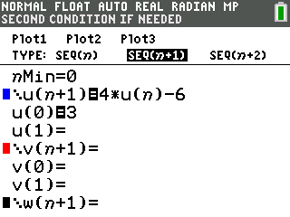
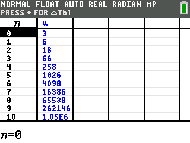
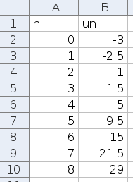
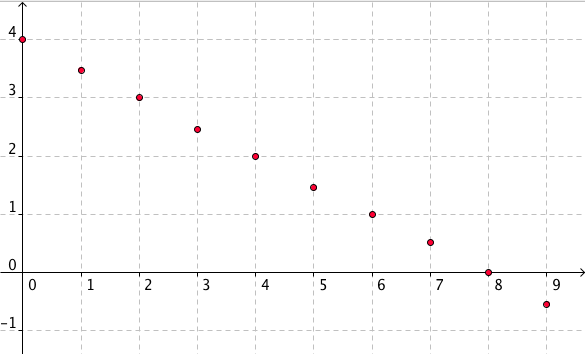
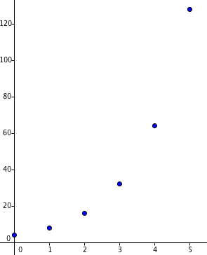

# Définition et représentation graphique

---

### Exemple

On considère une liste de nombres formée par tous les nombres impairs rangés dans l'ordre croissant : $1$, $3$, $5$, $7$, $\ldots$

. . .

On note $u_{n}$ l'ensemble des "éléments" de cette suite de nombres tel que :

$u_0=1$ \quad $u_1=3$ \quad $u_2=5$ \quad $u_3=7$ \quad $\ldots$

. . .

On a ainsi défini une **suite numérique**.

On peut lui associer une fonction définie sur $\mathbb{N}$ par $u$ :
\begin{align*}
\mathbb{N}  &\longmapsto \mathbb{R}\\
n           &\longmapsto u\left( n \right) = u_{n}
\end{align*}

---

## Définition : Suite numérique

Une **suite numérique** $u_{n}$ est une liste ordonnée de nombres réels telle qu'à tout entier $n$ on associe un nombre réel noté $u_{n}$.

$u_{n}$ est appelé le **terme de rang** $n$ de cette suite (ou d'indice $n$).

## Définition : Suite définie par une formule explicite

Lorsqu'on définit une suite par une formule **explicite**, chaque terme de la suite est exprimé en fonction de $n$ et indépendamment des termes précédents.

### Exemples

- Pour tout $n\in\mathbb{N}$, on donne : $u_{n} = 2n$ qui définit la suite des nombres pairs.

. . .

Les premiers termes de cette suite sont donc :
\begin{align*}
u_{0} &= 2 \times 0 = 0\\
u_{1} &= 2 \times 1 = 2\\
u_{2} &= 2 \times 2 = 4\\
u_{3} &= 2 \times 3 = 6
\end{align*}

---

- Pour tout $n\in\mathbb{N}$, on donne : $v_{n} = 3\times n^{2} - 1$.

. . .

Les premiers termes de cette suite sont donc :
\begin{align*}
v_{0} &= 3 \times 0^{2} -1 = 3\times 0 -1 = 0\\
v_{1} &= 3 \times 1^{2} -1 = 3\times 1 -1 = 2\\
v_{2} &= 3 \times 2^{2} -1 = 3\times 4 -1 = 11\\
v_{3} &= 3 \times 3^{2} -1 = 3\times 9 -1 = 26
\end{align*}

---

## Défintion : Suite définie par une relation de récurrence

Lorsqu'on définit une suite par une relation de **récurrence**, chaque terme de la suite est exprimé en fonction du terme précédent.

. . .

### Exemples {-}

- On définit la suite $u_{n}$ par : $u_{0} = 5$ et chaque terme de la suite est le **triple** de son précédent.

. . .

Les premiers termes de cette suite sont donc :
\begin{align*}
u_{0} &= 5\\
u_{1} &= 3 \times u_{0} = 3 \times 5 = 15\\
u_{2} &= 3 \times u_{1} = 3 \times 15 = 45
\end{align*}

. . .

De façon générale, on peut noter : $u_{n + 1} = 3 \times u_{n}$

---

- On définit la suite $v_{n}$ par : $v_{0}= 3$ et pour tout $n\in\mathbb{N}$, $v_{n + 1} = 4 \times v_{n} - 6$

. . .

Les premiers termes de cette suite sont donc :
\begin{align*}
v_{0} &= 3\\
v_{1} &= 4\times v_{0} - 6 = 4 \times 3 - 6 = 6\\
v_{2} &= 4\times v_{1} - 6 = 4 \times 6 - 6 = 18\\
v_{3} &= 4\times v_{2} - 6 = 4 \times 18 - 6 = 66
\end{align*}

. . .

Contrairement à une suite définie par une formule explicite, il n'est pas possible, dans l'état, de calculer par exemple $v_{13}$ sans connaître $v_{12}$.

---

### Remarque {-}

Cependant il est possible d'écrire un algorithme avec Python :

. . .


```python
v=3
for i in range(1,10):
    v=4*v-6
    print(i,v)
```

---

Et on obtient :

```python
(1, 6)
(2, 18)
(3, 66)
(4, 258)
(5, 1026)
(6, 4098)
(7, 16386)
(8, 65538)
(9, 262146)
```

---

Ou sur une calculatrice :

| Casio Graph 85 | {height=2cm} | {height=2cm} |
|:-:|:-:|:-:|
| TI-84 CE | {height=2.5cm} | {height=2.5cm} |

. . .

A noter : Le mot *récurrence* vient du latin *recurrere* qui signifie "revenir en arrière".

---

## Représentation graphique d'une suite

Dans un repère du plan, on représente une suite par un nuage de points de coordonnées $\left( n\ ;\ u_{n} \right)$.

. . .

### Exemple

Pour tout $n\in\mathbb{N}$, on donne : $u_{n} = \dfrac{n^{2}}{2} - 3$.

On construit le tableau de valeurs avec les premiers termes de la suite :

  $n$         0    1      2    3     4   5     6    7      8
  ----------- ---- ------ ---- ----- --- ----- ---- ------ ----
  $u_{n}$     -3   -2,5   -1   1,5   5   9,5   15   21,5   29

---

Il est possible d'obtenir un nuage de points à l'aide d'un **tableur**

{height=4cm}

---

\begin{figure}
\begin{center}
\begin{tikzpicture}[line cap=round,line join=round,>=triangle 45,x=1.0cm,y=1.0cm]
\begin{axis}[
width=12cm,height=7cm,
axis lines=middle,ymajorgrids=true,
xmajorgrids=true,xmin=-0.5,xmax=8.5,ymin=-5.5,ymax=30.5,
xtick={-2.0,-1.0,...,13.0},
ytick={-15.0,-10.0,...,35.0},]
\draw [fill=black] (0.,-3.) circle (2.0pt);
\draw [fill=black] (1.,-2.5) circle (2.0pt);
\draw [fill=black] (2.,-1.) circle (2.0pt);
\draw [fill=black] (3.,1.5) circle (2.0pt);
\draw [fill=black] (4.,5.) circle (2.0pt);
\draw [fill=black] (5.,9.5) circle (2.0pt);
\draw [fill=black] (6.,15.) circle (2.0pt);
\draw [fill=black] (7.,21.5) circle (2.0pt);
\draw [fill=black] (8.,29.) circle (2.0pt);
\end{axis}
\end{tikzpicture}
\end{center}
\caption{Les termes de la suites $u_{n}$ représentés par un nuage de points}
\end{figure}

# Sens de variation d'une suite numérique

---

### Exemple

On a représenté ci-dessous le nuage de points des premiers termes d'une suite $u_{n}$ :

. . .

\begin{figure}
\begin{center}
\begin{tikzpicture}[line cap=round,line join=round,>=triangle 45,x=1.0cm,y=1.0cm]
\begin{axis}[
width=12cm,height=6cm,
axis lines=middle,ymajorgrids=true,
xmajorgrids=true,xmin=-0.5,xmax=8.5,ymin=-2.5,ymax=3.5,
xtick={-2.0,-1.0,...,13.0},
ytick={-4,-3,...,5},]
\draw [color=blue!40,line width=1.pt,dashed] (0.,0)-- (1,0);
\draw [color=red!40,line width=1.pt,dashed] (0.,2.2222222222222223)-- (5.,2.2222222222222223);
\draw [color=red!40,line width=1.pt,dashed] (5.,2.2222222222222223)-- (5.,0.);
\draw [color=green!40,line width=1.pt,dashed] (4.,0.)-- (4.,1.875);
\draw [color=green!40,line width=1.pt,dashed] (4.,1.875)-- (0.,1.875);
\draw [color=black!40,line width=1.pt,dashed] (0.,0.833333333333333)-- (2.,0.833333333333333);
\draw [color=black!40,line width=1.pt,dashed] (2.,0.833333333333333)-- (2.,0.);
\draw [fill=black] (0.,-1.25) circle (2.0pt);
\draw [fill=black] (1.,0.) circle (2.0pt);
\draw (1,0) node[anchor=south west] {$u_1$};
\draw [fill=black] (2.,0.833333333333333) circle (2.0pt);
\draw (2,0.83333333) node[anchor=south west] {$u_2$};
\draw [fill=black] (3.,1.4285714285714284) circle (2.0pt);
\draw [fill=black] (4.,1.875) circle (2.0pt);
\draw (4,1.875) node[anchor=north west] {$u_4$};
\draw [fill=black] (5.,2.2222222222222223) circle (2.0pt);
\draw (5,2.22222) node[anchor=south west] {$u_5$};
\draw [fill=black] (6.,2.5) circle (2.0pt);
\draw [fill=black] (7.,2.727272727272727) circle (2.0pt);
\draw [fill=black] (8.,2.9166666666666665) circle (2.0pt);
\end{axis}
\end{tikzpicture}
\end{center}
\caption{Les termes de la suites $u_{n}$ représentés par un nuage de points}
\end{figure}

. . .

On peut conjecturer que cette suite est **croissante**.

On constate par exemple que $u_{1} < u_{2}$ ou encore $u_{4} < u_{5}$.

De manière générale, on peut écrire : $u_{n} < u_{n + 1}$

---

## Définition : Variation d'une suite numérique

Soit une suite numérique $u_{n}$.

. . .

- La suite $u_{n}$ est **croissante** signifie que pour tout entier $n$, on a $u_{n + 1} \geq u_{n}$.
- La suite $u_{n}$ est **décroissante** signifie que pour tout entier $n$, on a $u_{n + 1} \leq u_{n}$.

. . .

\begin{figure}
\begin{center}
\begin{tikzpicture}[line cap=round,line join=round,>=triangle 45,x=1.0cm,y=1.0cm]
\begin{axis}[
width=12cm,height=6cm,
axis lines=middle,ymajorgrids=true,
xmajorgrids=true,xmin=-0.5,xmax=12.5,ymin=-1.5,ymax=5.5,
xtick={-2.0,-1.0,...,13.0},
ytick={-4,-3,...,5},]
\draw [fill=red] (0.,-1.) circle (2.0pt);
\draw [fill=red] (1.,-0.5) circle (2.0pt);
\draw [fill=red] (2.,0.) circle (2.0pt);
\draw [fill=red] (3.,0.5) circle (2.0pt);
\draw [fill=red] (4.,1.) circle (2.0pt);
\draw [fill=red] (5.,1.5) circle (2.0pt);
\draw [fill=red] (6.,2.) circle (2.0pt);
\draw [fill=red] (7.,2.5) circle (2.0pt);
\draw [fill=red] (8.,3.) circle (2.0pt);
\draw [fill=red] (9.,3.5) circle (2.0pt);
\draw [fill=red] (10.,4.) circle (2.0pt);
\draw [fill=red] (11.,4.5) circle (2.0pt);
\draw [fill=red] (12.,5.) circle (2.0pt);
\draw [fill=blue] (0.,4.) circle (2.0pt);
\draw [fill=blue] (1.,2.) circle (2.0pt);
\draw [fill=blue] (2.,1.3333333333333333) circle (2.0pt);
\draw [fill=blue] (3.,1.) circle (2.0pt);
\draw [fill=blue] (4.,0.8) circle (2.0pt);
\draw [fill=blue] (5.,0.6666666666666666) circle (2.0pt);
\draw [fill=blue] (6.,0.5714285714285714) circle (2.0pt);
\draw [fill=blue] (7.,0.5) circle (2.0pt);
\draw [fill=blue] (8.,0.4444444444444444) circle (2.0pt);
\draw [fill=blue] (9.,0.4) circle (2.0pt);
\draw [fill=blue] (10.,0.36363636363636365) circle (2.0pt);
\draw [fill=blue] (11.,0.3333333333333333) circle (2.0pt);
\draw [fill=blue] (12.,0.3076923076923077) circle (2.0pt);
\end{axis}
\end{tikzpicture}
\end{center}
\caption{Suite croissante en rouge et décroissante en bleu}
\end{figure}

## Méthode : Étudier les variations d'une suite

> a) Pour tout $n\in\mathbb{N}$, on donne la suite $u_{n}$ définie par : $u_{n + 1} = u_{n} + 2$. Démontrer que la suite $u_{n}$ est croissante.
> b) Pour tout $n\in\mathbb{N}$, on donne la suite $v_{n}$ définie par : $v_{n} = 4n + 4$. Démontrer que la suite $v_{n}$ est croissante.

---

(a) Calculons $\left(u_{n + 1} - u_{n}\right)$ et étudions son signe.

$u_{n + 1} - u_{n} = u_{n} + 2 - u_{n} = 2 > 0 \Longrightarrow$ On en déduit que $u_{n}$ est croissante.

. . .

(b) Caculons $\left(v_{n + 1} - v_{n}\right)$ et étudions son signe.

. . .

On a : $v_{n} = 4n + 4$ donc $v_{n + 1} = 4\left( n + 1 \right) + 4 = 4n + 4 + 4 = 4n + 8$

. . .

\begin{align*}
v_{n + 1} - v_{n} &= \left(4n + 8\right) - \left( 4n + 4 \right)\\
\quad             &= 4n + 8 - 4n - 4\\
\quad             &= 4 >0
\end{align*}

. . .

Pour tout $n$ entier $v_{n + 1} - v_{n} > 0 \Longrightarrow$ On en déduit que la suite $\left(u_{n}\right)$ est croissante.

# Suites arithmétiques

---

### Exemples

- Considérons une suite numérique $\left(u_{n}\right)$ où la **différence** entre un terme et son précédent reste constante et égale à $5$.

. . .

Si le premier terme est égal à $3$, les premiers termes successifs sont :
\begin{align*}u_{0}&=3\\u_{1}&=8\\u_{2}&=13\\u_{2}&=18\end{align*}

. . .

Une telle suite est appelée une suite **arithmétique** de raison $5$ et de premier terme $3$.

La suite est donc définie par : $u_{n + 1} = u_{n} + 5$ et $u_{0} = 3$.

---

- Soit la suite numérique $v_{n}$ de premier terme $5$ et de raison $-2$.

. . .

Les premiers termes successifs sont :
\begin{align*}v_{0}&= 5\\v_{1}&=5-2=3\\v_{2}&=3-2=1\\v_{3}&=1-2=-1\end{align*}

La suite est donc définie par : $v_{n + 1} = v_{n} - 2$ et $v_{0} = 5$.

## Définition : Suite arithmétique

Une suite $\left(u_{n}\right)$ est une **suite arithmétique** s'il existe un nombre $r$ tel que pour tout entier $n$, on a : $$u_{n + 1} = u_{n} + r$$

Le nombre $r$ est appelé **raison** de la suite.

## Propriété : Variations d'une suite arithmétique

Soit $\left(u_{n}\right)$ est une suite **arithmétique** de raison $r$

. . .

> - Si $r > 0$ alors la suite $\left(u_{n}\right)$ est **croissante**.
> - Si $r = 0$ alors la suite $\left(u_{n}\right)$ est **constante**.
> - Si $r < 0$ alors la suite $\left(u_{n}\right)$ est **décroissante**.

. . .

### Exemple

La suite **arithmétique** $\left(u_{n}\right)$ définie par $u_{n+1}=u_{n}-4$ et $u_{0}=5$ est **décroissante** car de raison $-4<0$.

---

### Démonstration

Etudions le signe de $u_{n + 1} - u_{n}$.

. . .

$\left(u_{n}\right)$ est une suite arithmétique de raison $r$ donc $u_{n+1} =u_{n} + r$.

. . .

On a donc :
\begin{align*}
u_{n + 1} - u_{n} &= \left(u_{n} + r\right) - u_{n}\\
\quad&= r
\end{align*}

. . .

> - Si $r>0$ alors $u_{n + 1} - u_{n} > 0$ et la suite $\left(u_{n}\right)$ est **croissante**.
> - Si $r<0$ alors $u_{n + 1} - u_{n} < 0$ et la suite $\left(u_{n}\right)$ est **décroissante**.

---

## Représentation graphique d'une suite arithmétique

Les points de la représentation graphique d'une suite **arithmétique** sont alignés.

. . .

### Exemple

On a représenté ci-dessous la suite de raison $-0,5$ et de premier terme $4$.

\begin{figure}
\begin{center}
\begin{tikzpicture}[line cap=round,line join=round,>=triangle 45,x=1.0cm,y=1.0cm]
\begin{axis}[
width=10cm,height=6cm,
axis lines=middle,ymajorgrids=true,
xmajorgrids=true,xmin=-0.5,xmax=12.5,ymin=-2.5,ymax=5.5,
xtick={-2.0,-1.0,...,13.0},
ytick={-4,-3,...,5},]
\draw[line width=1.pt,dashed,color=black!50,smooth,samples=50,domain=-1:13] plot(\x,{0-0.5*(\x)+4.0});
\draw [fill=red] (0.,4) circle (2.0pt);
\draw [fill=red] (1.,3.5) circle (2.0pt);
\draw [fill=red] (2.,3) circle (2.0pt);
\draw [fill=red] (3.,2.5) circle (2.0pt);
\draw [fill=red] (4.,2) circle (2.0pt);
\draw [fill=red] (5.,1.5) circle (2.0pt);
\draw [fill=red] (6.,1.) circle (2.0pt);
\draw [fill=red] (7.,0.5) circle (2.0pt);
\draw [fill=red] (8.,0.) circle (2.0pt);
\draw [fill=red] (9.,-0.5) circle (2.0pt);
\draw [fill=red] (10.,-1) circle (2.0pt);
\draw [fill=red] (11.,-1.5) circle (2.0pt);
\draw [fill=red] (12.,-2) circle (2.0pt);
\end{axis}
\end{tikzpicture}
\end{center}
\caption{Représentation de $u_{n+1}=u_{n}-0.5$ et $u_{0}=4$}
\end{figure}

# Suites géométriques

---

### Exemples

- Considérons une suite numérique $\left(u_{n}\right)$ où le **rapport** entre un terme et son précédent reste constant et égale à $2$.

. . .

\begin{align*}u_{0}&=5\\u_{1}&=10\\u_{2}&=20\\u_{2}&=40\end{align*}

. . .

Une telle suite est appelée une suite **géométrique** de raison $2$ et de premier terme $5$.

La suite est donc définie par : $u_{n + 1} = 2\times u_{n}$ et $u_{0} = 5$.

---

- Soit la suite géométrique $v_{n}$ de premier terme $4$ et de raison $0,1$.

. . .

Les premiers termes successifs sont :
\begin{align*}v_{0}&=4\\v_{1}&=4\times 0.1=0.4\\v_{2}&=0.4\times 0.1=0.04\\v_{3}&=0.04\times 0.1=0.004\end{align*}

. . .

La suite est donc définie par : $v_{n + 1} = 0,1 \times v_{n}$ et $v_{0} = 4$.

## Définition : Suite géométrique

Une suite $\left(u_{n}\right)$ est une **suite géométrique** s'il existe un nombre $q$, strictement positif, tel que pour tout entier $n$, on a : $$u_{n + 1} = q \times u_{n}$$

Le nombre $q$ est appelé **raison** de la suite.

---

### Exemple : Intérêt d'un capital {-}

On place un capital de $500$€ sur un compte dont les intérêts annuels s'élèvent à $4$%.

. . .

Chaque année, le capital est multiplié par $1,04$.

Ce capital suit une progression **géométrique** de raison $1,04$.

. . .

On a ainsi :
\begin{align*}
u_{0} &= 500\\
u_{1} &= 1,04 \times 500 = 520\\
u_{2} &= 1,04 \times 520 = 540,80\\
u_{3} &= 1,04 \times 540,80 = 562,432
\end{align*}

De manière générale : $u_{n + 1} = 1,04 \times u_{n}$ avec $u_{0} = 500$

## Propriété : Variations d'une suite géométrique

Soit $\left(u_{n}\right)$ est une suite **géométrique** de raison $q$ et de premier terme $u_{0}$ **strictement positif**.

. . .

> - Si $q>1$ alors la suite $\left(u_{n}\right)$ est **croissante**.
> - Si $q=1$ alors la suite $\left(u_{n}\right)$ est **constante**.
> - Si $0<q<1$ alors la suite $\left(u_{n}\right)$ est **décroissante**.

---

### Exemple

La suite géométrique $\left(u_{n}\right)$ définie par $u_{n + 1} = 0,5\times u_{n}$ et $u_{0} = 5$ est **décroissante** car la raison est $q=0.5$ et $0<q<1$.

. . .

\begin{figure}
\begin{center}
\begin{tikzpicture}[line cap=round,line join=round,>=triangle 45,x=1.0cm,y=1.0cm]
\begin{axis}[
width=10cm,height=6cm,
axis lines=middle,ymajorgrids=true,
xmajorgrids=true,xmin=-0.5,xmax=6.5,ymin=-0.5,ymax=5.5,
xtick={-2.0,-1.0,...,13.0},
ytick={-4,-3,...,5},]
\draw[line width=1.pt,dashed,color=black!50,smooth,samples=50,domain=-1:13] plot(\x,{5*0.5^(\x)});
\draw [fill=red] (0.,5) circle (2.0pt);
\draw [fill=red] (1.,2.5) circle (2.0pt);
\draw [fill=red] (2.,1.25) circle (2.0pt);
\draw [fill=red] (3.,0.625) circle (2.0pt);
\draw [fill=red] (4.,0.3125) circle (2.0pt);
\draw [fill=red] (5.,0.15625) circle (2.0pt);
\draw [fill=red] (6.,0.078125) circle (2.0pt);
\end{axis}
\end{tikzpicture}
\end{center}
\caption{Représentation de $u_{n+1}=0.5\times u_{n}$ et $u_{0}=5$}
\end{figure}

## Représentation graphique d'une suite géométrique

Les points de la représentation graphique d'une suite **géométrique** ne sont pas alignés.

. . .

### Exemple

Soit la suite géométrique $\left(u_{n}\right)$ définie par $u_{n + 1} = 1,04\times u_{n}$ et $u_{0} = 500$.

\begin{figure}
\begin{center}
\begin{tikzpicture}[line cap=round,line join=round,>=triangle 45,x=1.0cm,y=1.0cm]
\begin{axis}[
y tick label style={/pgf/number format/.cd, scaled y ticks = false, set thousands separator={~}, fixed},
width=12cm,height=6cm,
axis lines=middle,ymajorgrids=true,
xmajorgrids=true,xmin=-2.5,xmax=60.5,ymin=300,ymax=5000,
xtick={0,5,...,60},
ytick={750,1250,...,4500},]
\draw[line width=0.5pt,dashed,color=black!75,smooth,samples=50,domain=-3:60] plot(\x,{500*1.04^(\x)});
\draw [fill=red] (0.,500.) circle (1.0pt);
\draw [fill=red] (1.,520.) circle (1.0pt);
\draw [fill=red] (2.,540.8000000000001) circle (1.0pt);
\draw [fill=red] (3.,562.432) circle (1.0pt);
\draw [fill=red] (4.,584.9292800000001) circle (1.0pt);
\draw [fill=red] (5.,608.3264512000001) circle (1.0pt);
\draw [fill=red] (6.,632.6595092480002) circle (1.0pt);
\draw [fill=red] (7.,657.9658896179201) circle (1.0pt);
\draw [fill=red] (8.,684.2845252026369) circle (1.0pt);
\draw [fill=red] (9.,711.6559062107425) circle (1.0pt);
\draw [fill=red] (10.,740.1221424591722) circle (1.0pt);
\draw [fill=red] (11.,769.7270281575392) circle (1.0pt);
\draw [fill=red] (12.,800.5161092838407) circle (1.0pt);
\draw [fill=red] (13.,832.5367536551944) circle (1.0pt);
\draw [fill=red] (14.,865.8382238014021) circle (1.0pt);
\draw [fill=red] (15.,900.4717527534583) circle (1.0pt);
\draw [fill=red] (16.,936.4906228635966) circle (1.0pt);
\draw [fill=red] (17.,973.9502477781406) circle (1.0pt);
\draw [fill=red] (18.,1012.9082576892663) circle (1.0pt);
\draw [fill=red] (19.,1053.4245879968369) circle (1.0pt);
\draw [fill=red] (20.,1095.5615715167105) circle (1.0pt);
\draw [fill=red] (21.,1139.3840343773788) circle (1.0pt);
\draw [fill=red] (22.,1184.959395752474) circle (1.0pt);
\draw [fill=red] (23.,1232.3577715825732) circle (1.0pt);
\draw [fill=red] (24.,1281.6520824458762) circle (1.0pt);
\draw [fill=red] (25.,1332.918165743711) circle (1.0pt);
\draw [fill=red] (26.,1386.2348923734596) circle (1.0pt);
\draw [fill=red] (27.,1441.684288068398) circle (1.0pt);
\draw [fill=red] (28.,1499.351659591134) circle (1.0pt);
\draw [fill=red] (29.,1559.3257259747795) circle (1.0pt);
\draw [fill=red] (30.,1621.6987550137708) circle (1.0pt);
\draw [fill=red] (31.,1686.5667052143217) circle (1.0pt);
\draw [fill=red] (32.,1754.0293734228944) circle (1.0pt);
\draw [fill=red] (33.,1824.1905483598105) circle (1.0pt);
\draw [fill=red] (34.,1897.1581702942028) circle (1.0pt);
\draw [fill=red] (35.,1973.044497105971) circle (1.0pt);
\draw [fill=red] (36.,2051.96627699021) circle (1.0pt);
\draw [fill=red] (37.,2134.044928069818) circle (1.0pt);
\draw [fill=red] (38.,2219.4067251926112) circle (1.0pt);
\draw [fill=red] (39.,2308.182994200316) circle (1.0pt);
\draw [fill=red] (40.,2400.5103139683283) circle (1.0pt);
\draw [fill=red] (41.,2496.5307265270617) circle (1.0pt);
\draw [fill=red] (42.,2596.3919555881444) circle (1.0pt);
\draw [fill=red] (43.,2700.24763381167) circle (1.0pt);
\draw [fill=red] (44.,2808.257539164137) circle (1.0pt);
\draw [fill=red] (45.,2920.5878407307027) circle (1.0pt);
\draw [fill=red] (46.,3037.411354359931) circle (1.0pt);
\draw [fill=red] (47.,3158.907808534328) circle (1.0pt);
\draw [fill=red] (48.,3285.2641208757013) circle (1.0pt);
\draw [fill=red] (49.,3416.6746857107296) circle (1.0pt);
\draw [fill=red] (50.,3553.3416731391585) circle (1.0pt);
\draw [fill=red] (51.,3695.4753400647255) circle (1.0pt);
\draw [fill=red] (52.,3843.294353667314) circle (1.0pt);
\draw [fill=red] (53.,3997.026127814007) circle (1.0pt);
\draw [fill=red] (54.,4156.907172926568) circle (1.0pt);
\end{axis}
\end{tikzpicture}
\end{center}
\caption{Représentation de $u_{n+1}=1.04\times u_{n}$ et $u_{0}=500$}
\end{figure}

# Récapitulatif

## Suite arithmétique

+--------------------+-----------------------------------------------------+---------------------------------------------------+
|                    | $u_{n}$ une **suite arithmétique**                  | Exemple :                                         |
|                    | de raison $r$ et de 1^er^ terme $u_{0}$             | $r=-0.5$ et $u_{0} = 4$                           |
+====================+=====================================================+===================================================+
| Définition         | $u_{n + 1} = u_{n} + r$                             | $u_{n + 1} = u_{n} - 0.5$                         |
+--------------------+-----------------------------------------------------+---------------------------------------------------+
|                    |                                                     |                                                   |
+--------------------+-----------------------------------------------------+---------------------------------------------------+
| Variation          | $r>0 \Rightarrow u_{n} \text{ croissante}$          | $r=0.5<0 \Rightarrow u_{n} \text{ décroissante}$  |
|                    | $r<0 \Rightarrow u_{n} \text{ décroissante}$        |                                                   |
+--------------------+-----------------------------------------------------+---------------------------------------------------+
|                    |                                                     |                                                   |
+--------------------+-----------------------------------------------------+---------------------------------------------------+
| Représentation     | Les points de la représentation sont alignés.       | Représentation de $u_{n + 1} = u_{n} - 0.5$       |
|                    | On parle de croissance linéaire.                    | {height=4cm}   |
+--------------------+-----------------------------------------------------+---------------------------------------------------+

## Suite géométrique

+--------------------+-----------------------------------------------------+------------------------------------------------+
|                    | $u_{n}$ une **suite géométrique**                   | Exemple :                                      |
|                    | de raison $q>0$ et de 1^er^ terme $u_{0}>0$         | $q=2$ et $u_{0} = 4$                           |
+====================+=====================================================+================================================+
| Définition         | $u_{n + 1} = u_{n} \times q$                        | $u_{n + 1} = u_{n} \times 2$                   |
+--------------------+-----------------------------------------------------+------------------------------------------------+
|                    |                                                     |                                                |
+--------------------+-----------------------------------------------------+------------------------------------------------+
| Variation          | $q>1 \Rightarrow u_{n} \text{ croissante}$          | $q=2>0 \Rightarrow u_{n} \text{ croissante}$   |
|                    | $0<q<1 \Rightarrow u_{n} \text{ décroissante}$      |                                                |
+--------------------+-----------------------------------------------------+------------------------------------------------+
|                    |                                                     |                                                |
+--------------------+-----------------------------------------------------+------------------------------------------------+
| Représentation     | Les points de la représentation ne sont pas alignés.| Représentation de $u_{n + 1} = 2\times u_{n}$  |
|                    |                                                     |                                                |
|                    |                                                     | {height=3cm}  |
+--------------------+-----------------------------------------------------+------------------------------------------------+