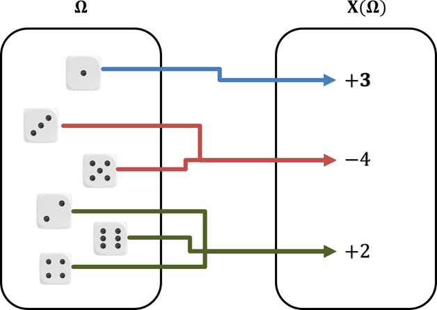
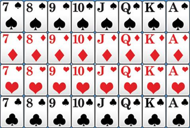

---

\newpage

# Variable aléatoire et loi de probabilité

## Définition : Variable aléatoire

Une variable aléatoire $X$ associe un nombre réel à chaque issue de l'univers $\Omega$.
\begin{center}
\tikzset{every picture/.style={line width=0.75pt}}
\begin{tikzpicture}[x=0.75pt,y=0.75pt,yscale=-1,xscale=1]
\draw [fill={rgb, 255:red, 184; green, 233; blue, 134 } ,fill opacity=1 ] (120,94) .. controls (120,80.75) and (130.75,70) .. (144,70) -- (216,70) .. controls (229.25,70) and (240,80.75) .. (240,94) -- (240,236) .. controls (240,249.25) and (229.25,260) .. (216,260) -- (144,260) .. controls (130.75,260) and (120,249.25) .. (120,236) -- cycle ;
\draw [fill={rgb, 255:red, 80; green, 227; blue, 194 } ,fill opacity=1 ] (310,94) .. controls (310,80.75) and (320.75,70) .. (334,70) -- (406,70) .. controls (419.25,70) and (430,80.75) .. (430,94) -- (430,236) .. controls (430,249.25) and (419.25,260) .. (406,260) -- (334,260) .. controls (320.75,260) and (310,249.25) .. (310,236) -- cycle ;
\draw (179,61) node [align=left] {\begin{minipage}[lt]{12.250608pt}\setlength\topsep{0pt}\begin{center}$\displaystyle \Omega $\end{center}\end{minipage}};
\draw (141,99) node [align=left] {\begin{minipage}[lt]{12.2825pt}\setlength\topsep{0pt}\begin{center}$\displaystyle e_{1}$\end{center}\end{minipage}};
\draw (159,141) node [align=left] {\begin{minipage}[lt]{12.2825pt}\setlength\topsep{0pt}\begin{center}$\displaystyle e_{2}$\end{center}\end{minipage}};
\draw (156,181) node [align=left] {\begin{minipage}[lt]{18.891216pt}\setlength\topsep{0pt}\begin{center}$\displaystyle \dotsc $\end{center}\end{minipage}};
\draw (201,131) node [align=left] {\begin{minipage}[lt]{12.2825pt}\setlength\topsep{0pt}\begin{center}$\displaystyle e_{3}$\end{center}\end{minipage}};
\draw (169,221) node [align=left] {\begin{minipage}[lt]{12.739392000000002pt}\setlength\topsep{0pt}\begin{center}$\displaystyle e_{n}$\end{center}\end{minipage}};
\draw (349,101) node [align=left] {\begin{minipage}[lt]{13.557500000000001pt}\setlength\topsep{0pt}\begin{center}$\displaystyle x_{1}$\end{center}\end{minipage}};
\draw (390,149) node [align=left] {\begin{minipage}[lt]{13.557500000000001pt}\setlength\topsep{0pt}\begin{center}$\displaystyle x_{2}$\end{center}\end{minipage}};
\draw (374,181) node [align=left] {\begin{minipage}[lt]{18.891216pt}\setlength\topsep{0pt}\begin{center}$\displaystyle \dotsc $\end{center}\end{minipage}};
\draw (390,229) node [align=left] {\begin{minipage}[lt]{13.557500000000001pt}\setlength\topsep{0pt}\begin{center}$\displaystyle x_{3}$\end{center}\end{minipage}};
\draw (201,189) node [align=left] {\begin{minipage}[lt]{12.2825pt}\setlength\topsep{0pt}\begin{center}$\displaystyle e_{4}$\end{center}\end{minipage}};
\draw (371,61) node [align=left] {\begin{minipage}[lt]{11.060608pt}\setlength\topsep{0pt}\begin{center}$\displaystyle X$\end{center}\end{minipage}};
\draw (180.5,223.69) .. controls (243.53,239.23) and (308.68,241.71) .. (375.96,231.12) ;
\draw [shift={(378,230.8)}, rotate = 530.8399999999999] [fill={rgb, 255:red, 0; green, 0; blue, 0 } ][line width=0.08] [draw opacity=0] (8.93,-4.29) -- (0,0) -- (8.93,4.29) -- cycle ;
\draw (212,132.17) .. controls (249.76,137.48) and (290.75,129.31) .. (334.98,107.68) ;
\draw [shift={(337,106.68)}, rotate = 513.55] [fill={rgb, 255:red, 0; green, 0; blue, 0 } ][line width=0.08] [draw opacity=0] (8.93,-4.29) -- (0,0) -- (8.93,4.29) -- cycle ;
\draw (152,96.59) .. controls (213.4,82.26) and (274.15,82.54) .. (334.25,97.44) ;
\draw [shift={(337,98.13)}, rotate = 194.33] [fill={rgb, 255:red, 0; green, 0; blue, 0 } ][line width=0.08] [draw opacity=0] (8.93,-4.29) -- (0,0) -- (8.93,4.29) -- cycle ;
\draw (212,182.71) .. controls (257.97,154.82) and (312.34,143.25) .. (375.13,147.97) ;
\draw [shift={(378,148.2)}, rotate = 184.74] [fill={rgb, 255:red, 0; green, 0; blue, 0 } ][line width=0.08] [draw opacity=0] (8.93,-4.29) -- (0,0) -- (8.93,4.29) -- cycle ;
\draw (170,145.77) .. controls (278.41,194.26) and (300.07,158.48) .. (375.69,217.95) ;
\draw [shift={(378,219.79)}, rotate = 218.68] [fill={rgb, 255:red, 0; green, 0; blue, 0 } ][line width=0.08] [draw opacity=0] (8.93,-4.29) -- (0,0) -- (8.93,4.29) -- cycle ;
\end{tikzpicture}
\end{center}

### Exemple {-}

Soit l'expérience aléatoire : "On lance un dé à six faces et on regarde le résultat."

L'ensemble de toutes les issues possibles $\Omega=\left\{1 ; 2 ; 3 ; 4 ; 5 ; 6\right\}$ s'appelle l'univers des possibles.

On considère le jeu suivant :

- Si le résultat est **pair**, on gagne $2$€.
- Si le résultat est **1**, on gagne $3$€.
- Si le résultat est **3** ou **5**, on perd $4$€.

On peut définir ainsi une variable aléatoire $X$ sur $\Omega=\left\{1 ; 2 ; 3 ; 4 ; 5 ; 6\right\}$ qui peut prendre les valeurs **2**, **3** ou **-4**.

- Pour les issues 2, 4 ou 6, on a : $X$=2
- Pour l'issue 1, on a : $X$=3
- Pour les issues 3 et 5, on a : $X$=-4

{width=50%}

\newpage

## Définition : Loi de probabilité

La **loi de probabilité** de $X$ est donnée par toutes les probabilités $P(X=x_{i})$.

| $x_{i}$ | $x_1$ | $x_2$ | $\ldots$ | $x_N$ |
|:-:|:-:|:-:|:-:|:-:|
|$P(X=x_{i})$ | $p_1$ | $p_2$ | $\ldots$ | $p_N$ |

### Exemple {-}

On considère la variable aléatoire $X$ définie dans l'exemple précédent.

{width=40%}

Chaque issue du lancer de dé est équiprobable et égale à $\dfrac{1}{6}$.

La probabilité que la variable aléatoire prenne la valeur **2** est égale à $\dfrac{1}{6}+\dfrac{1}{6} + \dfrac{1}{6}=\dfrac{1}{2}$.

On note : $P(X=2)=\dfrac{1}{2}$.

De même : $P(X=3)=\dfrac{1}{6}$ et $P(X=-4)=\dfrac{1}{6} + \dfrac{1}{6}=\dfrac{1}{3}$.

On peut résumer les résultats dans un tableau :

| $x_{i}$ | **-4** | **2** | **3** |
|:-|:-|:-|:-|
|$P(X=x_{i})$ | $\dfrac{1}{3}$ | $\dfrac{1}{2}$ | $\dfrac{1}{6}$ |

Ce tableau résume la loi de probabilité de la variable aléatoire $X$.

### Remarques : {-}

- $P(X=x_{i})$ peut se noter $p_i$.
- $p_1 + p_2 + ... + p_N=1$

### Exemple {-}

Dans l'exemple traité plus haut : $p_1 + p_2 + p_3=\dfrac{1}{3}+\dfrac{1}{2}+\dfrac{1}{6}=1$.

\newpage

## Méthode : Déterminer une loi de probabilité

Soit l'expérience aléatoire : "On tire une carte dans un jeu de 32 cartes."

{width=30%}

On considère le jeu suivant :

-   Si on tire un coeur, on gagne $2$€.
-   Si on tire un roi, on gagne $5$€.
-   Si on tire une autre carte, on perd $1$€.

On appelle $X$ la variable aléatoire qui, à une carte tirée, associe un gain ou une perte.

> a) Déterminer la loi de probabilité de $X$.
> b) Calculer $P(X \geq 5)$ et interpréter le résultat.

---

(a) La variable aléatoire $X$ peut prendre les valeurs **2**, **5**, **-1** mais aussi **7**. En effet, si on tire le roi de coeur, on gagne $5$€ pour le roi et $2$€ pour le coeur $=7$€.

- Si la carte tirée est un coeur (autre que le roi de coeur), $X=2$.$$P(X=2)=\dfrac{7}{32}$$
- Si la carte tirée est un roi (autre que le roi de coeur), $X=5$.$$P(X=5)=\dfrac{3}{32}$$
- Si la carte tirée est le roi de coeur, $X=7$.$$P(X=7)=\dfrac{1}{32}$$
- Si la carte tirée n'est ni un coeur, ni un roi, $X=-1$.$$P(X=-1)=\dfrac{21}{32}$$

La loi de probabilité de $X$ est :

| $x_{i}$ | $-1$ | $2$ | $5$ | $7$ |
|:-------:|:-------:|:-------:|:-------:|:-------:|
|  $p_i$  | $\dfrac{21}{32}$ | $\dfrac{7}{32}$ |  $\dfrac{3}{32}$  | $\dfrac{1}{32}$ |

On constate que : $p_1 + p_2 + p_3 + p_4=\dfrac{21}{32}+\dfrac{7}{32}+\dfrac{3}{32}+\dfrac{1}{32}=1$

(b) $P(X \geq 5)= P(X=5) + P(X=7) = \dfrac{3}{32}+\dfrac{1}{32}=\dfrac{4}{32}=\dfrac{1}{8}$. La probabilité de gagner plus de $5$€ est égale à $\dfrac{1}{8}$.

\newpage

# Espérance

## Définition : Espérance mathématique

L'**espérance mathématique** de la loi de probabilité de $X$ est : $$E(x)=p_1\times x_1 + p_2\times x_2 + ... + p_n\times x_n$$

## Méthode : Calculer l'espérance d'une loi de probabilité

On considère le jeu du paragraphe précédent dont la loi de probabilité de $X$ est la suivante.

| $x_{i}$ | $-1$ | $2$ | $5$ | $7$ |
|:-------:|:-------:|:-------:|:-------:|:-------:|
|  $p_i$  | $\dfrac{21}{32}$ | $\dfrac{7}{32}$ |  $\dfrac{3}{32}$  | $\dfrac{1}{32}$ |

> a) Calculer l'espérance de la loi de probabilité de $X$ et interpréter le résultat.

---

(a) $E(X)=\left(\dfrac{21}{32}\times \left(-1\right)\right) + \left(\dfrac{7}{32}\times 2\right) + \left(\dfrac{3}{32}\times 5\right) + \left(\dfrac{1}{32}\times 7\right)=\dfrac{15}{32}$

L'espérance est égale à $\dfrac{15}{32}\approx 0,5$ signifie qu'en jouant, on peut espérer gagner environ $0,50$€.

### Remarque {-}

L'espérance est donc la **moyenne** que l'on peut _espérer_ si l'on répète l'expérience un grand nombre de fois.

