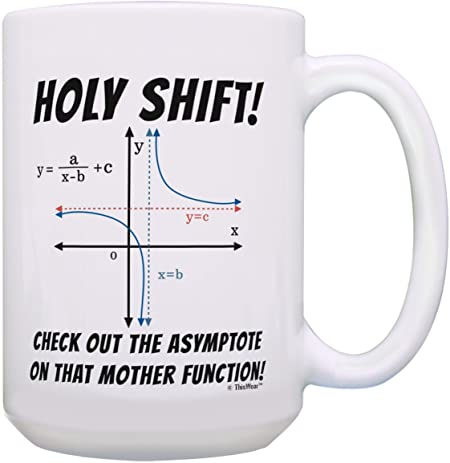
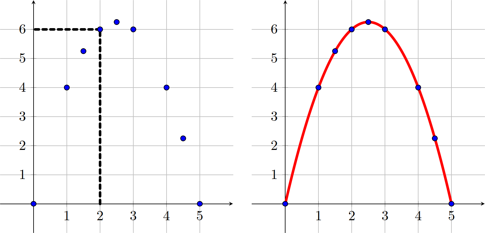
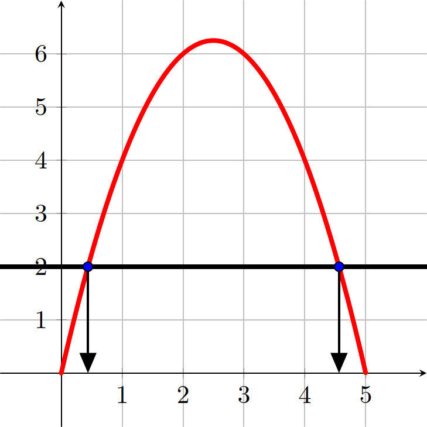
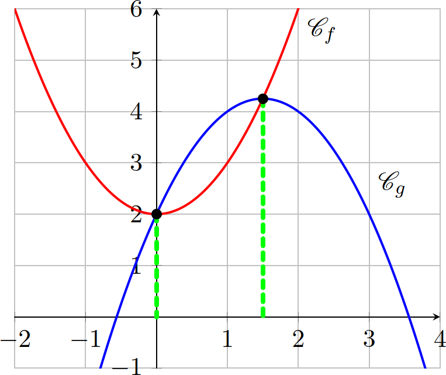
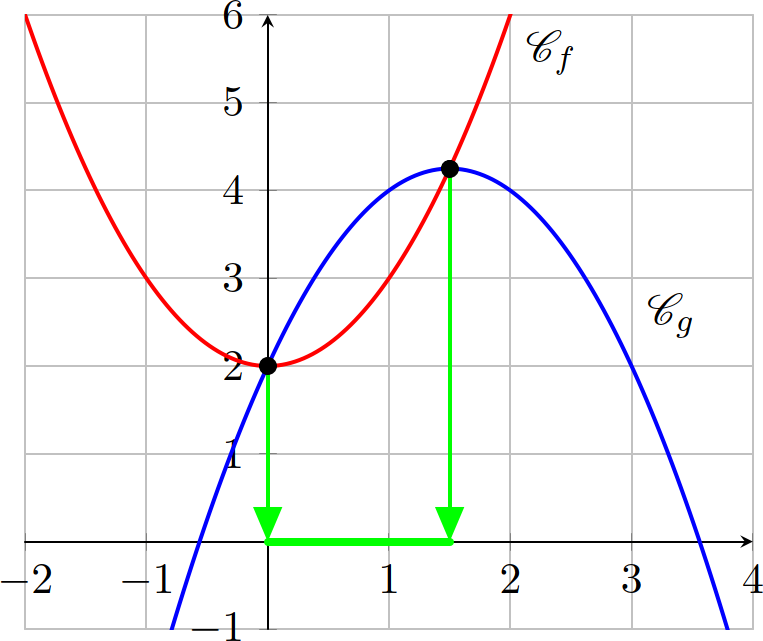

# Généralités sur les fonctions

---

<!-- paginate: true -->

# Définition

Soit $\mathscr{D}_f$ une partie de l'ensemble $\mathbb{R}$.
Une fonction $f$ définie sur $\mathscr{D}_f$, associe à tout nombre $x$ de $\mathscr{D}_f$, un unique nombre, noté $f(x)$.
$\mathscr{D}_f$ est l'ensemble de définition de $f$.

---

## Notation

>$\begin{aligned}
f: \mathscr{D}_f & \mapsto \mathbb{R}\\
               x & \mapsto f(x)
\end{aligned}$

ou

Soit $f$ une fonction définie sur $\mathscr{D}_f$ tel que $f(x) = ...$

---

## Exemple

$\begin{aligned}
f: \left[0;5\right] & \mapsto \mathbb{R}\\
   x & \mapsto x\left(5-x\right)
\end{aligned}$

ou

Soit $f$ une fonction définie sur $\left[0;5 \right]$ tel que $f(x) = x\left(5-x\right)$.

---

## Méthode : Établir un tableau de valeurs de $f$

Soit $f$ une fonction définie sur $\left[0;5 \right]$ tel que $f(x) = x\left(5-x\right)$.

Établir un tableau de valeurs de $f$, c'est calculer quelques valeurs de $f(x)$ pour des valeurs de $x\in \mathscr{D}_f$.

* $f(2)=2\times(5-2)=6$
* $f(0)=0\times(5-0)=0$
* $f(4.25)=4.25\times(5-4.25)=2.25$

---

Avec quelques valeurs de $x\in[0;5]$, on obtient un **tableau de valeurs**

| $x$ | $0$ | $1$ | $1,5$ | $2$ | $2,5$ | $3$ | $4$ | $4,25$ | $5$ |
|:--:|:--:|:--:|:--:|:--:|:--:|:--:|:--:|:--:|:--:|:--:|
| $f(x)$ | $0$ | $4$ | $5,25$ | $6$ | $6,25$ | $6$ | $4$ | $2,25$ | $0$ |

---

En plaçant les points dans un repère et en reliant ces points, on obtient :

---

## Remarque

L'ensemble des points de coordonnées $\left(x ; y\right)$ avec $y=f(x)$ définissent la courbe représentative de la fonction $f$.

On dira que $y=f(x)$ est **l'équation de la courbe**.

---

# Résolution graphique d'équations

## Résoudre graphiquement une équation du type $f(x)=k$

Pour résoudre une équation du type $f(x)=k$, il s'agit de trouver le (ou les) antécédent(s) de $k$ par la fonction $f$.

---

### Exemple

Soit $f$ une fonction définie sur $\left[0;5 \right]$ tel que $f(x) = x\left(5-x\right)$.

Pour résoudre $f(x)=2$, il s'agit de lire graphiquement les antécédents de $2$ par la fonction $f$.

---

On détermine les abscisses des points d'intersection de la courbe $\mathscr{C}_f$ avec la droite parallèle à l'axe des abscisses passant par le point $(0 ; 2)$.

On trouve deux solutions "approchées" : $x\approx 0,5$ et $x\approx 4,5$

---

### Remarques

* Par lecture graphique, les solutions obtenues sont approchées.
* L'équation $f(x)=7$ n'a pas de solution car dans ce cas la droite ne coupe pas la courbe.
* Graphiquement, on ne peut pas être certain que les solutions qui apparaissent sont les seules. Il pourrait y en avoir d'autres au-delà des limites de la représentation graphique tracée.

---

## Résoudre graphiquement une équation du type $f(x)=g(x)$

Pour trouver les solutions de l'équation $f(x)=g(x)$, il suffit de lire l'abscisse des points d'intersection des deux courbes $\mathscr{C}_f$ et $\mathscr{C}_g$.

---

### Exemple

On considère les fonctions $f$ et $g$ définie sur $\mathbb{R}$ par :

* $f(x)=x^2+2$
* $g(x)=-x^2+3x+2$

---

Les points d'intersections des deux courbes $\mathscr{C}_f$ et $\mathscr{C}_g$ ont pour abscisses $0$ et $1,5$.

Graphiquement, on lit que l'équation $f(x)=g(x)$ admet pour solutions :

$$x=0 \text{\quad et \quad} x=1,5$$

---

**Vérification :**

* Pour $x=0$
$f(0)=0^2+2=2$
$g(0)=-0^2+(3\times 0)+2=2$

* Pour $x=1.5$
$f(1.5)=1.5^2+2=4.25$
$\begin{aligned}
g(1.5)&=-(1.5)^2+(3\times 1.5)+2\\
& = -2.25+4.5+2\\
& = 4.25\\
\end{aligned}$

---

Pour déterminer l'ensemble des solutions de l'inéquation $f(x)<g(x)$, il faut lire l'ensemble des valeurs de $x$ pour lesquelles $\mathscr{C}_f$ est **au-dessous** de $\mathscr{C}_g$.

Graphiquement,
$$f(x)<g(x) \Leftrightarrow x\in \left]0;1.5\right[$$

