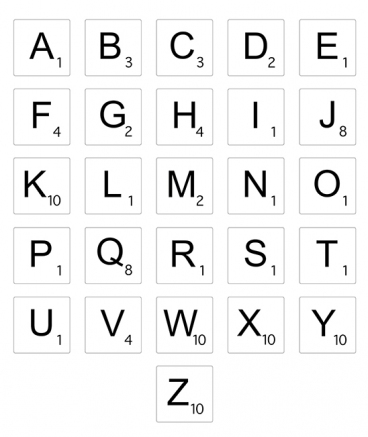
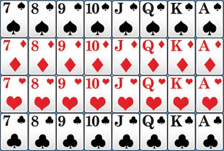
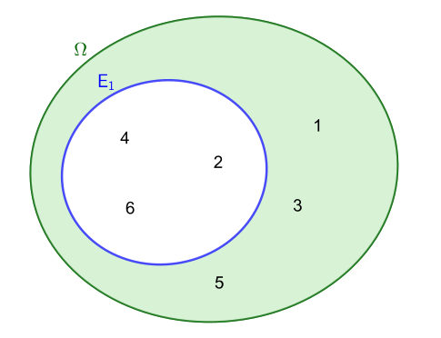
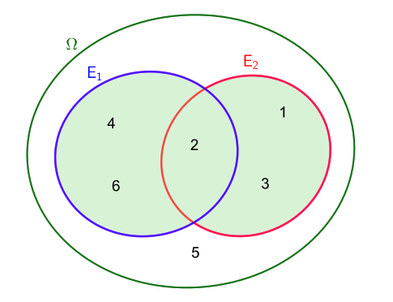
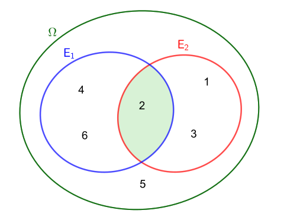

---

# Expérience aléatoire, issue, événement, ... 

## Définition : Expérience aléatoire

Une **expérience aléatoire** est une expérience dont le résultat dépend du hasard.

L'ensemble de tous les résultats possibles d'une expérience aléatoire s'appelle **l'univers** de l'expérience.

On le note en général $\Omega$

## Définition : Issue, Événement

Soit une **expérience aléatoire** d'univers $\Omega$.

Chacun des résultats possibles s'appelle une **éventualité** (ou un **événement élémentaire** ou une **issue**).

On appelle **événement** tout sous ensemble de $\Omega$.

Un événement est donc constitué de zéro, une ou plusieurs éventualités.

### Ex.1 : Des lettres {-}

\quad

{width="30%"}

Expérience aléatoire  : "Choisir, au hasard, une lettre dans l'alphabet"

> $\Omega =\left\{A;B;C;D;E;F;G;H;...;X;Y;Z\right\}$

L'ensemble $E_1=\left\{A;E;I;O;U\right\}$ est un événement.

> En français, cet événement peut se traduire par la phrase : "La lettre choisie est une voyelle"

L'ensemble $E_2=\left\{K;W;X;Y;Z\right\}$ est un autre événement. 

> Ce second événement peut se traduire par la phrase : "La lettre choisie vaut 10 pts au scrabble"

\quad

### Ex.2 : Des cartes {-}

\quad

{width="40%"}

Expérience aléatoire  : "Choisir, au hasard, une carte dans un jeu de 32 cartes"

> $\Omega =\left\{7\text{\ACK};8\text{\ACK};9\text{\ACK};10\text{\ACK};...;\text{Q\ENQ};\text{K\ENQ};\text{A\ENQ}\right\}$

L'ensemble $E_1=\left\{7\text{\ACK};8\text{\ACK};9\text{\ACK};10\text{\ACK};\text{J\ACK};\text{Q\ACK};\text{K\ACK};\text{A\ACK}\right\}$ est un événement.

> En français, cet événement peut se traduire par la phrase : "La carte choisie est un pique."

L'ensemble $E_2=\left\{10\text{\ACK};10\text{\ENQ};10\text{\ETX};10\text{\EOT}\right\}$ est un autre événement. 

> Ce second événement peut se traduire par la phrase : "La carte choisie est un 10."

Ces événements peuvent être représentés par un diagramme de Venn :

.png){width="80%"}

## Définition : Impossible, Certain, Contraire, Union, Intersection

- L'événement **impossible** est la partie vide, noté $\varnothing$, lorsque aucune issue ne le réalise.

- L'événement **certain** est $\Omega$, lorsque toutes les issues le réalisent.

- L'événement **contraire** de $A$ noté $\overline{A}$ est l'ensemble des issues de $\Omega$ qui n'appartiennent pas à $A$.

- L'événement $A \cup B$ (lire « $A$ union $B$ » ou « $A$ **ou** $B$ ») est constitué des éventualités qui appartiennent __soit à__ A, __soit à__ B, __soit aux deux ensembles__.

- L'événement $A \cap B$ (lire « $A$ inter $B$ » ou « $A$ **et** $B$ ») est constitué des éventualités qui appartiennent à $A$ __et__ à $B$.

### Exemple {-}

Expérience aléatoire : Lancer d'un dé à six faces

$\Omega =\left\{1;2;3;4;5;6\right\}$

- $E_1 = \{2;4;6\}$ : "Obtenir un nombre pair"

- $E_2 = \{1;2;3\}$ : "Obtenir un nombre strictement inférieur à 4"

- $E_3$ : "Obtenir un nombre supérieur à 6" est un événement **impossible**. $E_3=\varnothing$

- $E_4$ : " Obtenir un nombre entier" est un événement **certain**. $E_4 = \Omega$

- $\overline{E_1} =\{1;3;5\}$ : "Obtenir un nombre impair" est le **contraire** de $E_1$ : "Obtenir un nombre pair" 

{width="50%"}

- $E_1 \cup E_2 =\{1;2;3;4;6\}$ : "Obtenir un nombre pair __ou__ strictement inférieur à 4"

{width="50%"}

- $E_1 \cap E_2 =\{2\}$ : "Obtenir un nombre pair __et__ strictement inférieur à 4"

{width="50%"}

## Définition : Incompatible

On dit que $A$ et $B$ sont incompatibles si et seulement si 
$A \cap B=\varnothing$.

Deux événements sont incompatibles lorsqu'aucun événement ne les réalise simultanément.

### Remarque {-}

Deux événements contraires sont incompatibles mais deux événements peuvent être incompatibles sans être contraires.

### Exemple {-}

- $E_1=\{1;2\}$ : "Obtenir un chiffre inférieur ou égal à 2"

- $E_2=\{5;6\}$ : "Obtenir un chiffre supérieur à 4"

$E_1$ et $E_2$ sont deux événements incompatibles.

.png){width="50%"}

# Probabilités

## Définition : Probabilité

La probabilité d'un événement élémentaire est un nombre réel tel que:

- Ce nombre est compris __entre $0$ et $1$__

- La __somme__ des probabilités de tous les événements élémentaires de l'univers vaut 1

## Propriétés : Événement impossible, certain et contraire

- $P\left(\varnothing\right)=0$
- $P\left(\Omega \right)=1$
- $P\left(\overline{A}\right)=1-P\left(A\right)$

### Ex.1 {-}

On lance un dé à six faces. On note $E$ l'événement : "Obtenir un $1$". On suppose que le dé est bien équilibré et que la probabilité de $E$ est de $\dfrac{1}{6}$.

La probabilité d'obtenir un résultat différent de $1$ est : $P\left(\overline{E}\right)=1-P\left(E\right)=1-\dfrac{1}{6}=\dfrac{5}{6}$

### Ex.2 {-}

Expérience aléatoire : "Choisir, au hasard, une lettre dans l'alphabet"

Soit $E_1$ : "La lettre choisie est un K" $\Rightarrow E_1=\left\{K\right\}$

Donc $P(E_1)=\dfrac{1}{26}$ et $P(\overline{E_1})=\dfrac{25}{26}$

## Propriété : Probabilité d'un événement

La probabilité d'un événement est la **somme des probabilités des événements élémentaires** qui le compose.

### Exemple {-}

Expérience aléatoire : "Choisir, au hasard, une lettre dans l'alphabet"

Soit $E_2$ : "La lettre choisie est une voyelle" $\Rightarrow E_2=\left\{A;E;I;O;U;Y\right\}$

On a $P("A")=P("E")=P("I")=P("O")=P("U")=P("Y")=\dfrac{1}{26}$.

Donc $P(\overline{E_2})=P("A")+P("E")+...+P("Y")=6\times\dfrac{1}{26}=\dfrac{3}{13}$

## Théorème : $P(A\cup B)$

Soit $A$ et $B$ deux événement de $\Omega$ :

$$P(A\cup B)=P(A)+P(B)-P(A\cap B)$$

En particulier, si $A$ et $B$ sont incompatibles :

$$P(A\cup B)=P(A)+P(B)$$

### Exemple {-}

Expérience aléatoire : Lancer d'un dé à six faces

$\Omega =\left\{1;2;3;4;5;6\right\}$

- $A = \{2;4;6\}$ : "Obtenir un nombre pair" $\Rightarrow P(A)=\dfrac{3}{6}$

- $B = \{1;2;3\}$ : "Obtenir un nombre strictement inférieur à 4" $\Rightarrow P(B)=\dfrac{3}{6}$

- $A \cap B =\{2\}$ : "Obtenir un nombre pair __et__ strictement inférieur à 4" $\Rightarrow P(A \cap B )=\dfrac{1}{6}$

- $A \cup B =\{1;2;3;4;6\}$ : "Obtenir un nombre pair __ou__ strictement inférieur à 4"

> $P(A \cup B)=P(A)+P(B)-P(A\cap B)=\dfrac{3}{6}+\dfrac{3}{6}-\dfrac{1}{6}=\dfrac{5}{6}$

.png){width="70%"}

## Définition : Équiprobabilité

Deux événements qui ont la même probabilité sont dits **équiprobables**.

Lorsque tous les événements élémentaires sont **équiprobables** d'une expérience aléatoire, on dit qu'il y a situation d'**équiprobabilité**.

### Exemples et contre-exemple {-}

- Un lancer d'un dé non truqué et noter le nombre obtenu.

> Situation d'équiprobabilité car $P("1")=P("2")=P("3")=P("4")=P("5")=P("6")=\dfrac{1}{6}$

\quad

- Choisir, au hasard, une carte dans un jeu de 32 cartes et noter la couleur obtenue.

> Situation d'équiprobabilité car $P("\text{\ACK}")=P("\text{\ENQ}")=P("\text{\ETX}")=P("\text{\EOT}")=\dfrac{1}{4}$

> Il y a autant de $\text{\ACK}$, $\text{\ENQ}$, $\text{\ETX}$ et $\text{\EOT}$ dans le jeu de cartes.

\quad

- Choisir, au hasard, un élève dans la classe et noter son nom et prénom.

> Situation d'équiprobabilité car $P("\text{Astride Béranger}")=P("\text{Bilal Maoudi}")=...=\dfrac{1}{\text{nb élèves}}$

\quad

- Choisir, au hasard, un élève dans la classe et la marque de son téléphone.

> Ce n'est pas une situation d'équiprobabilité car $P("\text{APPLE}")\neq P("\text{NOKIA}")\neq P("\text{SAMSUNG}")\neq ...$

> Les marques de téléphone portable ne sont pas réparties équitablement dans une classe.

\quad

## Propriétés : Probabilité en situation d'équiprobabilité

On suppose que l'univers est composé de $n$ événements élémentaires.

- Dans le cas d'équiprobabilité, chaque événement élémentaire a pour probabilité : 

$$p=\frac{1}{n}$$

- Si un événement $A$ de $\Omega$ est composé de $m$ événements élémentaires, alors : 

$$P\left(A\right)=\frac{m}{n}$$

### Exemple {-}

Expérience aléatoire : Lancer d'un dé à six faces $\Rightarrow \Omega =\left\{1;2;3;4;5;6\right\}$

> Situation d'équiprobabilité car $P("1")=P("2")=P("3")=P("4")=P("5")=P("6")=\dfrac{1}{6}$

- $A = \{2;4;6\}$ : "Obtenir un nombre pair" $\Rightarrow P(A)=\dfrac{3}{6}=\dfrac{1}{2}$

### Remarque {-}

Dans une situation d'équiprobabilité, la probabilité d'un événement $A$ est :

$$P(A)=\dfrac{\text{nombre d'issues favorables à A}}{\text{nombre d'issues possibles}}$$

On peut aussi écrire : 

$$P(A)=\dfrac{\text{Card}(A)}{\text{Card}(\Omega)}$$ 

Avec $\text{Card}(A)=$ nombre d'éléments de $A$ et $\text{Card}(\Omega)=$ nombre d'éléments de $\Omega$
