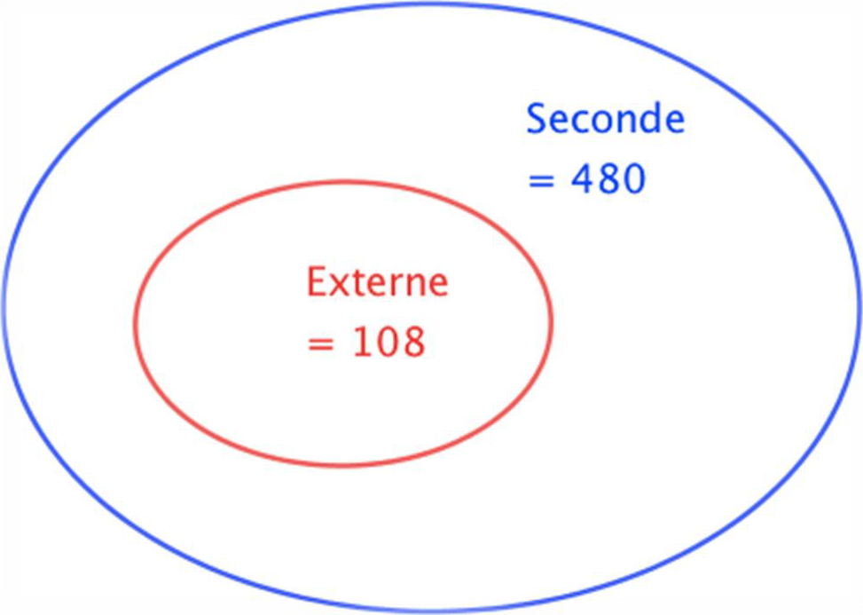
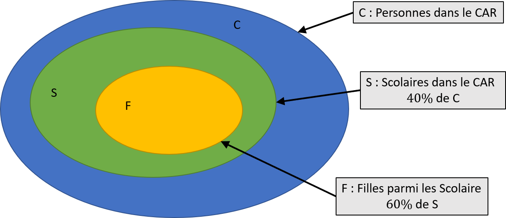
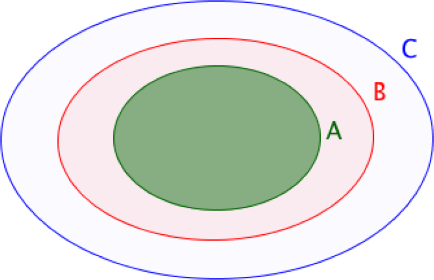
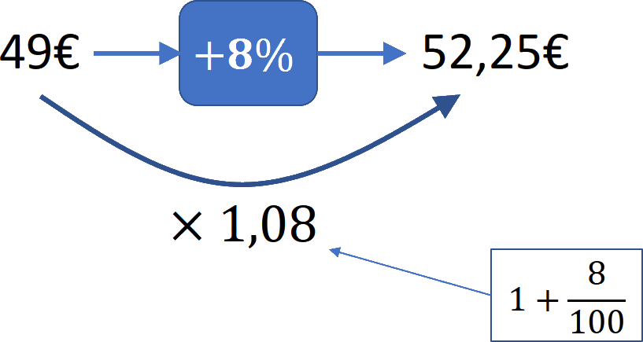
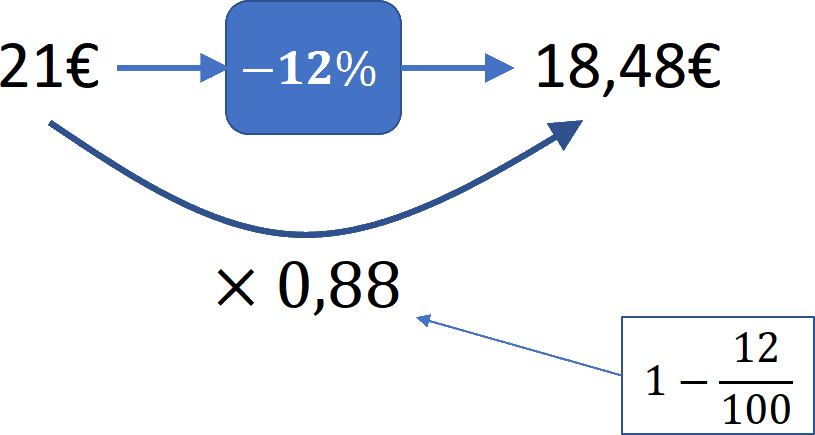
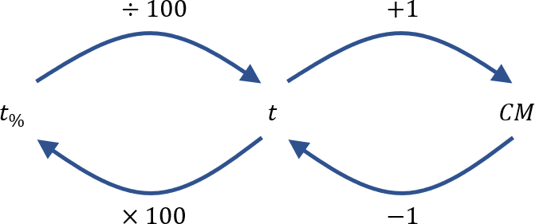
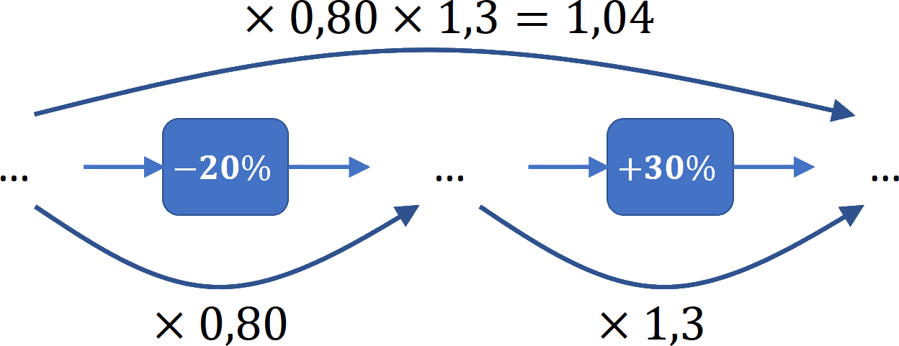
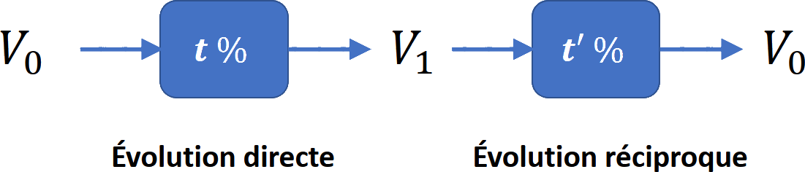
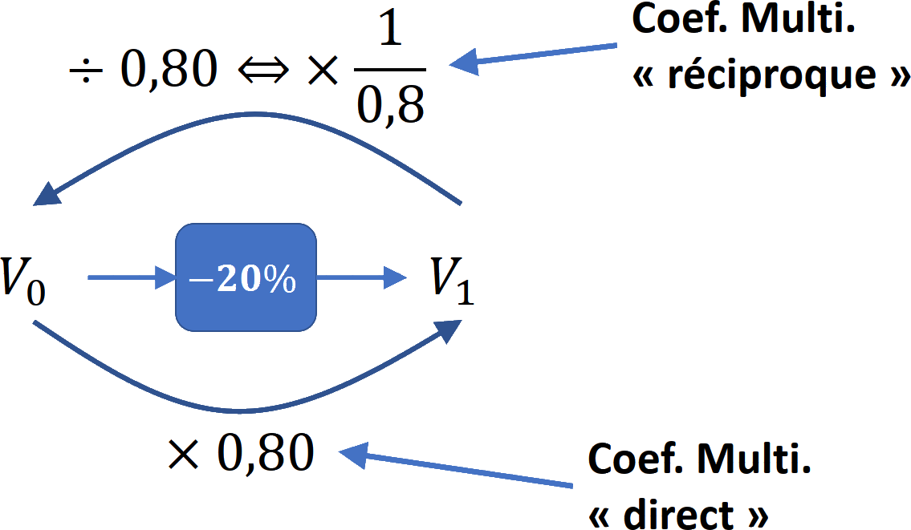

\newpage

# Proportion et pourcentage

## Proportion d'une quantité

Soit une population comprenant $N$ éléments et une sous-population comprenant $n$  éléments, la proportion de la sous-population par rapport à la population totale est :
 $$p=\dfrac{n}{N}$$

### Méthode : Calculer une proportion d'une sous-population

Sur les $480$ élèves inscrits en classe de 2GT , $108$ d'entre eux sont externes.

{width=45%}

* La population totale des élèves de 2GT, notée N, est égale à 480.
* La sous-population des élèves externes, notée n, est égale à 108.
* La proportion d'élèves externes parmi tous les élèves de seconde, notée $p$, est :

$$p=\dfrac{n}{N}=\dfrac{108}{480}=0,225\qquad\text{soit}\qquad p=22,5\%$$

### Méthode : Calculer la proportion d'une quantité

Parmi les $480$ élèves de seconde, $15\%$ ont choisi l'option "sport".

$15\%$ **de** $480$ ont choisi "sport" soit :

$$15\%\times 480=\dfrac{15}{100}\times 480=72\text{ élèves}$$

\newpage

### Méthode : Associer effectif, proportion et pourcentage

Une société de $75$ employés compte $12\%$ de cadres et le reste d'ouvriers. $35$ employés de cette société sont des femmes et $5$ d'entre elles sont cadres.

1. Calculer l'effectif des cadres.
2. Calculer la proportion de femmes dans cette société.
3. Calculer la proportion, en $\%$, de cadres parmi les femmes.

---

1. $12\%$ de $75$ employés $=\dfrac{12}{100}\times 75 =9$ cadres. Cette société compte 9 cadres.
2. $n=35$ et $N=75$ employés. La proportion de femmes est : $$p=\dfrac{35}{75}\approx0,47=47\%$$
3. $n = 5$ femmes cadres et $N = 35$ femmes. La population de référence n'est plus la même.
$$p=\dfrac{5}{35}\approx0,14=14\%$$

$14\% > 12\%$ donc les femmes cadres sont surreprésentées dans cette société.

## Proportion de proportion

### Méthode : Calculer une proportion de proportion

Dans un car, il y a $40\%$ de scolaires et, **parmi les scolaires**, $60\%$ sont des filles.

Soit :

* $C$ : l'ensemble de toutes les personnes dans le car.
* $S$ : l'ensemble des scolaires dans le car.
* $F$ : l'ensemble des scolaires filles.

{width=45%}

* L'ensemble $F$ est inclus dans l'ensemble $S$ et on a : $P_F = 60\%$ de $S$
* L'ensemble $S$ est inclus dans l'ensemble $C$ et on a : $P_S = 40\%$ de $C$

La proportion de scolaires filles dans le CAR est donc égale à : 

$60\%$ de $40\%=60\% \times 40\% = 0,6 \times 0,4= 0,24 = 24\%$

**Dans le car**, il y a $24\%$ de filles scolaires.

### Propriété :

Soit "$A$ inclus dans $B$" et "$B$ inclus dans $C$".

* $p_1$ est la proportion de $A$ dans $B$.
* $p_2$ est la proportion de $B$ dans $C$.

Alors $p=p_1\times p_2$ est la proportion de $A$ dans $C$.

{width=45%}

**Remarque :** "$A$ inclus dans $B$" se note $A\subset B$

### Exemple : Calculer des pourcentages de pourcentages

Sur $67$ millions d’habitants en France, $66\%$ de la population est en âge de travailler. La population active représente $70\%$ de la population en âge de travailler.

1. Calculer la proportion de population active par rapport à la population totale.
2. Combien de français compte la population active ?

---

Soit :

* $F$ : pop. Française
* $T$ : pop. en âge de travailler
* $A$ : pop. active

1. La proportion de $A$ dans $F$ est :

$$p=70\%\text{ de }66\% = 0,7\times 0,66 = 0,462 = 46,2\%$$

$46,2\%$ des français sont actifs.

2. $46,2\%$ de $67$ millions $=0,462 \times 67 = 30,954 \approx 31$ millions

La France compte environ 31 millions d’actifs.

\newpage

# Évolution exprimée en pourcentage

## Taux d'évolution

On considère une valeur $V_0$ qui subit une évolution pour arriver à une valeur $V_1$.

Le **taux d'évolution** est égal à : 

$$t=\dfrac{V_1-V_0}{V_0}$$

En pourcentage, le taux d'évolution est égal à :

$$t_\%=\dfrac{V_1-V_0}{V_0}\times 100$$

### Remarque

* Si $t>0$, l'évolution est une **augmentation**.
* Si $t<0$, l'évolution est une **diminution**.

### Exemple

La population d'un village est passé de $8~500$ à $10~400$ entre 2008 et 2012. Calculons le taux d'évolution de la population en $\%$.

$$t=\dfrac{V_1-V_0}{V_0}=\dfrac{10~400-8~500}{8~500}\approx+0,224\qquad\text{soit}\qquad\quad t_\%=+22,4\%$$

\newpage

## Coefficient multiplicateur

* Faire **évoluer** une valeur de $\pm~t~\%$ revient à la **multiplier** par $CM=1+\dfrac{t_\%}{100}$
* $CM=1+\dfrac{t_\%}{100}$ est appelé coefficient multiplicateur

### Exemple :

* Le prix d'un survêtement est de $49~$€. Il **augmente** de $8\%$. Son nouveau prix est :

$\left(1 + \dfrac{8}{100}\right)\times 49 = 1,08 \times 49 = 52,25~$€

{width=30%}

* Le prix d'un polo est de $21~$€. Il **diminue** de $12\%$. Son nouveau prix est :

$\left(1 + \dfrac{-12}{100}\right)\times 21 = 0,88 \times 21 = 18,48~$€

{width=30%}

### Propriété : Coefficient multiplicateur et $t_\%$

$$CM=1+\dfrac{t_\%}{100}\qquad\text{et}\qquad t_\% = \left(CM-1\right)\times 100$$

{width=45%}

\newpage

## Taux d'évolution global

Si une grandeur subit **plusieurs** évolutions successives alors le **coefficient multiplicateur global** est égal **aux produits** des coefficients multiplicateurs de chaque évolution.

Le **taux d'évolution global** est le taux d'évolution associé au **coefficient multiplicateur global**.

### Exemple

Soit deux évolutions successives de $-20\%$ et $+30%$.

* $CM_1=\left(1+\dfrac{t_1}{100}\right)=\left(1+\dfrac{-20}{100}\right)=0,8$
* $CM_2=\left(1+\dfrac{t_2}{100}\right)=\left(1+\dfrac{+30}{100}\right)=1,3$
* $CM_{global}=CM_1\times CM_2=0,8\times 1,3=1,04$

{width=45%}

Le **taux d'évolution global** est donc :

$t_{global}=(CM-1)\times 100=(1,04-1)\times 100 = +0,04 = +4\%$

Deux évolutions successives de $-20\%$ et $+30\%$ équivaut à une évolution de $+4\%$.

\newpage

## Taux d'évolution réciproque

On considère le taux $t$ d'évolution de la valeur $V_0$ à la valeur $V_1$.

On appelle **taux évolution réciproque** le taux $t^\prime$ d'évolution de la valeur $V_1$ à la valeur $V_0$.

{width=45%}

L'évolution **réciproque** possède un **coefficient multiplicateur inverse** de l'évolution directe.

### Exemple

Soit une évolution de $-20\%$.

* $CM_{direct}=\left(1+\dfrac{-20}{100}\right)=0,8$
* $CM_{réciproque}=\dfrac{1}{0,8}=1,25$

{width=45%}

Le **taux d'évolution réciproque** est donc de :

$t_{réciproque}=(CM-1)\times 100=(1,25-1)\times 100 = +0,25 = +25\%$

Si une valeur subit une **baisse** de $20\%$, il faut lui appliquer une **augmentation** de $25\%$ pour revenir à la valeur de départ.