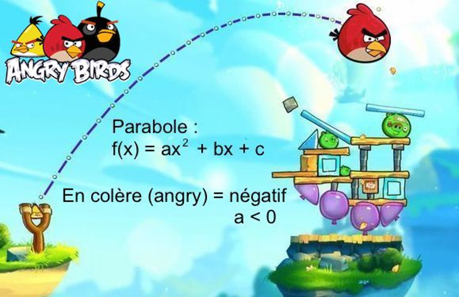
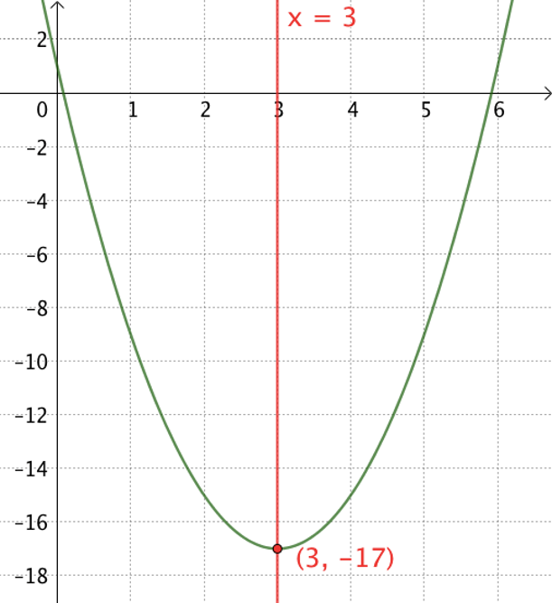

# Fonction polynôme de degré 2

## Définition : {-}
On appelle **fonction polynôme de degré 2** toute fonction $f$ définie sur $\mathbb{R}$ par une expression de la forme :

$$f\left( x \right) = ax^{2} + bx + c$$

où les coefficients *a*, *b* et *c* sont des réels donnés avec $a \neq 0$.

### Remarque : {-}

Une fonction polynôme de degré 2 s'appelle également fonction **trinôme du second degré** ou par abus de langage **"trinôme"**.

### Exemples et contre-exemples : {-}

(@) $f\left( x \right) = 3x^{2} - 7x + 3$

$f$ est une fonction du 2^nd^ degré avec $a=3$ , $b=-7$ et $c=3$

(@) $g\left( x \right) = \frac{1}{2}x^{2} - 5x + \frac{3}{5}$

$g$ est une fonction du 2^nd^ degré avec $a=\frac{1}{2}$ , $b=-5$ et $c=\frac{3}{5}$

(@) $h\left( x \right) = 4 - 2x^{2}$

$h$ est une fonction du 2^nd^ degré avec $a=-2$ , $b=0$ et $c=4$

(@) $k\left( x \right) = \left( x - 4 \right)\left( 5 - 2x \right)$

$k$ est une fonction du 2^nd^ degré car $(x-4)(5-2x)=(5\times x)-(2x\times x)-(4\times 5)+(2\times 4x)$

Donc $k(x)=-2x^2+13x-20  \Rightarrow a=-2$ , $b=13$ et $c=-20$

(@) $m\left( x \right) = 5x - 3$ 

$m(x)$ est une fonction polynôme de degré 1 (fonction affine).

(@) $n\left( x \right) = 5x^{4} - 7x^{3} + 3x - 8$

$n(x)$ est une fonction polynôme de degré 4.

# Forme canonique d'une fonction polynôme de degré

## Méthode : Déterminer la forme canonique d'une fonction polynôme de degré 2 {-}

Soit la fonction $f$ définie sur $\mathbb{R}$ par : $f\left( x \right) = 2x^{2} - 20x + 10$.

On veut exprimer la fonction $f$ sous sa forme canonique :

$f\left( x \right) =\left(x -\alpha \right)^2 + \beta$ où $\alpha$ et $\beta$ sont des nombres réels.

$\begin{aligned}
f\left(x\right) & = 2x^{2}-20x+10\\
                & = 2\left\lbrack x^{2}-10x\right\rbrack+10\\
                & = 2\left\lbrack x^{2}-10x+25-25\right\rbrack+10\\
                & = 2\left\lbrack\left(x-5\right)^{2}-25\right\rbrack+10\\
                & = 2\left(x-5\right)^{2}-50+10\\
                & = 2\left(x-5\right)^{2}-40
\end{aligned}$

On a donc $\alpha=5$ et $\beta=-40$

$f(x) = 2\left( x - 5 \right)^{2} - 40$ est la forme *canonique* de *$f$*.

## Propriété :  {-}
Toute fonction polynôme $f$ de degré 2 définie sur $\mathbb{R}$ par $f\left( x \right) = ax^{2} + bx + c$ peut s'écrire sous la forme :

$f\left( x \right) = a\left( x - \alpha \right)^{2} + \beta$, où
$\alpha$ et $\beta$ sont deux nombres réels.

Cette dernière écriture s'appelle la **forme canonique** de $f$.

### Démonstration : {-}

Comme $a \neq 0$, on peut écrire pour tout réel *x* :

$\begin{aligned}
f\left( x \right) & =  ax^{2} + bx + c \\
                  & =  a\left\lbrack x^{2}+\frac{b}{a}x\right\rbrack + c \\
                  & =  a\left\lbrack x^{2}+\frac{b}{a}x+\left(\frac{b}{2a}\right)^{2}-\left(\frac{b}{2a}\right)^{2}\right\rbrack + c \\
                  & =  a\left\lbrack \left( x + \frac{b}{2a} \right)^{2} - \left( \frac{b}{2a} \right)^{2} \right\rbrack + c \\
                  & =  a\left( x + \frac{b}{2a} \right)^{2} - a\frac{b^{2}}{4a^{2}} + c \\
                  & =  a\left( x + \frac{b}{2a} \right)^{2} - \frac{b^{2}}{4a} + c \\
                  & =  a\left( x + \frac{b}{2a} \right)^{2} - \frac{b^{2} - 4ac}{4a} \\
                  & =  a\left( x - \alpha \right)^{2} + \beta
\end{aligned}$

avec $\alpha = -$ $\frac{b}{2a}$ et $\beta =- \frac{b^{2} - 4ac}{4a}$.

### Remarque :{-}
Pour écrire un trinôme sous sa forme canonique, il est possible d’utiliser les deux dernières formules donnant $\alpha$ et $\beta$.

# Variations et représentation graphique

### Exemple : {-}

Soit la fonction $f$ donnée sous sa forme canonique par : $f\left( x \right) = 2\left( x - 1 \right)^{2} + 3$

Alors : $f(x) \geq 3$ car $2\left( x - 1 \right)^{2}$ est positif.

Or $f\left( 1 \right) = 3$ donc pour tout $x$, $f\left( x \right) \geq f(1)$.

$f$ admet donc un minimum en $x=1$. Ce minimum est égal à $3$.

\begin{tikzpicture}[line cap=round,line join=round,>=triangle 45,x=0.5cm,y=0.5cm]
\begin{axis}[axis lines=middle,x=1cm,y=1cm,xmin=-1.0,xmax=3,ymin=-1,ymax=6.0]
\draw[line width=1.5pt,color=green,smooth,samples=100,domain=-3:5] plot(\x,{2*((\x)-1)^(2)+3});
\draw [line width=1pt,dash pattern=on 2pt off 2pt,color=blue] (1,0)-- (1,3);
\draw [line width=1pt,dash pattern=on 2pt off 2pt,color=blue] (0,3)-- (1,3);
\end{axis}
\end{tikzpicture}

## Propriété : {-}

Soit $f$ une fonction polynôme de degré 2 définie par $f(x) = a\left( x - \alpha \right)^{2} + \beta$, avec $a \neq 0$.

- Si $a > 0$, $f$ admet un minimum pour $x = \alpha$. Ce minimum est égal à $\beta$.
- Si $a < 0$, $f$ admet un maximum pour$\ x = \alpha$. Ce maximum est égal à $\beta$.

### Remarque : {-}
Soit la fonction $f$ définie sur $\mathbb{R}$ par : $f\left( x \right) = ax^{2} + bx + c$, avec $a \neq 0$.

On peut retenir que $f$ admet un maximum (ou un minimum) pour $x = -\frac{b}{2a}$.

\definecolor{ffqqqq}{rgb}{1.,0.,0.}
\definecolor{uuuuuu}{rgb}{0.26666666666666666,0.26666666666666666,0.26666666666666666}
\definecolor{qqwuqq}{rgb}{0.,0.39215686274509803,0.}

\begin{tabular}{lcl}
Si $a>0$ & \quad & Représentation :\\
\begin{tikzpicture}
   \tkzTabInit{$x$ / .75 , $f$ / 1.5}{$+\infty$, $-\frac{b}{2a}$, $+\infty$}
   \tkzTabVar{+/ $+\infty$, -/ $f(\frac{-b}{2a})$, +/ $+\infty$}
\end{tikzpicture}
& \quad &
\begin{tikzpicture}[line cap=round,line join=round,>=triangle 45,x=0.5cm,y=0.5cm]
\begin{axis}[x=0.5cm,y=0.5cm,axis lines=middle,ymajorgrids=true,xmajorgrids=true,xmin=-3.0,xmax=4.5,ymin=-1.5,ymax=6.0,xtick={0},ytick={0},]
\clip(-3.,-1.5) rectangle (4.5,6.);
\draw[line width=1.2pt,color=qqwuqq,smooth,samples=100,domain=-2.0:4.5] plot(\x,{0.75*((\x)-1.5)^(2.0)+1.7});
\draw [line width=0.5pt,dash pattern=on 1pt off 1pt,color=ffqqqq] (1.5,0.)-- (1.5,1.7);
\draw [line width=0.5pt,dash pattern=on 1pt off 1pt,color=ffqqqq] (0.,1.7)-- (1.5,1.7);
\draw [color=ffqqqq](1.2268850945058474,0.07080942721391516) node[anchor=north west] {$\frac{-b}{2a}$};
\draw [color=ffqqqq](-2.6184962079322918,2.5227752248167786) node[anchor=north west] {$f\left(\frac{-b}{2a}\right) $};
\begin{scriptsize}
\draw [fill=uuuuuu] (1.5,1.7) circle (1.5pt);
\draw[color=uuuuuu] (1.45,2.2) node {$M$};
\end{scriptsize}
\end{axis}
\end{tikzpicture}
\end{tabular}

\begin{tabular}{lcl}
Si $a<0$ & \quad & Représentation :\\
\begin{tikzpicture}
   \tkzTabInit{$x$ / .75 , $f$ / 1.5}{$+\infty$, $-\frac{b}{2a}$, $+\infty$}
   \tkzTabVar{-/ $-\infty$, +/ $f(\frac{-b}{2a})$, -/ $-\infty$}
\end{tikzpicture}
& \quad &
\begin{tikzpicture}[line cap=round,line join=round,>=triangle 45,x=0.5cm,y=0.5cm]
\begin{axis}[x=0.5cm,y=0.5cm,axis lines=middle,ymajorgrids=true,xmajorgrids=true,xmin=-3.0,xmax=4.5,ymin=-1.5,ymax=6.0,xtick={0},ytick={0},]
\clip(-3.,-1.5) rectangle (4.5,6.);
\draw[line width=1.2pt,color=qqwuqq,smooth,samples=100,domain=-2.0:4.5] plot(\x,{-0.75*((\x)-1.5)^(2.0)+3.7});
\draw [line width=0.5pt,dash pattern=on 1pt off 1pt,color=ffqqqq] (1.5,0.)-- (1.5,3.7);
\draw [line width=0.5pt,dash pattern=on 1pt off 1pt,color=ffqqqq] (0.,3.7)-- (1.5,3.7);
\draw [color=ffqqqq](1.2268850945058474,0.07080942721391516) node[anchor=north west] {$\frac{-b}{2a}$};
\draw [color=ffqqqq](-2.6184962079322918,4.5227752248167786) node[anchor=north west] {$f\left(\frac{-b}{2a}\right) $};
\begin{scriptsize}
\draw [fill=uuuuuu] (1.5,3.7) circle (1.5pt);
\draw[color=uuuuuu] (1.45,4.2) node {$M$};
\end{scriptsize}
\end{axis}
\end{tikzpicture}
\end{tabular}

Il existe un moyen pour se souvenir du résultat précedent :
{width="60%"}

## Propriétés {-}

- Dans un repère orthogonal $\left( O\ ;\overrightarrow{i},\ \overrightarrow{j} \right)$, la représentation graphique d'une fonction polynôme de degré 2 est une **parabole**.
- Le point M de coordonnées $\left( - \frac{b}{2a}\ ;\ f\left( - \frac{b}{2a} \right) \right)$ est le **sommet** de la parabole. Il correspond au maximum (ou au minimum) de la fonction $f$.
- La parabole possède un **axe de symétrie**. Il s'agit de la droite d'équation $x = -$ $\frac{b}{2a}$.

## Méthode {-}
Représenter graphiquement une fonction polynôme de degré 2

Représenter graphiquement la fonction $f$ définie sur $\mathbb{R}$ par $f\left( x \right) = - x^{2} + 4x$.

Commençons par écrire la fonction $f$ sous sa forme canonique :

$\begin{aligned}
f\left( x \right) & = - x^{2} + 4x\\
                  & = - \left( x^{2} - 4x \right)\\
                  & = - \left( x^{2} - 4x + 4 - 4 \right)\\
                  & = - \left( \left( x - 2 \right)^{2} - 4 \right)\\
                  & = - \left( x - 2 \right)^{2} + 4\\
\end{aligned}$

$f$ admet donc un maximum en $x=2$ égal à $4$

$f\left( 2 \right) = - \left( 2 - 2 \right)^{2} + 4 = 4$

Les variations de $f$ sont donc données par le tableau suivant :

\begin{tikzpicture}
   \tkzTabInit{$x$ / .75 , $f$ / 1.5}{$+\infty$, $2$, $+\infty$}
   \tkzTabVar{-/ $-\infty$, +/ $4$, -/ $-\infty$}
\end{tikzpicture}

On obtient la courbe représentative de $f$ ci-dessous.

\begin{tikzpicture}[line cap=round,line join=round,>=triangle 45,x=0.75cm,y=0.75cm]
\begin{axis}[x=0.75cm,y=0.75cm,axis lines=middle,ymajorgrids=true,xmajorgrids=true,xmin=-1,xmax=5,ymin=-5,ymax=6.0,xtick={},ytick={},]
\draw[line width=1.2pt,color=qqwuqq,smooth,samples=100,domain=-1:5] plot(\x,{-1*((\x)-2)^(2.0)+4});
\draw [line width=1pt,dash pattern=on 5pt off 5pt,color=ffqqqq] (2,0)-- (2,4);
\draw [line width=1pt,dash pattern=on 5pt off 5pt,color=ffqqqq] (0,4)-- (2,4);
\end{axis}
\end{tikzpicture}

## Méthode : Déterminer les caractéristiques d’une parabole {-}

Déterminer l’axe de symétrie et le sommet de la parabole d’équation $y = 2x^{2} - 12x + 1$.

La parabole possède un axe de symétrie d'équation $x = -\frac{b}{2a}$, soit $x = -\frac{- 12}{2 \times 2} = 3$.

La droite d’équation $x = 3$ est donc axe de symétrie de la parabole d’équation $y = 2x^{2} - 12x + 1$.

Les coordonnées de son sommet sont : $\left( - \frac{b}{2a}\ ;\ f\left( - \frac{b}{2a} \right) \right)$, soit : $\left( 3\ ;2 \times 3^{2} - 12 \times 3 + 1 \right) = \left( 3\ ;\  - 17 \right)$.

Le point de coordonnées $\left( 3\ ;\  - 17 \right)$ est donc le sommet de la parabole.

$a = 2 > 0$, ce sommet correspond à un minimum.

{width="60%"}

