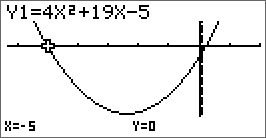
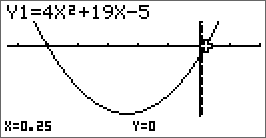

# Résolution d'une équation du 2^nd^ degré

## Définition {-}

Une **équation du 2^nd^ degré** est une équation de la forme $ax^{2} + bx + c = 0$ où *a*, *b* et *c* sont des réels avec : $a \neq 0$.

Une solution de cette équation s'appelle une **racine** du trinôme $ax^{2} + bx + c$.

### Exemple {-}

L'équation $3x^{2} - 6x - 2 = 0$ est une équation du 2^nd^ degré.

## Définition
On appelle **discriminant** du trinôme $ax^{2} + bx + c$, le nombre réel, noté $\Delta$, égal à $b^{2} - 4ac$.

## Propriété {-}

Soit $\Delta$ le discriminant du trinôme $ax^{2} + bx + c$.

- Si $\Delta < 0$ : L'équation $ax^{2} + bx + c = 0$ n'a pas de solution réelle.
- Si $\Delta = 0$ : L'équation $ax^{2} + bx + c = 0$ a une unique solution : $x_{0}=\frac{- b}{2a}$.
- Si $\Delta > 0$ : L'équation $ax^{2} + bx + c = 0$ a deux solutions distinctes :

$x_{1} =$ $\frac{- b - \sqrt{\Delta}}{2a}$ et $x_{2} =\frac{- b + \sqrt{\Delta}}{2a}$.

## Méthode : Résoudre une équation du 2^nd^ degré {-}

Résoudre les équations suivantes :
(@) $2x^{2} - x - 6 = 0$
(@) $2x^{2} - 3x + \frac{9}{8} = 0$
(@) $x^{2} + 3x + 10 = 0$

- Calculons le discriminant de l'équation $2x^{2} - x - 6 = 0$ :

*a* $= 2$, *b* $= -1$ et *c* $= -6$ donc $\Delta = b^{2} - 4ac = (-1)^{2} - 4\times 2 \times (-6) = 49$.

Comme $\Delta> 0$, l'équation possède deux solutions distinctes :

$x_{1}=\frac{-b-\sqrt{\Delta}}{2a}=\frac{-\left(-1\right)-\sqrt{49}}{2\times 2}=-\frac{3}{2}$

et $x_{2}=\frac{-b+\sqrt{\Delta}}{2a}=\frac{-\left(-1\right)+\sqrt{49}}{2\times 2}=2$

- Calculons le discriminant de l'équation $2x^{2} - 3x + \frac{9}{8} = 0$ :

*a* $= 2$, *b* $= -3$ et *c* $= \frac{9}{8}$ donc $\Delta = b^{2} - 4ac = (-3)^{2}- 4\times 2 \times \frac{9}{8} = 0$.

Comme $\Delta = 0$, l'équation possède une unique solution : $x_{0}=-\frac{b}{2a}=-\frac{-3}{2 \times 2}=\frac{3}{4}$

- Calculons le discriminant de l'équation $x^{2} + 3x + 10 = 0$ :

*a* $= 1$, *b* $= 3$ et *c* $= 10$ donc $\Delta = b^{2} - 4ac = 3^{2} - 4 \times 1 \times 10 = -31$.

Comme $\Delta 0$, l'équation ne possède pas de solution réelle.

## Propriété {-}
La somme *S* et le produit *P* des racines d’un polynôme du 2^nd^ degré de la forme $ax^{2} + bx + c = 0$ sont donnés par : 

$S=-\frac{b}{a}$ et $P=\frac{c}{a}$.

### Exercice : Démontrer ces deux formules.{-}
Soit $x_1$ et $x_2$ les solutions de $x^2+bx+c=0$ alors

$x_{1}=\frac{-b-\sqrt{\Delta}}{2a}$ et $x_{2}=\frac{-b+\sqrt{\Delta}}{2a}$

Donc $S=x_1 + x_2$ :

$\begin{aligned}
S & = x_1 + x_2\\
  & = \frac{-b-\sqrt{\Delta}}{2a}+\frac{-b+\sqrt{\Delta}}{2a}\\
  & = \frac{(-b-\sqrt{\Delta})+(-b+\sqrt{\Delta})}{2a}\\
  & = \frac{-2b}{2a} = \frac{-b}{a}
\end{aligned}$

Pour le produit, $P=x_1 \times x_2$ :

$\begin{aligned}
P & = x_1 \times x_2\\
  & = \frac{-b-\sqrt{\Delta}}{2a} \times \frac{-b+\sqrt{\Delta}}{2a}\\
  & = \frac{(-b-\sqrt{\Delta})\times(-b+\sqrt{\Delta})}{2a\times 2a}\\
  & = \frac{ (-b)^2 + \left((-b) \times \sqrt{\Delta}\right) + \left(-\sqrt{\Delta} \times (-b)\right) + (-\sqrt{\Delta} \times \sqrt{\Delta}) }{4a^2}\\
  & = \frac{b^2 - \Delta}{4a^2} = \frac{b^2 - (b^2-4ac)}{4a^2} = \frac{4ac}{4a^2}\\
  & = \frac{c}{a}
\end{aligned}$

# Factorisation d'un trinôme

### Démonstration  {-}

La fonction $f$ définie sur $\mathbb{R}$ par ${f\left( x \right) = ax}^{2} + bx + c$ peut s'écrire sous sa forme canonique :

$f(x) = a\left( x - \alpha \right)^{2} + \beta$ avec $\alpha = -\frac{b}{2a}$ et $\beta =- \frac{b^{2} - 4ac}{4a}$.

Donc :

$ax^{2} + bx + c = 0$ peut s’écrire : 

$\begin{aligned}
a\left( x + \frac{b}{2a} \right)^{2} - \frac{b^{2} - 4ac}{4a}  & = 0 \\
     a\left( x + \frac{b}{2a} \right)^{2} - \frac{\Delta}{4a}  & = 0 \\
                         a\left( x + \frac{b}{2a} \right)^{2}  & = \frac{\Delta}{4a} \\
                          \left( x + \frac{b}{2a} \right)^{2}  & = \frac{\Delta}{4a^{2}} \text{\quad car  } a \neq 0
\end{aligned}$

- Si $\Delta < 0$ : 
Comme un carré ne peut être négatif $\left( \frac{\Delta}{4a^{2}} < 0 \right)$, l'équation $ax^{2} + bx + c = 0$ n'a pas de solution.

- Si $\Delta = 0$ : 
L'équation $ax^{2} + bx + c = 0$ peut s'écrire : $\left( x + \frac{b}{2a} \right)^{2} = 0$

L'équation n'a qu'une seule solution : $x = \frac{-b}{2a}$

- Si $\Delta > 0$ : 
L'équation $ax^{2} + bx + c = 0$ est équivalente à :

\begin{tabular}{|cc|c}
$\begin{aligned}
x + \frac{b}{2a} & = +\sqrt{\frac{\Delta}{4a^{2}}} \\
               x & = +\sqrt{\frac{\Delta}{4a^{2}}} - \frac{b}{2a} \\
               x & = \frac{+\sqrt{\Delta}}{2a} - \frac{b}{2a} \\
               x & = \frac{+\sqrt{\Delta}-b}{2a} \\
               x & = \frac{-b+\sqrt{\Delta}}{2a}
\end{aligned}$
& et &
$\begin{aligned}
x + \frac{b}{2a}  & = -\sqrt{\frac{\Delta}{4a^{2}}} \\
               x  & = -\sqrt{\frac{\Delta}{4a^{2}}} - \frac{b}{2a} \\
               x  & = \frac{-\sqrt{\Delta}}{2a} - \frac{b}{2a} \\
               x  & = \frac{-\sqrt{\Delta}-b}{2a} \\
               x  & = \frac{-b-\sqrt{\Delta}}{2a}
\end{aligned}$
\end{tabular}

L'équation a deux solutions distinctes :

$x_1 = \frac{-b+\sqrt{\Delta}}{2a}$ et $x_1 = \frac{-b-\sqrt{\Delta}}{2a}$

## Propriété {-}

Soit $f$ une fonction polynôme de degré $2$ définie sur par $f\left( x \right) = ax^{2} + bx + c$.

- Si $\Delta = 0$ : Pour tout réel $x$, on a : $f\left( x \right) = a\left( x - x_{0} \right)^{2}$.

- Si $\Delta > 0$ : Pour tout réel $x$, on a : $f\left( x \right) = a\left( x - x_{1} \right)\left( x - x_{2} \right)$.

### Remarque {-}
Si $\Delta < 0$, il n’existe pas de forme factorisée de $f$ .

## Méthode : Factoriser un trinôme {-}

Factoriser les trinômes suivants :

(@) ${4x}^{2} + 19x - 5$

(@) ${9x}^{2} - 6x + 1$

(@) On cherche les racines du trinôme ${4x}^{2} + 19x - 5$:

Calcul du discriminant : $\Delta = 19^2 - 4 \times 4 \times (-5) = 441$

Les racines sont :

$x_{1} = \frac{-19 - \sqrt{441}}{2 \times 4} = -5$ et $x_{2} =\frac{- 19 + \sqrt{441}}{2 \times 4} = \frac{1}{4}$

On a donc :

$\begin{aligned}
{4x}^{2}+19x-5 & = 4\left(x-\left(-5\right)\right)\left(x-\frac{1}{4}\right)\\
               & = \left( x + 5 \right)\left( 4x - 1 \right)
\end{aligned}$

Une vérification à l'aide de la calculatrice n'est jamais inutile \! On peut lire une valeur approchée des racines sur l'axe des abscisses.

{width="40%"}
{width="40%"}

(@)

<!-- 

b) On cherche les racines du trinôme ${9x}^{2} - 6x + 1$ :

Calcul du discriminant : $\Delta$ = (-6)^{2} - 4 x 9 x 1 = 0

La racine (double) est : $x_{0} = -$ $\frac{- 6}{2 \times 9}$ =
$\frac{1}{3}$

On a donc :

${9x}^{2} - 6x + 1 = 9\left( x - \frac{1}{3} \right)^{2} = \left( 3x - 1 \right)^{2}$.

#Exercice d’approfondissement pour aller plus
loin :

Résoudre l'équation (E) : $\frac{x - 2}{{2x}^{2} - 3x - 2}$ $-$
$\frac{x^{2}}{{2x}^{2} + 13x + 6}$ $= 0$

\- On commence par factoriser les expressions ${2x}^{2} - 3x - 2$ et
${2x}^{2} + 13x + 6$.

Le discriminant de ${2x}^{2} - 3x - 2$ est $\Delta$ = (-3)^{2} - 4 x
2 x (-2) = 25 et ses racines sont :

$x_{1} =$ $\frac{3 - \sqrt{25}}{2 \times 2}$ = $\frac{- 1}{2}$ et
$x_{2} =$ $\frac{3 + \sqrt{25}}{2 \times 2}$ = $2$

On a donc :
${2x}^{2} - 3x - 2 = 2\left( x + \frac{1}{2} \right)\left( x - 2 \right) = \left( 2x + 1 \right)\left( x - 2 \right)$.
.

Le discriminant de ${2x}^{2} + 13x + 6$ est $\Delta$' = 13^{2} - 4 x
2 x 6 = 121 et ses racines sont :

$x_{1}' =$ $\frac{- 13 - \sqrt{121}}{2 \times 2}$ = -6 et
$x_{2}' =$ $\frac{- 13 + \sqrt{121}}{2 \times 2}$ =
$\frac{- 1}{2}$

On a donc :
${2x}^{2} + 13x + 6 = 2\left( x + 6 \right)\left( x + \frac{1}{2} \right) = \left( x + 6 \right)\left( 2x + 1 \right)$.
.

\- L'équation (E) s'écrit alors :
$\frac{x - 2}{\left( 2x + 1 \right)\left( x - 2 \right)}$ $-$
$\frac{x^{2}}{\left( x + 6 \right)\left( 2x + 1 \right)}$ $= 0$

Les valeurs -6, $\frac{- 1}{2}$ et 2 annulent les dénominateurs. On
résout alors (E) sur

$\mathbb{R \smallsetminus}\left\{ - 6\ ;\  - \frac{1}{2}\ ;\ 2 \right\}\ $:

(E) s'écrit : $\frac{1}{2x + 1}$ $-$
$\frac{x^{2}}{\left( x + 6 \right)\left( 2x + 1 \right)}$ $= 0$

$\frac{x + 6}{\left( 2x + 1 \right)\left( x + 6 \right)}$ $-$
$\frac{x^{2}}{\left( x + 6 \right)\left( 2x + 1 \right)}$ $= 0$

$\frac{x + 6 - x^{2}}{\left( 2x + 1 \right)\left( x + 6 \right)}$
$= 0$

$x + 6 - x^{2} = 0$ car $x \neq -$ $\frac{1}{2}$ et
$x \neq - 6$.

Le discriminant de $- x^{2} + x + 6$ est $\Delta$'' = 1^{2} - 4 x
(-1) x 6 = 25.

Les racines sont : $x_{1}'' =$
$\frac{- 1 - \sqrt{25}}{2 \times \left( - 1 \right)}$ = 3 et
$x_{2}'' =$ $\frac{- 1 + \sqrt{25}}{2 \times \left( - 1 \right)}$ =
-2

Les solutions de l'équation (E) sont : -2 et 3.

III. #Signe d'un trinôme

 **Vidéo** **<https://youtu.be/sFNW9KVsTMY>**

 **Vidéo** **<https://youtu.be/pT4xtI2Yg2Q>**

 **Vidéo**
[**https://youtu.be/JCVotquzIIA**](https://youtu.be/JCVotquzIIA)

#Remarque préliminaire :

Pour une fonction polynôme de degré 2 définie par
${f\left( x \right) = ax}^{2} + bx + c$ :

\- si *a* \> 0, sa représentation graphique est une parabole tournée
vers le haut :

\- si *a* \< 0, sa représentation graphique est une parabole tournée
vers le bas :

#Propriété : Soit $f$ une fonction
polynôme de degré 2 définie sur $\mathbb{R}$ par

$f\left( x \right) = ax^{2} + bx + c$.

\- Si $\Delta$ \< 0 :

| $x$      | $- \infty$ $+ \infty$ |
| -------- | ------------------------- |
| $f$ ($x$) | Signe de *a*              |

\- Si $\Delta$ = 0 :

| $x$      | $- \infty$ $x_{0}$ $+ \infty$ |
| -------- | ----------------------------------- |
| $f$ ($x$) | Signe de *a* O Signe de *a*         |

\- Si $\Delta$ \> 0 :

<table>
<thead>
<tr class="header">
<th><em>x</em></th>
<th> − ∞ <em>x</em>1 <em>x</em>2  + ∞</th>
</tr>
</thead>
<tbody>
<tr class="odd">
<td><em>f</em>(<em>x</em>)</td>
<td>
Signe de <em>a</em> O Signe opposé O Signe de <em>a</em>

de <em>a</em>
</td>
</tr>
</tbody>
</table>

#Méthode : Résoudre une inéquation du
2^nd^ degré

 **Vidéo** **<https://youtu.be/AEL4qKKNvp8>**

Résoudre l’inéquation : $x^{2} + 3x - 5 < - x + 2$

*On commence par rassembler tous les termes dans le membre de gauche
afin de pouvoir étudier les signes des trinômes.*

$x^{2} + 3x - 5 < - x + 2$ équivaut à $x^{2} + 4x - 7 < 0$.

Le discriminant de $x^{2} + 4x - 7$ est $\Delta$ = 4^{2} - 4 x 1 x
(-7) = 44 et ses racines sont :

$x_{1} =$ $\frac{- 4 - \sqrt{44}}{2 \times 1}$ $= - 2 - \sqrt{11}$
et $x_{2} =$ $\frac{- 4 + \sqrt{44}}{2 \times 1}$
$= - 2 + \sqrt{11}$

On obtient le tableau de signes :

L'ensemble des solutions de l'inéquation $x^{2} + 3x - 5 < - x + 2$
est donc
$\left\rbrack - 2 - \sqrt{11}\ ;\  - 2 + \sqrt{11} \right\lbrack$.

*Une vérification à l'aide de la calculatrice n'est jamais inutile \!*

*On peut lire une valeur approchée des racines sur l'axe des abscisses.*

#Exercice d’approfondissement pour aller plus
loin :

Résoudre l’inéquation $\frac{1}{x^{2} - x - 6}$ $\geq 2$

$\frac{1}{x^{2} - x - 6}$ $\geq 2$ équivaut à
$\frac{1}{x^{2} - x - 6}$ $- 2 \geq 0$

Soit : $\frac{1}{x^{2} - x - 6}$ $-$
$\frac{2\left( x^{2} - x - 6 \right)}{x^{2} - x - 6}$ $\geq 0$

Soit encore : $\frac{- 2x^{2} + 2x + 13}{x^{2} - x - 6}$ $\geq 0$

\- On commence par déterminer les racines du trinôme
$x^{2} - x - 6\ $:

Le discriminant est $\Delta$ = (-1)^{2} - 4 x 1 x (-6) = 25 et ses
racines sont :

$x_{1} =$ $\frac{1 - \sqrt{25}}{2 \times 1}$ $= - 2$ et
$x_{2} =$ $\frac{1 + \sqrt{25}}{2 \times 1}$ $= 3$

Les valeurs -2 et 3 annulent le dénominateur. On résout donc l'équation
dans

$\mathbb{R \smallsetminus}\left\{ - 2\ ;3 \right\}$.

\- On détermine les racines du trinôme $- 2x^{2} + 2x + 13$ :

Le discriminant est $\Delta$' = 2^{2} - 4 x (-2) x 13 = 108 et ses
racines sont :

$x_{1}' =$ $\frac{- 2 - \sqrt{108}}{2 \times \left( - 2 \right)}$
$= \frac{1 + 3\sqrt{3}}{2}$ et $x_{2}' =$
$\frac{- 2 + \sqrt{108}}{2 \times \left( - 2 \right)}$
$= \frac{1 - 3\sqrt{3}}{2}$

\- On obtient le tableau de signe :

L'ensemble des solutions de l'inéquation $\frac{1}{x^{2} - x - 6}$
$\geq 2$ est :

\[\left\lbrack \frac{1 - 3\sqrt{3}}{2}\ ;\  - 2 \right\lbrack \cup \left\rbrack 3\ ;\ \frac{1 + 3\sqrt{3}}{2} \right\rbrack\]

IV. #Application : position relative de deux
courbes

#Méthode : Étudier la position de deux
courbes

 **Vidéo**
[**https://youtu.be/EyxP5HIfyF4**](https://youtu.be/EyxP5HIfyF4)

Soit $f$ et *g* deux fonctions définies sur $\mathbb{R}$ par :
${f\left( x \right) = - x}^{2} + 8x - 11$ et
$g\left( x \right) = x - 1$.

Étudier la position relative des courbes représentatives $C_{f}$ et
$C_{g}$.

On va étudier le signe de la différence
$f\left( x \right) - g\left( x \right)$:

$f\left( x \right) - g\left( x \right) = {- x}^{2} + 8x - 11 - x + 1 = - x^{2} + 7x - 10$.

Le discriminant du trinôme ${- x}^{2} + 7x - 10$ est $\Delta$ = 7^{2}
- 4 x (-1) x (-10) = 9

Le trinôme possède deux racines distinctes :

$x_{1} =$ $\frac{- 7 - \sqrt{9}}{2 \times \left( - 1 \right)}$
$= 5$ et $x_{2} =$
$\frac{- 7 + \sqrt{9}}{2 \times \left( - 1 \right)}$ $= 2$

On dresse le tableau de signes du trinôme $\  - x^{2} + 7x - 10$ :

| $x$                                       | $- \infty$ 2 5 $+ \infty$ |
| ----------------------------------------- | ----------------------------- |
| \[f\left( x \right) - g\left( x \right)\] | - O + O -                     |

On conclut :

La courbe $C_{f}$ est en-dessous de la courbe
$C_{g}$ pour tout $x$ de

$\left\rbrack - \infty\ ;2 \right\rbrack \cup \left\lbrack 5\ ;\  + \infty \right\lbrack$.

La courbe $C_{f}$ est au-dessus de la courbe $C_{g}$ pour tout $x$
de $\left\lbrack 2\ ;5 \right\rbrack$.

 -->
