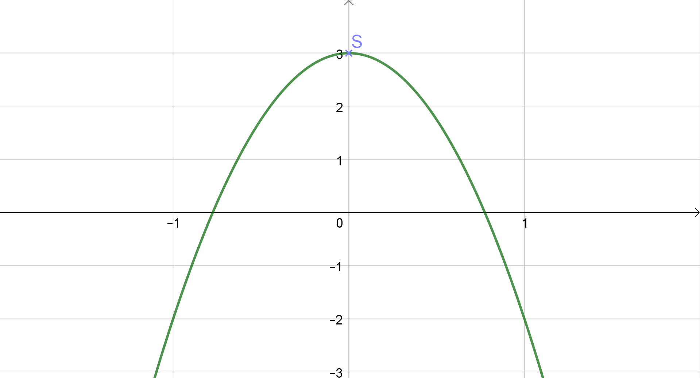

# Questions / Réponses

## Fonctions du 2$^{nd}$ degré

---

# Q.1

> Résoudre :

$$-0.5(x-2)(x+3)=0$$

---

$\begin{aligned}
\quad           & -0.5(x-2)(x+3)=0 \\
\Leftrightarrow & \begin{cases}x-2=0\\x+3=0\end{cases}\Leftrightarrow \begin{cases}x=2\\x=-3\end{cases}
\end{aligned}$

$$S=\left\{2;-3\right\}$$

---

# Q.2

$$f(x)=-5x^2+3$$

> 1. Quelle est l'allure de $\mathscr{C}_f$ ?
> 2. Quels sont les coordonnées du sommet de $\mathscr{C}_f$ ?

---

1. $\quad a=-5<0\quad$ donc la parabole $\mathscr{C}_{f}$ a les branches tournées vers le bas.
2. Sommet $S$ a pour coordonnées $\quad S\left(0;3\right)$

---

# Q.3

> Résoudre :

$$-5x^2+3=0$$

---

$\begin{aligned}
                & -5x^2+3 = 0 \\
\Leftrightarrow & -5x^2   = -3\\
\Leftrightarrow &~x^2=\frac{-3}{-5}=0.6\\
\Leftrightarrow & \begin{cases}x=\sqrt{0.6}\\x=-\sqrt{0.6}\end{cases}
\end{aligned}
$

$$S=\left\{-\sqrt{0.6};\sqrt{0.6}\right\}$$

---
